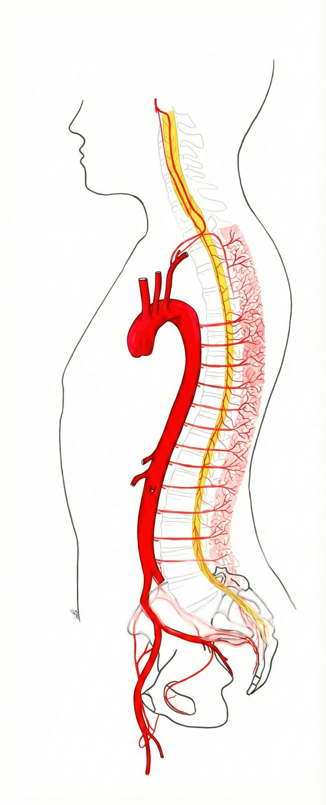
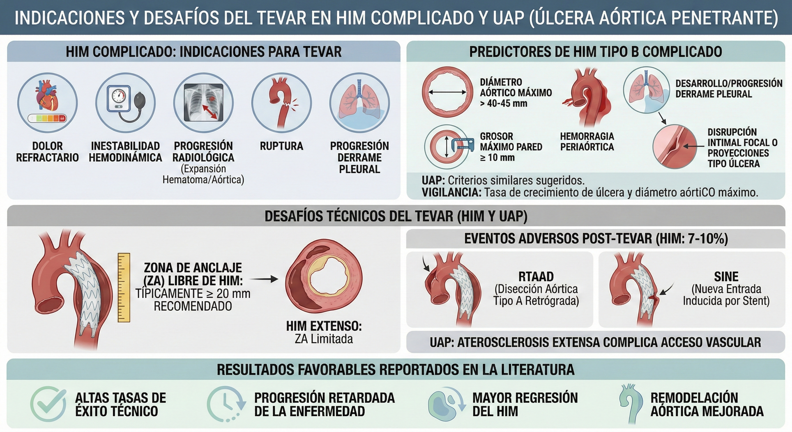

<footer>ESVS 2026</footer>

# ESVS 2026 Guidelines: Descending Thoracic and Thoraco-Abdominal Aortic Diseases
# 1. METODOLOGÍA

## 1.1. Propósito de las guías

La Sociedad Europea de Cirugía Vascular (ESVS) ha desarrollado guías de práctica clínica para el cuidado de pacientes con enfermedades de la aorta torácica descendente (ATD) y tóraco-abdominal (ATAbd), en sucesión a la versión de 2017, con el objetivo de ayudar a los médicos a seleccionar la mejor estrategia de manejo.
Los usuarios potenciales de estas guías incluyen a cualquier médico involucrado en el manejo de pacientes con enfermedades de ATD y ATAbd, como cirujanos vasculares, médicos vasculares y angiólogos, médicos de atención primaria, cardiólogos, cirujanos cardiovasculares, radiólogos intervencionistas y otros profesionales de la salud involucrados en el cuidado de estos pacientes, así como a los responsables de políticas de salud y la industria. Además, las guías pretenden servir como una fuente importante de información imparcial para el paciente y sus familiares para optimizar la toma de decisiones compartida (TDC) (véase el Capítulo 11).

Las guías promueven estándares de atención, pero no son un estándar legal de cuidado. Son un "principio rector", y la atención brindada depende de la presentación del paciente, la elección, las comorbilidades y el entorno (técnicas disponibles, experiencia local).
Estas guías se basan en evidencia científica complementada por la opinión de expertos en la materia. Al resumir y evaluar la mejor evidencia disponible, se han formulado recomendaciones para la evaluación y el tratamiento de los pacientes. Las recomendaciones representan el conocimiento general en el momento de redactar estas guías, pero la tecnología y el conocimiento de la enfermedad en este campo pueden cambiar rápidamente; por lo tanto, las recomendaciones pueden quedar obsoletas. La ESVS tiene como objetivo actualizar las guías cuando estén disponibles nuevas perspectivas importantes sobre el manejo de enfermedades de la ATD y ATAbd.

Las guías de práctica clínica de la ESVS 2026 sobre el manejo de enfermedades de ATD y ATAbd se publican en el European Journal of Vascular and Endovascular Surgery (EJVES) como una publicación de acceso abierto en línea, están perpetuamente disponibles de forma gratuita, además de ser de acceso gratuito a través del sitio web de la ESVS. También están disponibles en una aplicación dedicada de Guías de la ESVS.

## 1.2. Cumplimiento con los estándares AGREE II
Los estándares de reporte AGREE II (Appraisal of Guidelines for Research and Evaluation) para evaluar la calidad y el reporte de guías de práctica fueron adoptados durante la preparación de las guías de 2026; una lista de verificación está disponible como material complementario en el Apéndice A.

## 1.3. Comité de Redacción de Guías
Los miembros del Comité de Redacción de Guías (GWC) fueron seleccionados por los presidentes del GWC y el Comité Directivo de Guías (GSC) de la ESVS para representar a los clínicos involucrados en el manejo de pacientes con enfermedades de ATD y ATAbd. El GWC comprendió 20 cirujanos vasculares y cardiovasculares de 11 países europeos.

Los miembros del GWC han proporcionado declaraciones de divulgación de todas las relaciones que podrían percibirse como fuentes reales o potenciales de conflictos de intereses. Estos formularios de divulgación se mantienen en archivo en la sede de la ESVS. Los miembros del GWC no recibieron apoyo financiero de ningún organismo farmacéutico, de dispositivos o de la industria para desarrollar las guías.

El GSC de la ESVS fue responsable del proceso de respaldo de esta guía. Todos los expertos involucrados en el GWC han aprobado el documento final. El documento de la guía se sometió a un proceso formal de revisión por expertos externos y fue revisado y aprobado por el GSC de la ESVS y por el EJVES. Este documento ha sido revisado por 18 revisores de 11 países, incluidos 11 miembros del GSC y siete revisores externos.

## 1.4. Metodología

### 1.4.1. Estrategia
El trabajo en esta guía comenzó en octubre de 2020 pero se retrasó debido a la pandemia de COVID-19 y la posterior reestructuración del GWC. El GWC tuvo reuniones en línea regulares y una reunión presencial en Uppsala, Suecia, en agosto de 2024 para revisar la redacción y la clasificación de cada recomendación. Si no había acuerdo unánime, se mantenían discusiones para decidir cómo llegar a un consenso. Si esto fallaba, entonces la redacción, el grado y el nivel de evidencia se aseguraban mediante un voto mayoritario de los miembros del GWC. Después de varias reuniones de seguimiento en línea, el GWC pudo acordar un conjunto final de recomendaciones en agosto de 2025. El documento se sometió a cuatro rondas de revisión externa. La versión final de la guía se envió en septiembre de 2025.

### 1.4.2. Búsqueda y selección de literatura
Se realizó una búsqueda sistemática de literatura para artículos relevantes publicados hasta junio de 2025 en PubMed (MEDLINE), Embase y la Biblioteca Cochrane. No se aplicaron restricciones de idioma. La verificación de referencias y la búsqueda manual por parte de los miembros del GWC agregaron otra literatura relevante.
Los miembros del GWC realizaron la selección de literatura basada en la información proporcionada en el título y el resumen de los estudios recuperados. Solo se incluyeron publicaciones revisadas por pares, siguiendo el principio de la pirámide de evidencia. Múltiples ensayos controlados aleatorios (ECA) o metaanálisis de múltiples ECA estaban en la cima, luego ECA individuales o grandes estudios no aleatorios (incluidos metaanálisis de grandes estudios no ECA), seguidos de metaanálisis de pequeños estudios no ECA, estudios observacionales, series de casos y grandes auditorías prospectivas. La opinión de expertos estaba en la base de la pirámide, mientras que se excluyeron los informes de casos y los resúmenes.

### 1.4.3. Recomendaciones
Se utilizó el sistema de clasificación de recomendaciones de las guías de práctica clínica de la ESVS para clasificar la fuerza (clase) de cada recomendación, calificada de I a III (Tabla 2), y el nivel de evidencia, calificado de A a C (Tabla 3).
El texto de apoyo tiene como objetivo proporcionar una base resumida para la necesidad y clasificación de las recomendaciones. Las diferencias descritas, efectos, etc., son siempre significativas a menos que se indique lo contrario, aunque los intervalos de confianza o los valores p no siempre se indiquen. Para más detalles, se remite a los lectores a la Tabla de Evidencia (ToE) (Apéndice A) o a la referencia citada.

# 2. ESTÁNDARES DE SERVICIO
Las enfermedades de la aorta torácica descendente (ATD) son relativamente raras. Aunque las presentaciones de las patologías de la ATD pueden involucrar a varias especialidades (por ejemplo, medicina de cuidados agudos, cardiología, cirugía), es probable que la mayoría de los médicos manejen pocos pacientes con estas patologías muy raras a lo largo de su carrera. Por otro lado, para los centros que se centran en la enfermedad aórtica, el manejo de las enfermedades de la ATD es una parte integral de la práctica. Otro desafío en el manejo de las patologías de la ATD es la relativa escasez de evidencia de alto nivel en este campo. Estos aspectos pueden tener implicaciones para la organización de los servicios prestados para el manejo de la patología de la ATD, como se discute en este capítulo.

## 2.1. Recursos, disponibilidad y volumen quirúrgico
La patología de la ATD puede variar desde hallazgos incidentales sin relevancia clínica inmediata hasta emergencias potencialmente mortales que requieren intervención quirúrgica urgente. Estos casos a menudo se detectan primero en centros con experiencia limitada en el manejo de la enfermedad aórtica, donde la acción oportuna es crítica. Las redes de derivación bien establecidas y los protocolos para el traslado rápido a centros aórticos especializados pueden mejorar los resultados en casos agudos. El modelo centralizado de "hub and spoke" (centro de referencia y centros periféricos) del Reino Unido para la cirugía aórtica, que ha llevado a mejores resultados en la reparación de aneurismas de aorta abdominal (AAA), ilustra este enfoque. Estas redes también ayudan a garantizar que los hallazgos incidentales y las decisiones de seguimiento sean gestionados por especialistas experimentados.

Aunque no existe una definición universal, un "centro aórtico" en el contexto de estas guías se refiere a una instalación con experiencia quirúrgica vascular las 24 horas capaz de proporcionar atención médica, endovascular y quirúrgica abierta de la patología de la ATD. Las competencias esenciales adicionales incluyen imágenes cardiovasculares avanzadas, cardiología y cirugía cardiotorácica para enfermedades cardíacas y de la aorta proximal, anestesia vascular y cuidados intensivos, genética clínica para la aortopatía genética y manejo especializado de angiología e hipertensión.
No todos los pacientes con patología aguda de la ATD requieren cirugía inmediata, por ejemplo, aquellos con hematoma intramural (HIM) no complicado o disecciones tipo B (ver Capítulo 4). En tales casos, la necesidad de traslado a un centro aórtico a menudo se debate. Si bien los datos son limitados, un estudio sugiere mejores resultados de supervivencia para la disección aórtica (DA) manejada en centros de alto volumen. Dado el potencial de deterioro rápido incluso en casos inicialmente no complicados, el acceso a experiencia quirúrgica urgente puede ser beneficioso. La decisión de trasladar debe guiarse por el juicio clínico y la toma de decisiones compartida (TDC) con el paciente.

Se ha demostrado una clara relación volumen-resultado en numerosos procedimientos quirúrgicos, incluidos los de la enfermedad de la ATD. Esta asociación es particularmente evidente en reparaciones toracoabdominales y abiertas, mientras que los datos son menos sólidos para la reparación aórtica endovascular torácica (TEVAR) estándar. Varios estudios nacionales han demostrado mejores resultados para la reparación endovascular de aneurismas de aorta toracoabdominal (AATA) en centros de alto volumen, a pesar de tratar a pacientes mayores con anatomía más compleja. Estudios de registros de EE. UU., Alemania y Australia muestran tasas de morbilidad y mortalidad más bajas en hospitales de alto volumen y entre cirujanos de alto volumen. Además, un estudio poblacional de Canadá, que incluyó a 664 pacientes sometidos a reparación de AATA, informó mejores resultados a largo plazo en instituciones de alto volumen. Aunque no se puede definir un umbral preciso, los centros que realizan menos de 20 reparaciones de ATD anualmente parecen tener resultados inferiores; por lo tanto, el Comité de Redacción de la Guía considera que este es un umbral de volumen quirúrgico mínimo razonable por ahora, incluyendo reparación de ATD, aorta toracoabdominal (ATabd) y arco.

El momento óptimo para la intervención en la patología de la ATD no ha sido bien estudiado. Sin embargo, por analogía con los AAA y otras condiciones de alto riesgo (por ejemplo, neoplasias malignas), se considera razonable un límite superior de ocho semanas desde la decisión hasta el tratamiento para la reparación electiva estándar de ATD. Para casos de alto riesgo de ruptura, como aneurismas grandes (> 7 cm), se justifica un plazo más corto (para más información sobre disección y aneurismas de alto riesgo, ver Capítulos 5.2 y 6.2). Por el contrario, en pacientes con comorbilidades significativas o anatomía compleja, la reparación diferida puede ser apropiada para permitir el estudio y la optimización médica y la planificación, incluida la preparación de injertos personalizados.

<button class="fullscreen-btn" onclick="toggleFullScreen(this.parentElement)">⛶</button>

**1** Rec 1: Se recomienda que el manejo de la patología de aorta torácica descendente se organice en redes definidas con vías de derivación establecidas. (IC)

<button class="fullscreen-btn" onclick="toggleFullScreen(this.parentElement)">⛶</button>

**2** Rec 2: Se debería considerar la transferencia inmediata de pacientes con enfermedad aguda de la aorta torácica descendente a centros aórticos para una evaluación y manejo integral. (IIaC)

<button class="fullscreen-btn" onclick="toggleFullScreen(this.parentElement)">⛶</button>

**3** Rec 3: Se recomienda que los centros aórticos que tratan la enfermedad de la aorta torácica descendente tengan un volumen anual de ≥ 20 reparaciones. (IC)

<button class="fullscreen-btn" onclick="toggleFullScreen(this.parentElement)">⛶</button>

**4** Rec 4: Se recomienda una vía de atención quirúrgica vascular rápida ("fast track") para pacientes con patología de aorta torácica descendente que cumplan con los criterios de tamaño para reparación electiva. (IC)

## 2.2. Registros y control de calidad
Gran parte de la evidencia que guía el manejo de la enfermedad de la ATD se deriva de estudios de cohortes basados en registros. Los registros específicos de dispositivos, como el Global Registry for Endovascular Aortic Treatment (GREAT) y el Medtronic Thoracic Endovascular Registry (MOTHER), han sido fundamentales para evaluar la práctica de TEVAR. Los registros multicéntricos específicos de enfermedades como el International Registry of Acute Aortic Dissection (IRAD) también proporcionan datos valiosos para el manejo de la ATD. Los registros de calidad nacionales y regionales incluyen cada vez más la ATD, y los esfuerzos de colaboración como VASCUNET y el Consorcio Internacional de Registros Vasculares han establecido puntos de referencia de resultados de TEVAR y han propuesto un conjunto de datos básicos para armonizar las medidas de calidad (Tabla 4). Estos registros apoyan el monitoreo de resultados y la mejora de la calidad, beneficiando tanto a pacientes como a clínicos. Sin embargo, faltan un conjunto de resultados básicos estandarizados y medidas de resultados informados por el paciente validadas para la reparación de la ATD y representan prioridades clave para la investigación futura.

<button class="fullscreen-btn" onclick="toggleFullScreen(this.parentElement)">⛶</button>

Tabla 4

Conjunto de datos básicos propuesto para la recopilación estandarizada de datos de reparación aórtica endovascular torácica (TEVAR) (adaptado de Hellgren et al. y de Borst et al.)

<table border="1">
  <thead>
    <tr>
      <th>Parámetro</th>
      <th>Datos y unidades</th>
    </tr>
  </thead>
  <tbody>
    <tr>
      <th colspan="2">Demografía y factores de riesgo</th>
    </tr>
    <tr>
      <td>País</td>
      <td>Nombre del país</td>
    </tr>
    <tr>
      <td>Edad</td>
      <td>0–120 años</td>
    </tr>
    <tr>
      <td>Sexo</td>
      <td>Número (%) masculino/femenino</td>
    </tr>
    <tr>
      <td>Modo de admisión</td>
      <td>Electivo/emergencia</td>
    </tr>
    <tr>
      <td>Diabetes mellitus</td>
      <td>Sí/no</td>
    </tr>
    <tr>
      <td>Enfermedad cardíaca</td>
      <td>Sí/no</td>
    </tr>
    <tr>
      <td>Enfermedad pulmonar</td>
      <td>Sí/no</td>
    </tr>
    <tr>
      <td>Ictus o AIT</td>
      <td>Sí/no</td>
    </tr>
    <tr>
      <td>Nivel de creatinina (TFGe)</td>
      <td>µmol/L (mL/min)</td>
    </tr>
    <tr>
      <td>Grado ASA</td>
      <td>1–5</td>
    </tr>
    <tr>
      <td>Indicación para TEVAR</td>
      <td>Disección, aneurisma, trauma u otro</td>
    </tr>

    <tr>
      <th colspan="2">Disección</th>
    </tr>
    <tr>
      <td>Tiempo desde el inicio de los síntomas</td>
      <td>Aguda (1–14 días)/subaguda (15–90 días)/crónica (&gt;90 días)</td>
    </tr>
    <tr>
      <td>Fecha de inicio de los síntomas</td>
      <td>AAAA-MM-DD</td>
    </tr>
    <tr>
      <td>Tiempo desde la disección hasta el tratamiento</td>
      <td>Número de días</td>
    </tr>
    <tr>
      <td>Clasificación anatómica*</td>
      <td>Tipo A(D)/tipo B(P, D)/tipo I(D)</td>
    </tr>
    <tr>
      <td>Indicación para TEVAR</td>
      <td>Isquemia visceral/isquemia renal/ruptura/dilatación/dolor refractario/isquemia de extremidades/otro</td>
    </tr>
    <tr>
      <td>Diámetro aórtico máximo</td>
      <td>mm</td>
    </tr>

    <tr>
      <th colspan="2">Aneurisma</th>
    </tr>
    <tr>
      <td>Patología aórtica</td>
      <td>Degenerativa/micótica/úlcera aórtica/otra</td>
    </tr>
    <tr>
      <td>Intacto o ruptura</td>
      <td>Intacto/ruptura</td>
    </tr>
    <tr>
      <td>Diámetro aórtico máximo</td>
      <td>mm</td>
    </tr>

    <tr>
      <th colspan="2">Trauma</th>
    </tr>
    <tr>
      <td>Tiempo desde el trauma hasta el tratamiento</td>
      <td>Número de días</td>
    </tr>
    <tr>
      <td>Clasificación de gravedad del trauma†</td>
      <td>Grado 1–3</td>
    </tr>

    <tr>
      <th colspan="2">Datos operatorios</th>
    </tr>
    <tr>
      <td>Fecha de operación</td>
      <td>AAAA-MM-DD</td>
    </tr>
    <tr>
      <td>Endoprótesis utilizadas</td>
      <td>Fabricante + nombre del dispositivo + número de producto + número identificador único del dispositivo (para cada endoprótesis)</td>
    </tr>
    <tr>
      <td>Zona de aterrizaje proximal‡</td>
      <td>0–5</td>
    </tr>
    <tr>
      <td>Zona de aterrizaje distal‡</td>
      <td>0–10</td>
    </tr>
    <tr>
      <td>Ramas cubiertas no revascularizadas</td>
      <td>AB/ACI/ASI/TC/AMS/ARI/ARD</td>
    </tr>
    <tr>
      <td>Ramas cubiertas revascularizadas</td>
      <td>AB/ACI/ASI/TC/AMS/ARI/ARD</td>
    </tr>
    <tr>
      <td>Drenaje profiláctico de LCR</td>
      <td>Sí/no</td>
    </tr>

    <tr>
      <th colspan="2">Datos postoperatorios (30 días)</th>
    </tr>
    <tr>
      <td>AIT/ictus</td>
      <td>Ninguno/no discapacitante/discapacitante</td>
    </tr>
    <tr>
      <td>Paraplejía</td>
      <td>Ninguna/transitoria/permanente</td>
    </tr>
    <tr>
      <td>Insuficiencia renal (que requiere TSR)</td>
      <td>Sí/no</td>
    </tr>
    <tr>
      <td>Insuficiencia respiratoria (que requiere ventilación asistida)</td>
      <td>Sí/no</td>
    </tr>
    <tr>
      <td>Evento coronario postoperatorio (infarto de miocardio, disritmia, insuficiencia cardíaca)</td>
      <td>Sí/no</td>
    </tr>
    <tr>
      <td>Hemorragia (que requiere regreso al quirófano)</td>
      <td>Sí/no</td>
    </tr>
    <tr>
      <td>Infección</td>
      <td>Sí/no</td>
    </tr>
    <tr>
      <td>Intestino isquémico (que requiere laparotomía)</td>
      <td>Sí/no</td>
    </tr>
    <tr>
      <td>Otra(s) complicación(es)</td>
      <td>Texto libre</td>
    </tr>
    <tr>
      <td>Regreso al quirófano</td>
      <td>Sí/no</td>
    </tr>
    <tr>
      <td>Muerte a los 30 días</td>
      <td>Vivo/muerto</td>
    </tr>
    <tr>
      <td>Muerte intrahospitalaria</td>
      <td>Vivo/muerto</td>
    </tr>
    <tr>
      <td>Muerte a los 90 días</td>
      <td>Vivo/muerto</td>
    </tr>
    <tr>
      <td>Tiempo desde el tratamiento hasta el alta</td>
      <td>Número de días</td>
    </tr>
  </tbody>
</table>

  AIT = ataque isquémico transitorio; TFGe = tasa de filtración glomerular estimada; ASA = Sociedad Americana de Anestesiólogos; TEVAR = reparación aórtica endovascular torácica; AB = arteria braquiocefálica; ACI = arteria carótida izquierda (común); ASI = arteria subclavia izquierda; TC = tronco celíaco; AMS = arteria mesentérica superior; ARI = arteria renal izquierda; ARD = arteria renal derecha; LCR = líquido cefalorraquídeo; TSR = terapia de sustitución renal. *Sistema de clasificación anatómica propuesto por Lombardi et al. †Puntuación de trauma vascular de la Sociedad Europea de Cirugía Vascular (ESVS). ‡Zonas de aterrizaje según Fillinger et al.

<button class="fullscreen-btn" onclick="toggleFullScreen(this.parentElement)">⛶</button>

**5** Rec 5: Se recomienda que los centros aórticos que realizan reparación de aorta torácica descendente inscriban los casos en registros de calidad prospectivos validados. (IC)

# 3. CONSIDERACIONES GENERALES
## 3.1. Imágenes
### 3.1.1. Angiografía por tomografía computarizada
La angiografía por tomografía computarizada (angio-TC) es la modalidad de imagen de primera línea para el diagnóstico, la vigilancia, la planificación preoperatoria y el seguimiento postoperatorio de las patologías aórticas. Ofrece una visualización rápida y detallada de toda la aorta y las estructuras circundantes y es ampliamente accesible.

Un examen de angio-TC aórtico debe extenderse desde los vasos supraaórticos hasta las arterias femorales comunes utilizando adquisición de cortes finos (típicamente ≤ 1 mm) para reconstrucción de imágenes multiplanar y 3D. En casos con afectación de vasos supraaórticos, la imagen debe incluir el polígono de Willis para evaluar el riesgo de accidente cerebrovascular y guiar posibles estrategias de revascularización pre o intraoperatorias.
La angio-TC proporciona un conjunto de datos detallado de la aorta toracoabdominal y los vasos de acceso, que pueden reconstruirse en modelos 3D utilizando software de posprocesamiento dedicado. Estos modelos pueden registrarse y superponerse con fluoroscopia en tiempo real para permitir la fusión de imágenes, ofreciendo guía 3D durante procedimientos endovasculares complejos. Se ha demostrado que la fusión de imágenes reduce significativamente el volumen de contraste, el tiempo de fluoroscopia y el tiempo total del procedimiento en la reparación aórtica endovascular compleja (EVAR). Un metaanálisis informó que la fusión de imágenes redujo el uso de contraste en 79 mL, el tiempo de fluoroscopia en 14 minutos y el tiempo general del procedimiento en 52 minutos en casos de EVAR compleja. La fusión de imágenes se recomienda en las guías de práctica clínica de la ESVS 2023 sobre seguridad radiológica para reducir la exposición a la radiación durante los procedimientos aórticos endovasculares.

### 3.1.2. Imágenes por resonancia magnética
La imagen por resonancia magnética (RM) permite una evaluación multiplanar de alta calidad de toda la aorta, con capacidades diagnósticas similares a la angio-TC pero sin radiación ionizante o, en algunos casos, agentes de contraste. Dada la exposición acumulativa a la radiación y los riesgos asociados con el contraste yodado, la RM debería considerarse una modalidad de imagen alternativa para la vigilancia a largo plazo, particularmente en pacientes más jóvenes.
Los agentes de contraste basados en gadolinio conllevan un riesgo muy bajo (< 0,1%) de fibrosis sistémica nefrogénica, incluso en pacientes con insuficiencia renal. Cuando el contraste está contraindicado, se prefieren las técnicas de angiografía por resonancia magnética (angio-RM) sin contraste, especialmente en pacientes embarazadas o con insuficiencia renal.
La presencia de implantes metálicos puede hacer que la RM sea insegura o reducir significativamente la calidad de la imagen debido a la formación de artefactos. Las limitaciones adicionales incluyen tiempos de adquisición más largos, contraindicaciones en pacientes claustrofóbicos y disponibilidad limitada, particularmente en entornos de emergencia.
La RM de flujo en cuatro dimensiones (RM de flujo 4D) es una técnica no invasiva para evaluar la hemodinámica aórtica. Permite un análisis detallado de los ángulos de chorro, el estrés de cizallamiento de la pared y el flujo sanguíneo volumétrico a través del vaso, incluso post-TEVAR. Sin embargo, su papel clínico aún está por definirse.

### 3.1.3. Ultrasonido
La ecocardiografía transtorácica (ETT) permite la evaluación de la raíz aórtica y la aorta ascendente proximal, pero no es útil para evaluar la patología de la aorta torácica descendente (ATD).
La ecocardiografía transesofágica (ETE) proporciona una mejor visualización de la aorta torácica y puede ser útil intraoperatoriamente, particularmente durante la reparación abierta o endovascular de disecciones aórticas (DA).
El ultrasonido intravascular ofrece una visualización de 360° de la aorta y sus ramas y puede asistir durante TEVAR para confirmar el paso de la guía por la luz verdadera (LV), evaluar la despresurización de la falsa luz (FL), evaluar la expansión de la LV y guiar el dimensionamiento aórtico en tiempo real.

### 3.1.4. Tomografía por emisión de positrones
La tomografía por emisión de positrones con flúor-18 fluorodesoxiglucosa combinada con tomografía computarizada (18F-FDG-PET/TC) detecta una mayor actividad metabólica midiendo la captación de 18F-FDG, un análogo de la glucosa. Es una herramienta valiosa para identificar una mayor actividad metabólica asociada con la infección de injertos vasculares y la infección e inflamación aórtica.
Para una orientación detallada sobre infecciones de injertos e injertos aórticos, consulte las guías de práctica clínica de la ESVS 2024 sobre el manejo de aneurismas de arteria aorto-ilíaca abdominal, así como las guías de práctica clínica de la ESVS 2020 sobre el manejo de infecciones de injertos vasculares y endoinjertos, con una versión actualizada esperada en 2026.

<button class="fullscreen-btn" onclick="toggleFullScreen(this.parentElement)">⛶</button>

**6** Rec 6: Se recomienda la angiografía por tomografía computarizada (angio-TC) multifásica de cortes finos como la modalidad de imagen de primera línea para diagnóstico, vigilancia, planificación y seguimiento. (IC)

<button class="fullscreen-btn" onclick="toggleFullScreen(this.parentElement)">⛶</button>

**7** Rec 7: Se recomienda que la imagen aórtica abarque toda la aorta, desde los vasos supraaórticos hasta las arterias femorales comunes. (IC)

<button class="fullscreen-btn" onclick="toggleFullScreen(this.parentElement)">⛶</button>

**8** Rec 8: Se debería considerar la resonancia magnética como modalidad de imagen alternativa para reducir la exposición a la radiación, especialmente en pacientes jóvenes. (IIaC)

<button class="fullscreen-btn" onclick="toggleFullScreen(this.parentElement)">⛶</button>

**9** Rec 9: Se debería considerar la 18F-FDG-PET/TC como modalidad adjunta en la evaluación diagnóstica de aortitis infectada y no infectada. (IIaC)

<button class="fullscreen-btn" onclick="toggleFullScreen(this.parentElement)">⛶</button>

**10** Rec 10: Se debería considerar la fusión de imágenes intraoperatoria durante la reparación endovascular para reducir la radiación y el contraste. (IIaC)

<button class="fullscreen-btn" onclick="toggleFullScreen(this.parentElement)">⛶</button>

**11** Rec 11: Podría considerarse el uso de ecocardiografía transesofágica como modalidad de imagen intraoperatoria adjunta. (IIbC)

<button class="fullscreen-btn" onclick="toggleFullScreen(this.parentElement)">⛶</button>

**12** Rec 12: Podría considerarse el uso de ecografía intravascular (IVUS) como modalidad adjunta para guía durante TEVAR. (IIbC)

## 3.2. Evaluación de riesgos y optimización
La cirugía aórtica se considera un procedimiento de alto riesgo, con eventos cardiovasculares adversos mayores que ocurren en más del 5% de los casos. La morbilidad y mortalidad cardiovascular tras la reparación de la ATD están influenciadas tanto por factores relacionados con el paciente como con el procedimiento, incluida la experiencia del centro (ver Capítulo 2), la estrategia anestésica, el enfoque quirúrgico (endovascular vs. abierto) y el momento de la intervención (Tabla 5).
En un estudio del Consorcio de Investigación Aórtica de EE. UU. de 2.099 pacientes sometidos a reparación aórtica endovascular fenestrada y ramificada (FBEVAR) electiva (709 AAA complejos, 777 TAAA I–III, 580 TAAA IV–V), los predictores independientes de muerte al año incluyeron edad > 75 años, tabaquismo actual, enfermedad pulmonar obstructiva crónica (EPOC), insuficiencia cardíaca, creatinina > 1,7 mg/dL, hematocrito < 36%, extensión TAAA I–III y diámetro aórtico máximo > 7 cm.
Los pacientes con patología de ATD frecuentemente tienen comorbilidades significativas. Es esencial una evaluación exhaustiva, incluyendo historia médica y familiar, factores de riesgo cardiovascular (hipertensión, dislipidemia, diabetes, obesidad, tabaquismo), evaluación de síntomas y examen físico. Las pruebas de laboratorio basales deben incluir hemograma completo, electrolitos, función renal y hepática. Se recomienda la evaluación preoperatoria de la función cardíaca, pulmonar y renal para guiar la selección de pacientes y reducir el riesgo perioperatorio.

<button class="fullscreen-btn" onclick="toggleFullScreen(this.parentElement)">⛶</button>

Tabla 5

<table border="1">
  <thead>
    <tr>
      <th>Momento</th>
      <th>Definición</th>
    </tr>
  </thead>
  <tbody>
    <tr>
      <td>Inmediato</td>
      <td>Amenaza inmediata para la vida, extremidad u órgano sin intervención quirúrgica (<2 horas)</td>
    </tr>
    <tr>
      <td>Urgente</td>
      <td>
        La reparación debe realizarse sin demora innecesaria para salvar la vida, extremidad o función del órgano, pero puede haber tiempo para una evaluación clínica preoperatoria para permitir intervenciones que podrían reducir los MACE u otras complicaciones postoperatorias (>2 a <24 horas)
      </td>
    </tr>
    <tr>
      <td>Sensible al tiempo</td>
      <td>
        La reparación debe realizarse tan pronto como sea posible ya que existe un riesgo dependiente del tiempo de perder la vida, extremidad o función del órgano. La sensibilidad al tiempo varía dependiendo de la enfermedad subyacente pero permite la evaluación y manejo preoperatorio sin impactar negativamente los resultados (<3 meses)
      </td>
    </tr>
    <tr>
      <td>Electivo</td>
      <td>
        La reparación puede realizarse electivamente sin riesgo significativo de perder la vida, extremidad o función del órgano, y permite una evaluación preoperatoria completa y manejo apropiado.
      </td>
    </tr>
  </tbody>
</table>

<strong>MACE</strong> = evento cardiovascular adverso mayor.

<strong>Tabla 5.</strong> Definiciones del momento de la cirugía.

### 3.2.1. Momento de la reparación
La muerte temprana es significativamente más común en la reparación urgente o de emergencia de aneurismas de aorta toracoabdominal (AATA o TAAA) que en los procedimientos electivos. En un análisis retrospectivo de un solo centro de 3.309 pacientes sometidos a reparación quirúrgica abierta (RQA u OSR) para TAAA de extensión Crawford I–IV, la tasa de mortalidad operatoria fue del 6,2% tras la reparación electiva frente al 21,8% para casos rotos. De manera similar, en una serie de 209 pacientes con TAAA de extensión I–III tratados con FBEVAR utilizando la plataforma Zenith (Cook Medical, Bloomingdale, IN, EE. UU.), la tasa de mortalidad a 30 días fue del 4,6% tras reparación electiva frente al 28,5% tras reparación urgente. Un estudio multicéntrico de 100 pacientes con TAAA roto tratados endovascularmente también informó una tasa de mortalidad temprana del 24%. Estos datos subrayan la importancia de la intervención electiva oportuna para evitar la alta tasa de mortalidad asociada con la reparación de emergencia (ver Capítulo 7).

### 3.2.2. Extensión de la enfermedad aneurismática aórtica
La extensión del TAAA influye fuertemente en los resultados. En un gran análisis retrospectivo, la muerte temprana tras OSR varió según la extensión de Crawford: 5,9% para tipo I, 9,5% para tipo II, 8,8% para tipo III y 5,4% para tipo IV. De manera similar, un análisis agrupado de ocho estudios prospectivos, no aleatorizados, con exención de dispositivo en investigación patrocinados por médicos realizados entre 2005 y 2020 demostró que los pacientes con un TAAA extenso tenían un mayor riesgo de muerte tardía relacionada con la aorta (definida como cualquier muerte temprana o tardía debido a ruptura, disección, malperfusión, complicaciones, reintervenciones u otras causas relacionadas con la aorta) en comparación con aquellos con enfermedad de extensión IV.

### 3.2.3. Patología aórtica subyacente
Los pacientes sometidos a OSR por aneurismas posdisección, ya sean agudos o crónicos, tienden a tener resultados más favorables que aquellos con aneurismas degenerativos, probablemente reflejando una edad más joven, menos comorbilidades y una mayor prevalencia de enfermedad aórtica hereditaria. Por el contrario, los pacientes con aneurismas degenerativos son generalmente mayores y más cargados por factores de riesgo como hipertensión, dislipidemia, diabetes, insuficiencia renal, enfermedad arterial coronaria (EAC o CAD) y disfunción pulmonar, contribuyendo a tasas más altas de morbilidad y mortalidad perioperatoria. Un análisis de la base de datos de la Iniciativa de Calidad Vascular (VQI) (2014–2021) encontró que los pacientes tratados con reparación endovascular compleja por aneurismas posdisección (n = 123) eran en promedio una década más jóvenes, más frecuentemente afroamericanos, más frecuentemente sintomáticos y tenían tasas más altas de hipertensión, anemia y enfermedad renal crónica que aquellos tratados por aneurismas degenerativos (n = 3.635). A pesar de la mayor extensión de la enfermedad y las intervenciones aórticas previas más frecuentes, la tasa de mortalidad a 30 días fue similar (7,3%) entre los grupos, probablemente debido a los diferentes perfiles de riesgo basal.

### 3.2.4. Aorta Shaggy (Aorta vellosa/desflecada)
La aorta shaggy se caracteriza por "enfermedad ateromatosa extensa con úlceras difusas asociadas con desechos blandos y poco adheridos, y una escasez de trombo real dentro de la aorta" (Fig. 1). La aorta shaggy es un factor de riesgo independiente reconocido para embolización difusa, así como para una mayor morbilidad y mortalidad postoperatoria tras la reparación de TAAA, independientemente del enfoque de tratamiento. En un estudio de cohorte observacional, retrospectivo y multicéntrico que incluyó a 255 pacientes sometidos a TEVAR, la aorta shaggy se asoció fuertemente con complicaciones isquémicas de órganos (odds ratio [OR] 12,1) y, por extensión, con un aumento de la muerte a 30 días (OR 3,6). En un estudio de un solo centro de 497 pacientes sometidos a OSR por TAAA, la aorta shaggy se asoció con un mayor riesgo de complicaciones embólicas postoperatorias (28,1% vs. 8,8%), insuficiencia renal (21,1% vs. 5,3%) y muerte intrahospitalaria (14% vs. 3,5%).
Se han propuesto varios sistemas de puntuación basados en angio-TC preoperatoria para cuantificar la aorta shaggy. Un método evalúa cortes axiales cada 5 mm (excluyendo el segmento aneurismático), asignando un punto por corte con (1) trombo tipo úlcera, (2) trombo ≥ 5 mm de grosor, y (3) afectación de > 2/3 de la circunferencia aórtica. La "puntuación shaggy" total se correlaciona con el riesgo embólico. Otro sistema puntúa cinco características del trombo: (1) ubicación, (2) tipo, (3) grosor, (4) área de superficie y (5) extensión circunferencial. Cada parámetro se puntúa de 0 a 2, dando una puntuación total máxima de 10. En 212 pacientes sometidos a FBEVAR, ocurrieron eventos adversos en el 53% de aquellos con trombo moderado o severo frente al 35% con enfermedad leve.
En pacientes con aorta shaggy, la reparación debe abordarse con precaución, y se aconseja una terapia médica intensificada para estabilizar el trombo preoperatoriamente. Sin embargo, hay poca evidencia con respecto al manejo médico de la aorta shaggy. Un pequeño análisis retrospectivo de 27 pacientes encontró una reducción significativa de la aorta shaggy tras una media de 771 días de administración de estatinas. En un estudio retrospectivo de 519 pacientes con aorta shaggy, las estatinas redujeron la tasa de ictus hasta en un 70%, siendo superiores a los fármacos antiplaquetarios, que no mostraron un efecto protector sobre la incidencia de ictus y otros eventos embólicos. Se necesita más evidencia sobre la toma de decisiones quirúrgicas y el manejo médico de pacientes con aorta shaggy.

### 3.2.5. Comorbilidades
La enfermedad renal crónica es un predictor mayor de resultados adversos tras la reparación de TAAA tanto abierta como endovascular. En pacientes con enfermedad renal crónica sometidos a OSR por TAAA tipo II, se informaron tasas más altas de eventos adversos (27% vs. 18,6%), diálisis (14,1% vs. 8,7%), complicaciones cardíacas (42,8% vs. 33,4%) y eventos que alteran la vida (18,1% vs. 9,6%) en comparación con controles emparejados. De manera similar, los datos del registro TEVAR (n = 2.995) mostraron un aumento escalonado en la lesión renal aguda postoperatoria con el empeoramiento de la función renal: tasa de filtración glomerular estimada (TFGe) > 90 mL/min, 3%; 60–90 mL/min, 10%; 15–30 mL/min, 23%; < 15 mL/min, 25%. Los datos de Medicare también vincularon la enfermedad renal crónica en estadio III–V y la enfermedad renal terminal con una mayor mortalidad a 30 días y tasas de complicaciones graves. La hidratación preoperatoria y la preservación de la perfusión renal son estrategias preventivas esenciales.
La EPOC y el tabaquismo aumentan el riesgo de complicaciones tras la OSR electiva de TAAA. Dos grandes estudios retrospectivos informaron tasas más altas de complicaciones respiratorias (38,4% vs. 30%), mortalidad operatoria (7,9% vs. 3,8%) y eventos adversos (14,9% vs. 9,8%) en pacientes con EPOC. Los datos para la reparación endovascular son limitados. Las pruebas de función pulmonar son esenciales para evaluar la reserva respiratoria; un volumen espiratorio forzado en 1 segundo (FEV1) ≤ 50% se asocia con un riesgo casi siete veces mayor de eventos adversos mayores tras OSR. La estadificación de la Iniciativa Global para la Enfermedad Pulmonar Obstructiva Crónica (GOLD) puede guiar la evaluación del riesgo preoperatorio. La optimización pulmonar, incluyendo el abandono del tabaco, el tratamiento de la bronquitis, la pérdida de peso y la prehabilitación, debe comenzar de uno a tres meses antes de la cirugía, particularmente en pacientes con obstrucción severa. Los datos sobre la importancia de la EPOC para la reparación endovascular son limitados.
La EAC es común en pacientes con TAAA, con una prevalencia que aumenta según la extensión de Crawford, del 28% en la extensión Crawford I al 49,5% en la extensión IV, y es más frecuente en la reparación endovascular compleja que en la OSR (43,7% vs. 31,3%). La evaluación cardíaca preoperatoria integral es esencial y debe incluir electrocardiograma (ECG), ecocardiografía (para detectar fracción de eyección reducida, regurgitación valvular e hipertensión pulmonar, condiciones mal toleradas durante el pinzamiento aórtico) y biomarcadores cardíacos (por ejemplo, troponina cardíaca de alta sensibilidad, péptido natriurético cerebral o propéptido natriurético cerebral N-terminal [NT-proBNP] para cuantificar la lesión miocárdica y el estrés hemodinámico). En pacientes seleccionados, la revascularización preoperatoria de EAC sintomática o asintomática significativa puede reducir el riesgo de infarto de miocardio (IM) perioperatorio y mejorar los resultados, particularmente para cirugía extensa. Un estudio de un solo centro mostró que la angiografía coronaria y la intervención coronaria percutánea con stents de metal desnudo pueden realizarse de forma segura antes de la reparación de TAAA sin aumentar el riesgo de sangrado, ruptura de aneurisma, trombosis del stent, IM o muerte.
Los pacientes con arritmias inestables, insuficiencia cardíaca descompensada, enfermedad valvular severa, hipertensión pulmonar o dispositivos cardíacos implantables deben ser evaluados por un equipo multidisciplinario para determinar la necesidad de más estudios cardíacos.
El cribado carotídeo rutinario antes de cirugía no cardíaca no se recomienda según las guías actuales de carótida de la ESVS. Sin embargo, el cribado se recomienda en pacientes con un ictus o ataque isquémico transitorio reciente (en seis meses). La intervención carotídea se recomienda antes de cirugía no cardíaca en pacientes con estenosis carotídea sintomática del 50–99%, mientras que la intervención carotídea profiláctica no se recomienda en pacientes con estenosis carotídea asintomática. Estas recomendaciones se basan en datos de cirugía cardíaca, con evidencia limitada específica para la reparación de ATD y TAAA. En casos que involucren reconstrucción arterial supraaórtica, la circulación cerebral debe evaluarse minuciosamente y cualquier enfermedad carotídea coexistente debe manejarse individualmente.

### 3.2.6. Edad
Muchos pacientes con TAAA degenerativos tienen edad avanzada. En un estudio de un solo centro, la tasa de mortalidad operatoria tras OSR fue marcadamente más alta en octogenarios (19,2%) en comparación con pacientes de ≤ 50 años (3,2%). Los datos de VQI mostraron que los pacientes de ≥ 80 años sometidos a FBEVAR fueron tratados con menos frecuencia por enfermedad de extensión II y con más frecuencia por enfermedad de extensión IV, pero experimentaron tasas de complicaciones más altas, alta más frecuente a rehabilitación o cuidados de enfermería, y mayor muerte específica aórtica. La edad cronológica por sí sola, embargo, no debe impedir la intervención. Las decisiones de tratamiento deben individualizarse basándose en la extensión del aneurisma, las comorbilidades del paciente y el estado funcional, reconociendo que la edad biológica y la reserva fisiológica varían ampliamente.

### 3.2.7. Capacidad funcional y fragilidad
La capacidad funcional, a menudo medida en equivalentes metabólicos (METs), refleja la capacidad de un paciente para tolerar el estrés fisiológico. Un umbral de < 4 METs sugiere una capacidad pobre y se evalúa comúnmente por la capacidad de subir escaleras o el Índice de Estado de Actividad de Duke (DASI). Sin embargo, los METs subjetivos tienen un valor predictivo limitado. En un estudio multicéntrico de 1.401 pacientes sometidos a cirugía no cardíaca mayor, solo las medidas objetivas (DASI, NT-proBNP y consumo máximo de oxígeno [VO2]) predijeron la muerte a 30 días y la lesión miocárdica. Por lo tanto, las herramientas objetivas como DASI y NT-proBNP pueden preferirse para la estratificación del riesgo preoperatorio.
La fragilidad es un declive multidimensional en la reserva fisiológica, que aumenta la vulnerabilidad al estrés quirúrgico. Los indicadores incluyen edad > 70 años, bajo índice de masa corporal (IMC), anemia y mal estado nutricional (por ejemplo, albúmina < 3,5 g/dL, pérdida de peso reciente > 5–10%, IMC < 22 kg/m²). En 1.089 pacientes sometidos a FBEVAR, la hipoalbuminemia severa predijo tasas de mortalidad más altas a 30 días (OR 5,0) y a dos años. El estado funcional deteriorado, incluidas las actividades diarias e instrumentales (por ejemplo, bañarse, ir de compras, manejo de medicamentos), predice fuertemente resultados pobres. La sarcopenia, evaluada por el área del músculo psoas magro en la angio-TC preoperatoria, es un marcador de fragilidad validado en la reparación endovascular, aunque su papel en la OSR sigue siendo incierto. El Índice de Fragilidad modificado (mFI-11) estratifica eficazmente el riesgo: en 592 pacientes de FBEVAR, la tasa de mortalidad a 90 días fue del 13% en grupos de alto riesgo frente al 3% en grupos de bajo riesgo. La prehabilitación puede mejorar la capacidad funcional, pero la evidencia sobre el efecto en la reparación de ATD y TAAA es limitada.
La puntuación de riesgo basada en factores del paciente y del procedimiento ayuda a la selección y asesoramiento del paciente. Sin embargo, la toma de decisiones compartida (TDC) también debe reflejar los valores del paciente, incluidos los objetivos de alta y la calidad de vida (CdV). Esto requiere información objetiva, tiempo adecuado para la discusión y una evaluación preoperatoria integral. No existe una definición universal de no aptitud quirúrgica. En casos electivos de ATD, diferir la reparación debido a una esperanza de vida limitada o fragilidad debe ser una decisión multidisciplinaria. Una esperanza de vida de menos de dos a tres años es un umbral razonable.

### 3.2.8. Estilo de vida y manejo médico
Los pacientes con enfermedad de ATD deben adoptar un estilo de vida saludable, incluida una dieta mediterránea, ejercicio regular y dejar de fumar. La rehabilitación cardíaca basada en el ejercicio está bajo evaluación. La terapia médica debe dirigirse a los factores de riesgo cardiovascular, especialmente hipertensión, estatinas y antiagregantes en aneurismas degenerativos debido a la aterosclerosis coexistente. Las estatinas pueden estabilizar las lesiones de la aorta shaggy, aunque los efectos pueden requerir al menos tres meses. Las terapias dirigidas se aplican en la aortopatía genética (ver Capítulo 10.1). El manejo médico es apropiado para pacientes asintomáticos por debajo de los umbrales de reparación, no aptos para intervención, o aquellos que optan por un cuidado conservador.

<button class="fullscreen-btn" onclick="toggleFullScreen(this.parentElement)">⛶</button>

**13** Rec 13: Se recomienda la evaluación preoperatoria de la función cardíaca, pulmonar y renal antes de la reparación electiva abierta o endovascular compleja. (IC)

<button class="fullscreen-btn" onclick="toggleFullScreen(this.parentElement)">⛶</button>

**14** Rec 14: Podría considerarse la revascularización preoperatoria de enfermedad coronaria sintomática o asintomática significativa en casos seleccionados. (IIbC)

<button class="fullscreen-btn" onclick="toggleFullScreen(this.parentElement)">⛶</button>

**15** Rec 15: Se debería considerar la evaluación multidisciplinaria de la fragilidad del paciente para candidatos a reparación electiva. (IIaC)

<button class="fullscreen-btn" onclick="toggleFullScreen(this.parentElement)">⛶</button>

**16** Rec 16: Se recomienda la evaluación y optimización de factores de riesgo cardiovascular, mejor tratamiento médico y estilo de vida saludable. (IC)

<button class="fullscreen-btn" onclick="toggleFullScreen(this.parentElement)">⛶</button>

**17** Rec 17: Podría considerarse una terapia médica intensificada con estatinas para estabilizar las lesiones trombóticas en "aorta shaggy" antes de la reparación. (IIbC)

<button class="fullscreen-btn" onclick="toggleFullScreen(this.parentElement)">⛶</button>

**18** Rec 18: Se recomienda informar completamente a los pacientes sobre todas las opciones de tratamiento y sus riesgos para apoyar la toma de decisiones compartida. (IC)

<button class="fullscreen-btn" onclick="toggleFullScreen(this.parentElement)">⛶</button>

**19** Rec 19: No se recomienda la reparación endovascular o abierta en pacientes considerados no aptos o con pocas probabilidades de beneficiarse debido a comorbilidades graves o fragilidad. (IIIbC)

## 3.3. Embarazo y enfermedad de aorta torácica descendente
Se recomienda el asesoramiento preconcepcional por parte de un equipo cardiovascular-obstétrico multidisciplinario para mujeres con patologías de ATD para evaluar el riesgo y suspender medicamentos teratogénicos (por ejemplo, inhibidores de la enzima convertidora de angiotensina [ECA] o bloqueadores de los receptores de angiotensina [BRA]). Se debe realizar una angio-TC o angio-RM sincronizada con ECG de toda la aorta antes del embarazo. El riesgo de DA y crecimiento o ruptura de aneurisma durante el embarazo depende de la etiología y el tamaño aórtico. Se puede aconsejar la reparación electiva antes del embarazo en mujeres con aortopatía genética, dado el alto riesgo de complicaciones relacionadas con el embarazo (ver Capítulo 10.1). En un registro global prospectivo internacional que incluyó a 170 mujeres con aortopatía genética conocida bajo vigilancia especializada, la tasa de DA relacionada con el embarazo fue del 3,5%. La DA se asocia con altas tasas de mortalidad materna y fetal (8,6% y 50%, respectivamente).
El monitoreo continuo por un equipo cardio-obstétrico multidisciplinario (incluyendo cirugía vascular y cardíaca, anestesia, cuidados intensivos y medicina materno-fetal) es esencial durante el embarazo. Los betabloqueantes se recomiendan para la dilatación aórtica, y la hipertensión debe tratarse de inmediato. Se aconseja ETT cada trimestre; si es inadecuado, se puede usar angio-RM sin contraste. La DA típicamente ocurre en el tercer trimestre o posparto. En el registro IRAD, la mitad de los casos de DA relacionados con el embarazo tenían una aortopatía conocida, principalmente síndrome de Marfan (SMF). El manejo de la DA durante el embarazo debe seguir los protocolos estándar. La planificación del parto debe considerar el tamaño aórtico y los riesgos hemodinámicos, con parto más temprano indicado en casos con crecimiento aórtico rápido, enfermedad valvular o complicaciones hipertensivas. Se recomienda cesárea para dilatación aórtica > 4,5–5,0 cm o para disección no tratada; el parto vaginal puede considerarse para aorta < 4,0–4,5 cm, basado en la patología genética subyacente y la TDC. No parece haber asociación entre la lactancia materna y las complicaciones posparto.
La vigilancia por imagen posparto con ETT, angio-TC o angio-RM es importante, ya que el riesgo de disección permanece elevado durante semanas después del parto. La frecuencia de vigilancia debe guiarse por el tamaño aórtico, la tasa de crecimiento y la etiología subyacente.

<button class="fullscreen-btn" onclick="toggleFullScreen(this.parentElement)">⛶</button>

**20** Rec 20: Se recomienda derivar a las mujeres embarazadas con aneurisma o disección a centros aórticos experimentados para manejo multidisciplinario. (IC)

## 3.4. Revascularización de la arteria subclavia izquierda
La cobertura intencional de la arteria subclavia izquierda (ASI) es a menudo necesaria durante TEVAR para asegurar un sellado proximal adecuado. Sin embargo, esto puede comprometer la perfusión al cerebro, médula espinal, brazo izquierdo o miocardio (en pacientes con injertos de arteria mamaria interna izquierda [LIMA]), aumentando el riesgo de ictus, isquemia de la médula espinal (IME o SCI), isquemia de extremidades e IM. La revascularización preventiva de la ASI puede mitigar estos riesgos pero conlleva riesgos procedimentales como ictus, lesión nerviosa e infección. Ningún ECA ha comparado la revascularización de la ASI rutinaria vs. selectiva vs. ninguna durante TEVAR. Los metaanálisis de estudios observacionales sugieren que la revascularización reduce las tasas de ictus (OR 0,67) e IME (OR 0,75) pero no la paraplejía o la muerte. Esto apoya que los pacientes sometidos a TEVAR electivo con cobertura intencional de la ASI deberían ser considerados para revascularización de la ASI. Aunque la revascularización de la ASI también puede considerarse en el entorno agudo, la toma de decisiones es típicamente más compleja y menos directa. El consenso actual apoya la revascularización en escenarios de alto riesgo, como arteria vertebral izquierda dominante, arteria vertebral derecha comprometida, polígono de Willis incompleto, arteria vertebral izquierda subdesarrollada que termina en la arteria cerebelosa inferior posterior o arteria vertebral aislada, injerto LIMA, acceso para diálisis en miembro superior, cobertura aórtica extensa o arteria subclavia derecha aberrante donde ambos orígenes subclavios estarían cubiertos.
Las técnicas de revascularización incluyen cirugía abierta (bypass carótido-subclavio o carótido-axilar, transposición subclavia) o métodos endovasculares (endoinjertos ramificados y fenestrados, injertos en chimenea y periscopio, y fenestración in situ). Los métodos quirúrgicos ofrecen permeabilidad duradera pero conllevan riesgos de complicaciones locales. Las opciones endovasculares son menos invasivas pero pueden aumentar el riesgo de endofuga, especialmente con injertos paralelos (PGs).
Ningún ensayo comparativo directo ha comparado la revascularización quirúrgica y endovascular de la ASI durante TEVAR. Un metaanálisis de 14 estudios retrospectivos (1.695 pacientes) no encontró diferencias significativas en las tasas de ictus, IME o isquemia de miembro superior, o muerte entre técnicas quirúrgicas abiertas (n = 1.204) y endovasculares (n = 491), aunque los PGs se asociaron con tasas más altas de endofuga tipo I. Otro metaanálisis de 28 estudios (2.759 pacientes) informó una permeabilidad similar entre los enfoques, pero tasas más altas de reestenosis con la reparación endovascular. El análisis de subgrupos mostró un aumento de ictus, mortalidad a 30 días y endofuga con PGs en comparación con dispositivos ramificados o fenestrados.
En conclusión, la elección entre revascularización rutinaria y selectiva, y entre técnicas quirúrgicas y endovasculares, debe individualizarse basándose en la anatomía del paciente, la urgencia y el perfil de riesgo general. Para la revascularización endovascular electiva de la ASI, generalmente se prefieren los dispositivos fenestrados o ramificados hechos a medida o disponibles en el mercado si la anatomía es adecuada, con alternativas que incluyen fenestraciones in situ asistidas por láser o aguja o endoinjertos modificados por el médico (PMEGs). En entornos urgentes, las opciones endovasculares incluyen dispositivos fenestrados y ramificados disponibles en el mercado, dispositivos hechos a medida (CMDs) adecuados de otros pacientes, fenestraciones in situ, PMEGs o PGs.

<button class="fullscreen-btn" onclick="toggleFullScreen(this.parentElement)">⛶</button>

**21** Rec 21: Se debería considerar la revascularización de la arteria subclavia izquierda en pacientes sometidos a TEVAR electivo con cobertura intencional. (IIaB)

<button class="fullscreen-btn" onclick="toggleFullScreen(this.parentElement)">⛶</button>

**22** Rec 22: Se debería considerar la elección entre revascularización abierta o endovascular de la subclavia izquierda caso por caso. (IIaC)

## 3.5. Isquemia de la médula espinal
La perfusión de la médula espinal depende de una compleja red colateral que involucra vasos segmentarios, subclavios, ilíacos y paravertebrales, que se conectan a través de las arterias torácica interna, epigástrica, intercostal y lumbar (Fig. 2). Durante la reparación aórtica, esta red puede verse interrumpida por pinzamiento, ligadura o cobertura con endoinjerto, aumentando el riesgo de IME. La hipoperfusión resultante puede desencadenar inflamación y muerte neuronal dentro de las 48 horas.
La IME es una complicación mayor tras la reparación de TAAA abierta y endovascular con una incidencia que varía del 2 al 20%, aunque las tasas han disminuido. Una revisión sistemática informó IME en el 13,5% tras reparación endovascular y en el 7,4% tras OSR. Los factores de riesgo incluyen cobertura aórtica extensa, pinzamiento aórtico, cirugía prolongada, pérdida de sangre e hipotensión.
Las medidas intra y postoperatorias, aplicadas cuando es apropiado, como mantener la presión de perfusión y los niveles de hemoglobina, preservación de colaterales, reparación por etapas, drenaje de líquido cefalorraquídeo (LCR) y minimizar la cobertura, están respaldadas por una creciente evidencia; estas estrategias se están incorporando en protocolos estructurados de prevención de IME. En un estudio reciente de 562 pacientes sometidos a FBEVAR, la implementación de un protocolo dedicado de prevención de IME redujo significativamente las tasas de IME, particularmente entre pacientes de alto riesgo, donde la incidencia disminuyó del 23,2% al 5,0% (p < ,001).

<figure class="wrapper anim-up shadow-soft" markdown="1">
<button class="fullscreen-btn" onclick="toggleFullScreen(this.parentElement)">⛶</button>

<figcaption>Circulación medular</figcaption>
</figure>

### 3.5.1. Hipertensión permisiva y niveles de hematocrito optimizados
La pérdida de sangre perioperatoria y la hipotensión sostenida se asocian consistentemente con un mayor riesgo de IME.
Mantener una presión arterial sistémica adecuada es crítico, con objetivos sugeridos de presión arterial sistólica (PAS) ≥ 120 mmHg y presión arterial media ≥ 90 mmHg perioperatoriamente, seguido de hipertensión permisiva hasta una PAS de 150 mmHg durante un mes postoperatoriamente. Se debe considerar el ajuste de la terapia antihipertensiva para minimizar el riesgo de hipotensión peri y postoperatoria, específicamente suspendiendo los inhibidores de la ECA o BRA durante al menos 48 horas antes de la cirugía y durante todo el período peri y postoperatorio temprano.
La transfusión sanguínea temprana para mantener una hemoglobina ≥ 10 g/dL durante las primeras 48 horas puede reducir aún más el riesgo de IME tras la reparación endovascular.

### 3.5.2. Preservación de colaterales
Para preservar la perfusión de la médula espinal durante la reparación abierta de TAAA, se realiza frecuentemente la reimplantación selectiva de arterias intercostales, guiada por el juicio quirúrgico o la neuromonitorización intraoperatoria (por ejemplo, potenciales evocados motores o somatosensoriales).
En la reparación endovascular, mantener el flujo colateral a través de la ASI (ver Recomendación #21 y #22 en el Capítulo 3.4) y los vasos pélvicos es crucial. Se ha propuesto la revascularización de arterias intercostales mayores (≥ 4 mm) con stents para TEVAR extenso, aunque la experiencia limitada restringe actualmente su uso rutinario. La reperfusión temprana de la pelvis y las extremidades inferiores se puede lograr retirando las vainas grandes de las arterias ilíacas inmediatamente después del despliegue del dispositivo central y antes de la canulación y extensión a las ramas viscerales. En casos seleccionados con acceso iliofemoral inadecuado, los conductos temporales pueden facilitar la reperfusión permitiendo la retracción de la vaina aórtica hacia el conducto.
La oclusión escalonada de la arteria intercostal puede mejorar la colateralización a través de la red paraespinal, según el "concepto de red de la médula espinal". Se ha propuesto la técnica MIS2ACE (embolización de la arteria segmentaria escalonada mínimamente invasiva) para reducir el riesgo de IME, pero sigue siendo investigacional pendiente de los resultados de los ensayos.

### 3.5.3. Reparación por etapas (estadio)
Un enfoque por etapas (retrasar deliberadamente la exclusión aórtica completa para permitir la perfusión temporal del saco) se ha convertido en una estrategia clave para reducir la IME durante la reparación endovascular de TAAA. Al promover el desarrollo de la red colateral entre etapas, esta técnica disminuye el riesgo de IME, como lo apoyan los modelos experimentales. El enfoque por etapas también reduce el trauma quirúrgico general y, por lo tanto, el riesgo de hipotensión perioperatoria, un contribuyente importante a la IME. Además, los procedimientos de la etapa final a menudo se pueden realizar bajo anestesia local, minimizando aún más el estrés hemodinámico.
En un gran estudio multicéntrico de 1.947 pacientes tratados con FBEVAR para TAAA de extensión I–III, una estrategia de múltiples etapas se asoció con una menor mortalidad a 30 días o intrahospitalaria o paraplejía permanente (OR 0,47) y una mejor supervivencia a uno y tres años. La paraplejía permanente ocurrió en el 4,3% de las reparaciones de múltiples etapas frente al 10% de las de una sola etapa (p < ,001). Sin embargo, la estadificación retrasa la exclusión completa y puede aumentar el riesgo de ruptura. El intervalo óptimo permanece indefinido y debe equilibrarse con la urgencia.

### 3.5.4. Drenaje de líquido cefalorraquídeo
La presión del líquido cefalorraquídeo aumenta durante el pinzamiento aórtico, y reducirla mejora la perfusión de la médula espinal. En un ECA de 145 pacientes sometidos a reparación abierta de TAAA de extensión I–II, el drenaje profiláctico de LCR redujo la IME permanente del 13% al 3%, una reducción del riesgo relativo del 80%. Esto llevó a la adopción generalizada del drenaje profiláctico de LCR en la reparación abierta de TAAA, respaldada por metaanálisis posteriores.
El drenaje profiláctico de LCR también se ha adoptado ampliamente en la reparación endovascular de TAAA, a pesar de la evidencia limitada de apoyo. Además, la incidencia de complicaciones relacionadas con el drenaje varía del 7 al 26%. En consecuencia, muchos centros aórticos han descontinuado el uso rutinario del drenaje profiláctico de LCR durante la reparación endovascular de TAAA, citando las altas tasas de complicaciones relacionadas con el drenaje y la equipoise entre los pacientes tratados sin drenaje profiláctico. En un estudio reciente de 541 pacientes sometidos a FBEVAR de extensión I–III sin drenaje profiláctico de LCR, la tasa general de IME fue del 8%, con drenaje de rescate de LCR e hipertensión permisiva mejorando los síntomas en el 73%; la paraplejía permanente ocurrió solo en el 2%. La evidencia actual apoya el uso selectivo y reactivo del drenaje de LCR sobre la profilaxis rutinaria durante TEVAR extenso para reducir el riesgo de IME evitando al mismo tiempo complicaciones relacionadas con el drenaje. Sin embargo, se necesita evidencia de mayor calidad, y un estudio piloto reciente demostró la viabilidad de realizar un ECA para evaluar el drenaje profiláctico frente al terapéutico de LCR para la prevención de IME en la reparación endovascular de TAAA.

### 3.5.5. Neuromonitorización
La neuromonitorización con potenciales evocados motores (PEM) y potenciales evocados somatosensoriales (PES) proporciona una evaluación en tiempo real de la integridad de la médula espinal durante la reparación de TAAA. Los PEM monitorean las vías motoras descendentes y son más sensibles a la isquemia temprana, mientras que los PES evalúan las vías sensoriales ascendentes y ayudan a diferenciar la IME de la isquemia de las extremidades. Las técnicas anestésicas deben adaptarse para preservar la calidad de la señal. La pérdida de PEM a menudo indica isquemia reversible; la pérdida de PES sugiere una lesión más avanzada y potencialmente irreversible. Los cambios en la señal justifican intervenciones inmediatas para restaurar la perfusión espinal, incluyendo la reconexión de la arteria intercostal (T8–T12), reperfusión pélvica, drenaje de LCR (< 10 mmHg), elevación de la presión arterial, optimización del hematocrito y asegurar una presión de perfusión distal > 80 mmHg.
Si bien es estándar en la reparación abierta de TAAA, la neuromonitorización está menos establecida en la reparación endovascular. TEVAR por etapas bajo anestesia local permite la evaluación clínica, pero en procedimientos extensos de una sola etapa bajo anestesia general, la neuromonitorización puede ser útil. En un estudio prospectivo de 170 pacientes de FBEVAR, ocurrieron cambios en PEM y PES en el 55%, lo que provocó intervenciones y recuperación de la señal en el 90%; la IME ocurrió en el 10% de los pacientes con pérdida de señal frente al 1% con señales normales. Una revisión sistemática de 11 estudios (1.069 pacientes) informó una sensibilidad y especificidad de neuromonitorización del 93% y 96%, respectivamente, para la detección de IME durante TEVAR y/o FBEVAR.
Se recomienda una evaluación neurológica clínica temprana, ya sea continua en pacientes despiertos o mediante pruebas de despertar inmediatas, después de la reparación de TAAA para la detección rápida de IME.
La espectroscopia de infrarrojo cercano puede ofrecer una alternativa no invasiva para el monitoreo de la perfusión espinal, pero sigue siendo investigacional debido a la validación limitada. La detección de isquemia espinal basada en biomarcadores también está bajo investigación, pero no hay marcadores clínicamente validados disponibles.

<button class="fullscreen-btn" onclick="toggleFullScreen(this.parentElement)">⛶</button>

**23** Rec 23: Se recomiendan estrategias protocolizadas para la prevención, detección temprana y manejo de la isquemia de la médula espinal. (IC)

<button class="fullscreen-btn" onclick="toggleFullScreen(this.parentElement)">⛶</button>

**24** Rec 24: Se debería considerar la reparación en etapas (estadio) para pacientes sometidos a reparación aórtica endovascular extensa. (IIaC)

<button class="fullscreen-btn" onclick="toggleFullScreen(this.parentElement)">⛶</button>

**25** Rec 25: Se recomienda el drenaje profiláctico de líquido cefalorraquídeo para pacientes sometidos a reparación abierta torácica o toracoabdominal. (IA)

<button class="fullscreen-btn" onclick="toggleFullScreen(this.parentElement)">⛶</button>

**26** Rec 26: Podría considerarse preferible una estrategia de drenaje de líquido cefalorraquídeo reactiva (rescate) frente al drenaje profiláctico rutinario en TEVAR extenso. (IIbC)

<button class="fullscreen-btn" onclick="toggleFullScreen(this.parentElement)">⛶</button>

**27** Rec 27: Se debería considerar la reimplantación de arterias intercostales mayores durante la reparación abierta toracoabdominal. (IIaC)

<button class="fullscreen-btn" onclick="toggleFullScreen(this.parentElement)">⛶</button>

**28** Rec 28: Se debería considerar la preservación del flujo a las arterias ilíacas internas durante la reparación endovascular toracoabdominal. (IIaC)

<button class="fullscreen-btn" onclick="toggleFullScreen(this.parentElement)">⛶</button>

**29** Rec 29: Se recomienda una evaluación neurológica clínica temprana tras la reparación para permitir la detección y tratamiento de la isquemia medular. (IC)

<button class="fullscreen-btn" onclick="toggleFullScreen(this.parentElement)">⛶</button>

**30** Rec 30: Se debería considerar la monitorización perioperatoria de potenciales evocados motores durante la reparación abierta toracoabdominal. (IIaC)

## 3.6. Ictus
El riesgo de ictus durante TEVAR se estima en 3–5% para procedimientos estándar y 10–20% para FBEVAR. Un metaanálisis confirmó una tasa de ictus del 4% tras la reparación endovascular de aneurisma de aorta torácica descendente (DTAA), con un riesgo significativamente menor cuando se preserva o revasculariza la ASI. El ictus ocurrió en el 12% de los pacientes con cobertura de la ASI sin revascularización, tres veces más alto que en aquellos con preservación o revascularización de la ASI. Los factores de riesgo adicionales incluyen el aterrizaje proximal en zonas por encima de la zona 3 de Ishimaru y zonas de aterrizaje (ZA) aórticas nativas.
La fisiopatología del ictus en TEVAR es multifactorial, implicando embolia, compromiso hemodinámico y hemorragia. Los émbolos pueden originarse incluso distales a la ASI debido al flujo diastólico retrógrado hacia las arterias vertebrales y carótidas. Si bien los émbolos sólidos de ateroma y trombo se han implicado durante mucho tiempo, la evidencia creciente destaca la importancia de la embolia gaseosa. Las burbujas de aire liberadas de los sistemas de entrega pueden afectar la perfusión y desencadenar neuroinflamación.
Los estudios de Doppler transcraneal muestran que > 90% de las señales transitorias de alta intensidad durante TEVAR son gaseosas y se correlacionan con infartos cerebrales silenciosos en la RM ponderada por difusión.
Las estrategias preventivas incluyen una cuidadosa selección de pacientes, minimizar la manipulación de catéteres y guías en el arco y evitar la cobertura innecesaria de la ASI. Se han explorado dispositivos de protección cerebral (filtros, pinzas, balones) pero pueden interrumpir la perfusión cerebral y aumentar la complejidad.
El lavado de endoinjertos con dióxido de carbono (CO2) seguido de solución salina (en lugar de solución salina sola) reduce significativamente la liberación de aire del sistema de entrega en entornos simulados. Este método es compatible con los dispositivos actuales restringidos por vaina equipados con un puerto de lavado y puede considerarse durante TEVAR. Se esperan con impaciencia los datos del ECA Carbon Dioxide Flushing versus Saline Flushing of Thoracic Aortic Stents (INTERCEPTevar). Para los endoinjertos torácicos restringidos por manguito, el aire se elimina del dispositivo permitiendo el sangrado retrógrado durante la inserción.

<button class="fullscreen-btn" onclick="toggleFullScreen(this.parentElement)">⛶</button>

**31** Rec 31: Podría considerarse el lavado previo del sistema de entrega del endoinjerto torácico para reducir el riesgo de embolia gaseosa cerebral. (IIbC)

## 3.7. Acceso vascular
La reparación endovascular de patologías de ATD y TAAA se realiza típicamente a través de la arteria femoral común (AFC) para la entrega retrógrada del dispositivo. La llegada de los CMDs y los dispositivos FBEVAR de bajo perfil disponibles en el mercado ha ampliado la viabilidad de la EVAR compleja en pacientes con acceso femoral o ilíaco hostil. Sin embargo, en pacientes con arterias iliofemorales muy pequeñas, calcificadas o tortuosas, aún pueden ser necesarios enfoques alternativos, como la punción directa ilíaca o aórtica, o la creación de conductos quirúrgicos. Para reparaciones complejas que involucran ramas viscerales, el acceso del miembro superior a través de la arteria braquial, axilar o subclavia permite la canulación anterógrada de ramas. Las rutas de acceso raras (por ejemplo, carótida, transapical, aorta ascendente, transcava) se han descrito en patologías del arco pero están fuera del alcance de este capítulo.
El acceso quirúrgico a la AFC se logra a través de incisiones inguinales longitudinales o transversales. Un metaanálisis de cinco estudios observacionales y dos ECAs (5.922 incisiones) encontró que las incisiones longitudinales se asociaban con mayores riesgos de infección de la herida y dehiscencia (riesgo relativo [RR] 2,9), sin diferencia en complicaciones linfáticas o de hematoma. De manera similar, una revisión Cochrane de dos ECAs (283 incisiones) mostró un menor riesgo de infección con incisiones transversales (RR 0,25), pero sin diferencia en complicaciones linfáticas.
Los conductos quirúrgicos se crean típicamente a través de acceso retroperitoneal a la arteria ilíaca o aorta distal utilizando un injerto protésico de 10 mm tunelizado a la ingle. Una revisión de 14 estudios (16.855 casos) informó un 94% de éxito técnico con conductos quirúrgicos, pero tasas de complicaciones más altas y estancias hospitalarias más largas. Los endoconductos, que combinan stent y dilatación con balón, son una alternativa y pueden crearse simultáneamente con TEVAR o como un procedimiento escalonado. Datos limitados sugieren que los endoconductos pueden ofrecer una morbilidad reducida y una hospitalización más corta en comparación con los conductos quirúrgicos.
Existe un interés creciente en el uso de la litotricia intravascular para la preparación de vasos para facilitar el acceso de gran calibre en arterias muy calcificadas. La evidencia actual se deriva principalmente, sin embargo, de la literatura de reemplazo de válvula aórtica transcatéter (TAVR), y se necesitan más estudios para establecer su eficacia clínica en otros entornos.
El acceso percutáneo a la AFC, guiado por ultrasonido, fluoroscopia y/o puntos de referencia, se ha convertido en una alternativa menos invasiva establecida al acceso quirúrgico para procedimientos aórticos endovasculares. La guía por ultrasonido mejora el éxito en el primer paso y reduce los hematomas y las complicaciones vasculares mayores. Si bien la evidencia deriva principalmente de intervenciones coronarias, los hallazgos también apoyan la guía por ultrasonido sobre los métodos tradicionales para la intervención aórtica. Un metaanálisis de nueve ECAs (2.361 pacientes) mostró un mayor éxito en el primer paso (OR 3,1) y un menor riesgo de hematoma (OR 0,41) con ultrasonido frente a la técnica de puntos de referencia anatómicos, guía fluoroscópica o una combinación de los mismos. Un metaanálisis de datos de participantes individuales de cuatro ECAs (2.441 pacientes) confirmó tasas más bajas de sangrado mayor y complicaciones vasculares con guía por ultrasonido. Un ECA reciente en 544 pacientes sometidos a acceso de gran calibre para procedimientos coronarios complejos también mostró un mejor éxito en el primer paso con ultrasonido (vs. guía fluoroscópica), pero sin diferencia significativa en complicaciones mayores.
Se utilizan varios dispositivos de cierre vascular para el cierre de arteriotomía femoral percutánea y se clasifican ampliamente en (1) basados en sutura, (2) basados en colágeno o tapón, y (3) sistemas basados en membrana. Los dispositivos basados en sutura son los más utilizados para el acceso de gran calibre. El Prostar XL (Abbott Vascular Inc., Santa Clara, CA, EE. UU.) está aprobado para acceso de 8,5–10 F pero se usa fuera de etiqueta hasta 24 F. El Perclose ProGlide (Abbott Vascular Inc., Santa Clara, CA, EE. UU.), el más utilizado para cierre de hasta 26 F, típicamente requiere dos dispositivos. Ambos permiten el cierre mediado por sutura sobre una guía, permitiendo la colocación de un dispositivo adicional si la hemostasia es inadecuada. El dispositivo basado en colágeno MANTA (Teleflex Inc., Wayne, PA, EE. UU.) utiliza un polímero biorreabsorbible intraarterial y un tapón de colágeno bovino extravascular, disponible en versiones de 14 F y 18 F para cerrar arteriotomías entre 10–14 F y 14–22 F, respectivamente. PerQseal (Vivasure Medical, Galway, Irlanda) e InSeal (InSeal Medical, Waltham, MA, EE. UU.) son dispositivos basados en membrana con marcado CE para cierre de arteriotomías de 14–24 F.
Los datos comparativos sobre dispositivos de cierre vascular provienen en gran medida de estudios en TAVR, con evidencia limitada específica para la reparación endovascular de ATD y TAAA. Una revisión sistemática y metaanálisis de dos ECAs y ocho estudios observacionales (3.113 pacientes de TAVR: MANTA, n = 1.358; ProGlide/Prostar XL, n = 1.755) no encontró diferencias significativas en complicaciones mayores del sitio de acceso, aunque los dispositivos basados en colágeno y tapón mostraron una tendencia no significativa hacia más intervenciones vasculares no planificadas. Un metaanálisis de red de dos ECAs y 15 estudios observacionales (11.344 pacientes de TAVR) encontró que MANTA y ProGlide tenían tasas similares de complicaciones de acceso mayores y sangrado, mientras que ProGlide fue superior a Prostar en ambos resultados. ECAs y estudios de cohorte han demostrado que la combinación de dispositivos de cierre vascular de sutura-tapón de colágeno (un Perclose ProGlide + un Angio-Seal) es superior a los dispositivos de solo sutura (doble Perclose ProGlide). Una revisión sistemática y metaanálisis reciente de > 2.000 pacientes sometidos a TAVR de seis estudios (dos ECAs) encontró una reducción significativa del fallo del dispositivo de cierre vascular (RR 0,14; p < ,0001), complicaciones hemorrágicas (RR 0,35; p < ,0001), complicaciones vasculares mayores (RR 0,42; p < ,0001) y complicaciones vasculares menores (RR 0,54; p < ,0001) en el grupo de combinación, mientras que no se observó diferencia en la mortalidad por todas las causas (RR 0,54; p = ,0709). Se informó un hallazgo similar de un metaanálisis de red de > 21.000 pacientes sometidos a TAVR de 28 estudios. Por lo tanto, la evidencia actual sugiere que combinar dispositivos de cierre vascular basados en tapón de colágeno de pequeño calibre y mediados por sutura puede ser la estrategia más segura y efectiva para el acceso vascular relacionado con TAVR. Sin embargo, su aplicabilidad en los entornos de ATD y TAAA queda por validar.
Los datos que comparan directamente el acceso percutáneo con la exposición femoral quirúrgica en TEVAR o EVAR compleja, procedimientos que requieren arteriotomías de gran calibre, siguen siendo limitados. Un metaanálisis de cuatro ECAs y 13 estudios observacionales con un total de 7.889 sitios de acceso (diez estudios reportando EVAR, uno reportando TEVAR, tres reportando tanto EVAR como TEVAR, y otros tres reportando TAVR) encontró que el acceso femoral percutáneo se asociaba con menor riesgo de seroma (OR 0,15), dehiscencia de la herida (OR 0,14) e infección del sitio quirúrgico (OR 0,38), pero un mayor riesgo de pseudoaneurisma (OR 3,83). Otro metaanálisis de cuatro ECAs con 368 participantes (530 sitios de acceso) comparó la disección quirúrgica con el acceso percutáneo total para EVAR electiva. No se encontraron diferencias significativas en complicaciones del sitio de acceso, infecciones, sangrado, lesión arterial, oclusión femoral, pseudoaneurisma, estancia hospitalaria o mortalidad perioperatoria. Sin embargo, el seroma y la linforrea fueron significativamente menos frecuentes con el acceso percutáneo (0% vs. 3%) y el tiempo del procedimiento fue más corto en un promedio de 12 minutos. Por lo tanto, la evidencia disponible sugiere una ventaja modesta para el acceso percutáneo, apoyando su uso preferencial.
El acceso de miembro superior puede facilitar la canulación de ramas orientadas hacia abajo y permitir soporte de guía de lado a lado, particularmente cuando el acceso femoral está limitado por enfermedad ilíaca o tortuosidad. La arteria braquial o axilar izquierda se prefiere tradicionalmente para evitar cruzar el arco aórtico y los grandes vasos, minimizando así el riesgo cerebrovascular. Sin embargo, el acceso del lado derecho puede ofrecer ventajas ergonómicas y tiempos de entrega más cortos, con estudios que no muestran diferencias significativas en el riesgo de ictus o complicaciones relacionadas con el acceso en comparación con el acceso del lado izquierdo. En última instancia, la elección del lado debe guiarse por la anatomía del paciente y la complejidad del procedimiento. En un registro de 331 pacientes, el acceso transaxilar percutáneo utilizando cierre mediado por sutura tuvo una tasa de éxito del 85%, con un 1,5% requiriendo conversión abierta y un 13,6% procedimientos adjuntos. Otro registro multicéntrico que comparó el acceso quirúrgico y percutáneo de miembro superior utilizando el dispositivo de cierre vascular Perclose ProGlide en 1.098 pacientes encontró tasas de complicaciones similares después del emparejamiento, aunque los procedimientos adjuntos fueron más frecuentes con el acceso percutáneo. La evidencia actual sigue siendo insuficiente para apoyar una recomendación definitiva sobre el acceso de miembro superior para la reparación compleja de TAAA.

<button class="fullscreen-btn" onclick="toggleFullScreen(this.parentElement)">⛶</button>

**32** Rec 32: Se recomienda la evaluación preoperatoria de los vasos de acceso iliofemorales antes de TEVAR. (IC)

<button class="fullscreen-btn" onclick="toggleFullScreen(this.parentElement)">⛶</button>

**33** Rec 33: Se debería considerar la optimización quirúrgica o endovascular para accesos comprometidos. (IIaC)

<button class="fullscreen-btn" onclick="toggleFullScreen(this.parentElement)">⛶</button>

**34** Rec 34: Se debería considerar el acceso percutáneo como el método preferido para el acceso femoral común en TEVAR. (IIaA)

<button class="fullscreen-btn" onclick="toggleFullScreen(this.parentElement)">⛶</button>

**35** Rec 35: Se recomienda la guía por ultrasonido para el acceso percutáneo de la arteria femoral común en TEVAR. (IA)

# 4. SÍNDROME AÓRTICO TORÁCICO AGUDO
El término síndrome aórtico agudo (SAA) abarca la disección aórtica (DA), el hematoma intramural (HIM) y la úlcera aórtica penetrante (UAP). La DA se atribuye generalmente a un desgarro de la íntima, mientras que se piensa que el HIM resulta de la ruptura de los vasa vasorum sin disrupción de la íntima, aunque su patogénesis sigue siendo debatida. Algunos ven el HIM como una DA trombosada, mientras que otros lo consideran una hemorragia medial distinta. La UAP se refiere a una lesión aterosclerótica focal que penetra en la media. Las imágenes modernas sugieren que la DA, el HIM y la UAP pueden reflejar un espectro del mismo proceso patológico.
Otras condiciones aórticas agudas, como la lesión aórtica traumática cerrada (BTAI) y el aneurisma de aorta torácica descendente (ATD) roto, se discuten por separado. Para el SAA y el embarazo, consulte los Capítulos 3.3 y 10.1.

## 4.1. Disección aórtica tipo B aguda
La DA aguda es la forma más común de SAA y resulta de un desgarro de la íntima (desgarro de entrada) que permite que la sangre entre en la capa media de la pared aórtica, creando una falsa luz (FL) junto a la luz verdadera (LV). La disección puede extenderse anterógradamente o retrógradamente a lo largo de la aorta y hacia los vasos ramificados, alterando potencialmente la perfusión de los órganos. Las DA que involucran la aorta ascendente son emergencias cardiotorácicas y no se abordan aquí. Esta sección se centra en la disección aórtica tipo B aguda (DATBA), que no involucra la aorta ascendente y representa el 30-40% de todos los casos de DA.
La hipertensión, a menudo mal controlada, es el factor de riesgo más común asociado con la DATBA, presente en más del 70% de los pacientes. Otros factores asociados incluyen el aumento de la edad, la aterosclerosis, anomalías congénitas de la válvula aórtica (por ejemplo, válvulas bicúspides o de una sola comisura), el uso de estimulantes (cocaína, anfetaminas), el embarazo, el esfuerzo físico intenso y el estrés emocional. Se reporta una historia familiar de enfermedad aórtica en el 13-22% de los casos. Los trastornos del tejido conectivo (TTC) como el síndrome de Marfan (SMF), el síndrome de Loeys-Dietz (SLD) y el síndrome de Ehlers-Danlos vascular (SEDv) también son factores de riesgo establecidos (ver Capítulo 10.1).
La DA aguda se puede clasificar según tres criterios clave: (1) extensión anatómica; (2) cronicidad de la disección; y (3) presencia o ausencia de complicaciones agudas (Tabla 6).
Existen tres sistemas de clasificación principales basados exclusivamente en la extensión anatómica de la DA (Fig. 3).

DeBakey: propuesto en 1965, la clasificación de DeBakey define las DA según la afectación de la aorta ascendente y/o descendente: tipo I, afectación tanto de la aorta ascendente como de la descendente; tipo II, afectación exclusiva de la aorta ascendente; y tipo III, afectación exclusiva de la aorta descendente.

Stanford: introducida en 1970 y basada en si la disección involucra la aorta ascendente: disección aórtica tipo A (DATA), afectación de la aorta ascendente; y disección aórtica tipo B (DATB), no involucra la aorta ascendente. El sitio más común para el desgarro de entrada proximal es justo distal al origen de la arteria subclavia izquierda (ASI), presentando el 90% de los pacientes múltiples desgarros de reentrada a lo largo de la íntima, permitiendo que la sangre vuelva a entrar en la LV.

Sociedad de Cirugía Vascular/Sociedad de Cirujanos Torácicos: propuesta por la Sociedad Norteamericana de Cirugía Vascular (SVS) y la Sociedad de Cirujanos Torácicos (STS) en 2020. Este sistema categoriza las disecciones según la ubicación del desgarro de entrada primario, en lugar de centrarse en la afectación de la aorta ascendente y/o descendente: tipo A, ubicación del desgarro de entrada primario en la zona 0; tipo B, ubicación del desgarro de entrada primario en la zona 1 o más allá; y tipo U, casos en los que el desgarro de entrada primario no es identificable.
Además de las clasificaciones anatómicas, tres sistemas adicionales incorporan características fisiopatológicas, proporcionando un marco más completo para la evaluación de la DA aguda (Fig. 4).

Penn: desarrollada en la Universidad de Pensilvania y publicada en 2012, esta clasificación integra el sistema de Stanford (DATA o DATB) con cuatro clases de presentación clínica basadas en la malperfusión de vasos ramificados y el compromiso circulatorio: clase A, pacientes no complicados, hemodinámicamente estables sin malperfusión; clase B, malperfusión de vasos ramificados; clase C, compromiso circulatorio, dividido a su vez en tipo I: ruptura aórtica con hemorragia fuera de la pared aórtica; y tipo II: amenaza de ruptura aórtica, típicamente indicada por dolor refractario y/o hipertensión; y clase B-C, malperfusión de vasos ramificados combinada con compromiso circulatorio.

DISSECT: propuesto por Dake et al. en 2013, este sistema abarca cinco características caracterizadas por la mnemotecnia DISSECT: duración (D), aguda (< dos semanas), subaguda (dos semanas a tres meses), crónica (> tres meses); desgarro intimal (I), evaluando la ubicación del desgarro de entrada primario, que puede estar en la aorta ascendente (A), arco aórtico (Ar), aorta descendente (D), aorta abdominal (Ab), o desconocido (Un); tamaño (S), diámetro transaórtico máximo del segmento disecado medido en reconstrucción de línea central; extensión segmentaria (SE), desde el límite proximal al distal; complicaciones clínicas (C), incluyendo complicada (C), con afectación de la válvula aórtica, taponamiento cardíaco, ruptura, malperfusión de vasos ramificados, progresión de la afectación aórtica con extensión proximal o distal, y otros (hipertensión incontrolable, síntomas clínicos incontrolables, dilatación rápida de la FL y/o agrandamiento transaórtico general > 10 mm dentro de las primeras dos semanas del diagnóstico inicial); o no complicada (UC); y trombosis de la falsa luz aórtica (T), categorizada como permeable (P), trombosis completa (CT), o trombosis parcial longitudinal o circunferencial de la FL (PT).

TEM: introducido por Sievers et al. en 2020, TEM significa tipo, entrada y malperfusión: tipo, amplía la clasificación de Stanford, introduciendo la categoría no-A, no-B para definir las disecciones del arco aórtico (afectación ya sea en el desgarro de entrada primario o vía extensión retrógrada). Esta terminología no-A, no-B también ha sido respaldada por la declaración de consenso de la Asociación Europea de Cirugía Cardio-Torácica (EACTS)/ESVS; entrada, identificada y verificada por el médico tratante: E0, sin entrada; E1, entrada en la aorta ascendente, entre la válvula aórtica y el borde proximal del tronco braquiocefálico; E2, entrada en el arco aórtico entre el borde proximal del tronco braquiocefálico y el borde distal de la ASI; E3, entrada en la aorta descendente, debajo del borde distal de la ASI; y malperfusión: M0, sin signos radiológicos o clínicos de malperfusión; M1, disección de al menos una arteria coronaria principal con (M1+) o sin (M1-) indicadores de isquemia cardíaca; M2, disección de al menos un vaso supraaórtico o colapso de la LV del arco aórtico con (M2+) o sin (M2-) síntomas clínicos de malperfusión cerebral o de extremidad superior; M3, disección u origen de la FL de al menos una arteria renovisceral o ilíaca, o colapso de la LV aórtica que conlleva el cierre funcional de al menos una arteria renovisceral o ilíaca, con (M3+) o sin (M3-) síntomas clínicos de isquemia intestinal, renal o de extremidad inferior.

<button class="fullscreen-btn" onclick="toggleFullScreen(this.parentElement)">⛶</button

Tabla 6

<table border="1">
  <thead>
    <tr>
      <th colspan="7">Tabla 6. Resumen de los diferentes sistemas de clasificación anatómica para la disección aórtica aguda</th>
    </tr>
    <tr>
      <th></th>
      <th colspan="3">Anatómica</th>
      <th colspan="3">Anatómica y fisiopatológica</th>
    </tr>
    <tr>
      <th></th>
      <th>DeBakey</th>
      <th>Stanford</th>
      <th>SVS/STS</th>
      <th>Penn</th>
      <th>DISSECT</th>
      <th>TEM</th>
    </tr>
  </thead>
  <tbody>
    <tr>
      <td><strong>Año</strong></td>
      <td>1965</td>
      <td>1970</td>
      <td>2020</td>
      <td>2012</td>
      <td>2013</td>
      <td>2020</td>
    </tr>
    <tr>
      <td><strong>Definición</strong></td>
      <td>Afectación de la aorta ascendente y/o descendente</td>
      <td>Afectación de la aorta ascendente (sí/no)</td>
      <td>Ubicación del desgarro de entrada primario</td>
      <td>Stanford + evaluación de compromiso circulatorio y perfusión de vasos ramificados</td>
      <td>Mnemotecnia</td>
      <td>Stanford + tipo + entrada + malperfusión</td>
    </tr>
    <tr>
      <td><strong>Categorías</strong></td>
      <td>
        Tipo I: ascendente + descendente 
        Tipo II: solo ascendente 
        Tipo III: solo descendente
      </td>
      <td>
        Tipo A: ascendente 
        Tipo B: aorta ascendente no involucrada
      </td>
      <td>
        Tipo A: desgarro de entrada en zona 0 
        Tipo B: desgarro de entrada más allá de zona 0 
        Tipo U: desgarro de entrada no identificado
      </td>
      <td>
        Clase A: no complicada 
        Clase B: malperfusión de vasos ramificados 
        Clase C: compromiso circulatorio 
        Clase B-C: malperfusión de vasos ramificados + compromiso circulatorio
      </td>
      <td>
        Duración (D): aguda, subaguda, crónica 
        Desgarro intimal (I): ascendente, arco, descendente, abdominal, desconocido 
        Tamaño (S): diámetro aórtico máximo 
        Extensión segmentaria (SE): desde la ascendente hasta las ilíacas 
        Complicaciones (C): regurgitación aórtica, ruptura, malperfusión, progresión, hipertensión no controlada o agrandamiento 
        Trombosis de la FL (T): permeable, parcial, completa
      </td>
      <td>
        Stanford tipo A y B, más tipo no-A no-B 
        Entrada: E0, E1, E2, E3, que debe añadirse al tipo 
        Malperfusión: M0–M3, más síntomas (+/–)
      </td>
    </tr>
  </tbody>
</table>

<strong>Abreviaturas:</strong> SVS = Society for Vascular Surgery; STS = Society of Thoracic Surgeons; Penn = University of Pennsylvania; DISSECT = duración, desgarro intimal, tamaño, extensión segmentaria, complicaciones clínicas, trombosis de la falsa luz aórtica; TEM = tipo, entrada, malperfusión; FL = falsa luz.

Cronicidad de la disección: La DATB se puede definir como hiperaguda (< 24 horas), aguda (dentro de los 14 días del inicio de los síntomas), subaguda (entre 15 días y 90 días) y crónica (después de 90 días). En la fase aguda, el colgajo de disección se considera delgado y altamente distensible, mientras que en la fase crónica se vuelve más grueso y menos distensible.

DATB no complicada o complicada: La DATBA típicamente se presenta con el inicio abrupto de dolor severo en el pecho y/o espalda, presente en aproximadamente el 80% de los pacientes. El dolor migratorio se observa en el 20% de los pacientes y déficits de pulso en el 15%. Aproximadamente el 40-50% de las DATB se clasifican como complicadas en el entorno agudo.
Una DATB complicada se puede definir como la presencia de uno o más de los siguientes: (1) ruptura aórtica, asociada con hipotensión y shock; (2) dolor intratable o hipertensión no controlada, síntomas refractarios a pesar de la terapia antihipertensiva multi-agente y alivio del dolor pueden ser indicativos de ruptura aórtica inminente; (3) expansión aórtica rápida; (4) propagación retrógrada hacia el arco; y (5) signos clínicos de síndromes de malperfusión (isquemia visceral, renal, espinal y/o de extremidades inferiores) causados por hipotensión, compresión de la LV o afectación de ramas.
Las pruebas de creatinina seriadas y el monitoreo de la producción de orina son esenciales para la detección temprana y el tratamiento de la malperfusión renal. La isquemia visceral puede no estar siempre asociada con dolor abdominal, y el dolor abdominal puede ser inespecífico en la DATBA. La elevación del lactato sérico ocurre solo en isquemia intestinal avanzada o irreversible. Por lo tanto, es crucial una alta sospecha de isquemia mesentérica, y se aconseja un umbral bajo para laparoscopia o laparotomía. La isquemia aguda de extremidades puede afectar una o ambas extremidades inferiores. Los síntomas neurológicos pueden ocurrir secundarios a malperfusión o tromboembolismo, incluyendo ictus cerebral, cerebeloso y espinal. La paraplejía aguda, debida a isquemia de la médula espinal (IME), es rara y puede imitar la isquemia de extremidades inferiores (y viceversa).

Características de alto riesgo: Más recientemente, la SVS y la STS introdujeron estándares de reporte para la DATB. Junto a no complicada y complicada, propusieron la categoría adicional de DATB no complicada con alto riesgo (de complicaciones relacionadas con la aorta o muerte). Sin embargo, es importante notar que la evidencia que apoya estos criterios de alto riesgo es limitada y se basa principalmente en estudios retrospectivos. Se necesita más validación antes de que se puedan establecer recomendaciones clínicas definitivas. Los criterios de alto riesgo propuestos se muestran en la Tabla 7.

<button class="fullscreen-btn" onclick="toggleFullScreen(this.parentElement)">⛶</button>

Tabla 7

<table border="1">
  <thead>
    <tr>
      <th colspan="2">Tabla 7. Características de imagen de alto riesgo sugeridas para la degeneración aneurismática durante la fase crónica después de una disección aórtica tipo B.</th>
    </tr>
    <tr>
      <th>Evidencia consistente</th>
      <th>Necesidad de evidencia adicional</th>
    </tr>
  </thead>
  <tbody>
    <tr>
      <td>• Diámetro de aorta descendente >40 mm</td>
      <td>• Ubicación del desgarro de entrada en la curvatura menor (vs. curva externa)</td>
    </tr>
    <tr>
      <td>• Desgarro de entrada primario >1 cm</td>
      <td>• Diámetro de la falsa luz >22 mm</td>
    </tr>
    <tr>
      <td>• Derrame pleural sanguinolento</td>
      <td>• Malperfusión radiográfica pero no clínicamente aparente</td>
    </tr>
    <tr>
      <td>• Disección aórtica retrógrada que se origina de un desgarro en la aorta descendente con extensión al arco</td>
      <td></td>
    </tr>
  </tbody>
</table>

### 4.1.1. Diagnóstico
El diagnóstico oportuno y preciso del SAA es crucial para prevenir complicaciones potencialmente mortales como la ruptura o la progresión de la disección. El diagnóstico es impulsado por síntomas clínicos y confirmado a través de técnicas de imagen avanzadas.
La angiografía por tomografía computarizada (angio-TC) multifásica es el estándar de oro para la imagen aórtica debido a su alta resolución, rápida finalización y amplia disponibilidad. La angio-TC tiene una sensibilidad y especificidad del 100% y es significativamente superior a la resonancia magnética (RM) y la ecocardiografía transesofágica (ETE) para evaluar la afectación de ramas supraaórticas. No solo confirma o excluye la DATBA, sino que también proporciona detalles anatómicos cruciales para el manejo inicial (ver Capítulo 3.1.1).
A pesar de la insuficiencia renal, en casos de fuerte sospecha clínica, la angio-TC no debe retrasarse y debe realizarse sin dudarlo.

### 4.1.2. Manejo médico
El manejo de la DATBA implica una combinación de terapia médica e intervenciones quirúrgicas, requiriendo un equipo multidisciplinario en un centro aórtico dedicado de alto volumen.
El control de la presión arterial es la piedra angular del manejo médico, dirigido a reducir el estrés de cizallamiento en la aorta enferma. Los avances en el manejo médico han mejorado significativamente los resultados, reduciendo la tasa de mortalidad aguda histórica del 40% al 10-14% en todos los casos de DATBA y tan bajo como 1.2-8% en la DATB no complicada (uTBAD).
El objetivo principal es lograr la reducción del estrés de la pared disminuyendo la presión arterial sistólica (PAS) a < 120 mmHg y manteniendo una frecuencia cardíaca < 60 lpm.
Los betabloqueantes se consideran terapia de primera línea, siendo el esmolol o labetalol intravenosos los agentes preferidos debido a su capacidad para reducir tanto la frecuencia cardíaca como la presión arterial. Si se necesita una mayor reducción de la presión arterial, se pueden usar bloqueadores de canales de calcio o inhibidores del sistema renina angiotensina como adjuntos. Los vasodilatadores como el nitroprusiato de sodio siempre deben combinarse con betabloqueantes para evitar la taquicardia refleja. Otras terapias alternativas o adjuntas incluyen bloqueadores A1 adrenérgicos y no selectivos.
Si bien se recomienda tradicionalmente una reducción agresiva a una PAS < 100-120 mmHg, la disminución rápida de la presión arterial se asocia con eventos adversos, incluyendo isquemia renal, cardíaca y cerebral. No hay ensayos controlados aleatorizados (ECA) que apoyen la experiencia clínica publicada de la terapia anti-impulso descrita anteriormente. Los pacientes con DATBA deben ser monitoreados de cerca en unidades de alta dependencia o cuidados intensivos (UCI) para asegurar la detección temprana de complicaciones y guiar una mayor intervención médica y/o quirúrgica. Si ocurren signos de hipoperfusión renal debido a la hipotensión inducida, se debe reevaluar el grado de reducción de la presión arterial, a la luz de la evolución de los síntomas y la progresión de la disección.
Además del control hemodinámico, el manejo efectivo del dolor es crucial, siendo los opiáceos intravenosos el pilar de la terapia. También se pueden administrar ansiolíticos, como las benzodiazepinas, para mitigar las fluctuaciones hemodinámicas inducidas por el estrés.
En casos de malperfusión, la terapia médica también debe abordar complicaciones asociadas como acidosis, hipercalcemia, inestabilidad hemodinámica e insuficiencia cardíaca izquierda. Sin embargo, la terapia médica nunca debe retrasar la intervención quirúrgica en casos donde se requiere reparación urgente.

<button class="fullscreen-btn" onclick="toggleFullScreen(this.parentElement)">⛶</button>

**36** Rec 36: Se recomienda terapia médica inmediata (control del dolor y anti-impulso) y monitorización hemodinámica invasiva como tratamiento inicial para disección aórtica tipo B aguda. (IC)

### 4.1.3. Reparación endovascular
#### 4.1.3.1. Disección aórtica tipo B aguda no complicada
Actualmente, no existe evidencia concluyente que apoye el TEVAR rutinario en pacientes con uTBAD. Cuando se realiza en pacientes con anatomía adecuada, siguiendo las instrucciones de uso del fabricante, los resultados parecen favorables. No obstante, el TEVAR no está exento de riesgos y puede asociarse con complicaciones graves.
Dos ECA han intentado aclarar el papel del TEVAR en la uTBAD (Tabla 8). El ensayo ADSORB (Acute Dissection Stentgraft OR Best Medical Treatment), patrocinado por la industria, es el único ECA que evalúa específicamente la uTBAD, comparando el mejor tratamiento médico (BMT) solo (31 pacientes) con BMT y TEVAR (30 pacientes) en la fase aguda. A los 30 días, no hubo muertes en ninguno de los grupos. El punto final primario, un compuesto de trombosis de la FL incompleta o ausente, dilatación aórtica o ruptura, se evaluó al año, pero el estudio no tuvo la potencia suficiente para detectar diferencias en la tasa de mortalidad general. Otro ensayo patrocinado por la industria, el ensayo INSTEAD (INvestigation of STEnt Grafts in Aortic Dissection), aleatorizó a 140 pacientes con uTBAD subaguda (≥ dos semanas post-disección) a BMT solo (n = 68) o BMT con TEVAR (n = 72). A los dos años, el TEVAR promovió una remodelación aórtica favorable pero no proporcionó un beneficio de supervivencia sobre el BMT solo (tasa de supervivencia a dos años, 95.6% BMT vs. 88.9% BMT + TEVAR; p = .15). El estudio INSTEAD-XL reportó más tarde resultados a cinco años, mostrando una reducción absoluta no significativa en la mortalidad por todas las causas del 8.2% en pacientes que se sometieron a TEVAR. Todos los pacientes se habían sometido a un seguimiento completo guiado por protocolo, sin pacientes perdidos durante el seguimiento. Un análisis de referencia de los años dos a cinco sugirió que el TEVAR redujo significativamente las muertes relacionadas con la aorta pero no mejoró la supervivencia general en comparación con la terapia médica sola. Dada la incertidumbre continua sobre el papel del TEVAR en la uTBAD, tres ECA adicionales están actualmente en curso (Tabla 8). Estos ensayos tienen como objetivo abordar las limitaciones de ADSORB e INSTEAD, con el objetivo de proporcionar evidencia concluyente sobre la estrategia de manejo óptima para pacientes con uTBAD.
Los pacientes con uTBAD manejados con BMT, así como aquellos con alto riesgo de degeneración aneurismática en la fase crónica (Tabla 3) que no se someten a TEVAR urgente, requieren una vigilancia estrecha con angio-TC repetida. Si el paciente permanece estable sin nuevos síntomas o progresión en la imagen, el programa de imagen recomendado típicamente incluye una angio-TC de seguimiento a las 48 horas y una semana después del inicio de los síntomas en la fase aguda, seguido de angio-TC o angio-RM al mes, tres y seis meses, y anualmente a partir de entonces si el diámetro aórtico permanece estable. Sin embargo, los pacientes que desarrollan síntomas nuevos o recurrentes, particularmente aquellos sugestivos de malperfusión, deben someterse a una angio-TC inmediata para reevaluar su condición.
La investigación emergente puede refinar aún más la estratificación del riesgo incorporando técnicas de imagen avanzadas. En particular, la RM de flujo 4D se está investigando como una herramienta potencial para identificar a pacientes clasificados como "no complicados" pero que pueden tener un mayor riesgo de crecimiento aórtico progresivo y complicaciones tardías. Estos avances podrían ayudar a guiar estrategias de seguimiento individualizadas y la intervención temprana en pacientes de alto riesgo.

<button class="fullscreen-btn" onclick="toggleFullScreen(this.parentElement)">⛶</button>

Tabla 8

<table border="1">
  <thead>
    <tr>
      <th colspan="7">Tabla 8. Ensayos controlados aleatorizados sobre el manejo de la disección aórtica tipo B no complicada (uTBAD).</th>
    </tr>
    <tr>
      <th>Nombre</th>
      <th>País</th>
      <th>Criterios de inclusión</th>
      <th>Pacientes</th>
      <th>Punto final primario</th>
      <th>Resultados</th>
    </tr>
  </thead>
  <tbody>
    <tr>
      <th colspan="6">Ensayos controlados aleatorizados pasados</th>
    </tr>
    <tr>
      <td>ADSORB: Acute Dissection Stentgraft OR Best Medical Treatment</td>
      <td>17 países europeos; patrocinado por la industria</td>
      <td>uTBAD aguda</td>
      <td>n = 61: 31 BMT, 30 BMT + TEVAR</td>
      <td>Punto final compuesto, incluyendo trombosis incompleta/nula de la FL, dilatación aórtica o ruptura aórtica al año</td>
      <td>Falta de potencia</td>
    </tr>
    <tr>
      <td>INSTEAD: INvestigation of STEnt Grafts in AD</td>
      <td>17 países europeos; patrocinado por la industria</td>
      <td>uTBAD subaguda (&gt;14 días tras inicio)</td>
      <td>n = 140: 68 BMT, 72 BMT + TEVAR</td>
      <td>Supervivencia a dos y cinco años</td>
      <td>Reducción absoluta no significativa del 8.2% en mortalidad por todas las causas a cinco años para cohorte BMT + TEVAR</td>
    </tr>
    <tr>
      <td>INSTEAD-XL</td>
      <td></td>
      <td></td>
      <td></td>
      <td></td>
      <td></td>
    </tr>
    <tr>
      <th colspan="6">Ensayos controlados aleatorizados en curso</th>
    </tr>
    <tr>
      <td>SUNDAY: Scandinavian Trial of Uncomplicated Aortic Dissection Therapy</td>
      <td>23 centros, Europa y Nueva Zelanda; impulsado por investigador</td>
      <td>uTBAD; aleatorización después de siete días a 12 semanas del inicio de los síntomas</td>
      <td>n = 554: 227 BMT, 227 BMT + TEVAR</td>
      <td>Mortalidad por todas las causas a cinco años</td>
      <td>N/D</td>
    </tr>
    <tr>
      <td>IMPROVE-AD: IMPRoving Outcomes in Vascular DisEase – Aortic Dissection</td>
      <td>60 centros norteamericanos</td>
      <td>uTBAD; aleatorización entre 48 horas y seis semanas del inicio de los síntomas</td>
      <td>n = 1 100</td>
      <td>
        Compuesto de mortalidad por todas las causas o complicaciones aórticas mayores, incluyendo ruptura, malperfusión, isquemia de médula espinal, ictus y necesidad de intervención aórtica a los cuatro años
      </td>
      <td>N/D</td>
    </tr>
    <tr>
      <td>EARNEST: Early Aortic Repair in patients Needing Endovascular/open Surgery for Type B Aortic Dissection</td>
      <td>25+ centros, Reino Unido</td>
      <td>uTBAD; aleatorización entre 10 días y 90 días</td>
      <td>n = 470: 235 BMT, 235 BMT + TEVAR</td>
      <td>Compuesto incluyendo muerte relacionada con la aorta, ictus mayor, parálisis o enfermedad cardíaca y pulmonar grave a los cinco años</td>
      <td>N/D</td>
    </tr>
  </tbody>
</table>

<strong>Abreviaturas:</strong> uTBAD = disección aórtica tipo B no complicada; BMT = mejor tratamiento médico; TEVAR = reparación aórtica endovascular torácica; FL = falsa luz; N/D = no disponible.

<button class="fullscreen-btn" onclick="toggleFullScreen(this.parentElement)">⛶</button>

**37** Rec 37: No está indicado el TEVAR rutinario para disecciones tipo B agudas no complicadas fuera de ensayos clínicos. (IIIaB)

<button class="fullscreen-btn" onclick="toggleFullScreen(this.parentElement)">⛶</button>

**38** Rec 38: Se debería considerar el manejo conservador continuo para disección tipo B aguda no complicada, con vigilancia por imagen. (IIaC)

#### 4.1.3.2. Disección aórtica tipo B aguda de alto riesgo no complicada

El TEVAR para la uTBAD puede considerarse en pacientes seleccionados para reducir el riesgo de complicaciones relacionadas con el aneurisma durante la fase crónica. Los factores de riesgo para estas complicaciones se describen en la Tabla 7. En estudios observacionales, un diámetro aórtico ≥ 4.0 cm es el único parámetro que ha demostrado consistentemente predecir la degeneración aneurismática. Otros factores, como la expansión temprana total de la luz, el diámetro aórtico total, el diámetro total de la FL, la ubicación del desgarro de entrada primario y la disección retrógrada originada en un desgarro en la ATD con extensión al arco aórtico, también pueden indicar un mayor riesgo de complicaciones relacionadas con el aneurisma en la fase crónica, aunque la evidencia de apoyo sigue siendo no concluyente. Basándose en estos factores, se puede considerar el TEVAR temprano en individuos seleccionados con uTBAD y expansión rápida o diámetro inicial grande (> 4.0 cm), preferiblemente durante la fase subaguda. Además, dada la indicación relativa, el TEVAR para uTBAD y diámetro inicial grande (> 4.0 cm) solo debe realizarse en pacientes con anatomía adecuada que permita un tratamiento de bajo riesgo.
Un metaanálisis reciente de 1 051 pacientes (623 TEVAR temprano vs. 428 tardío) sugirió que el TEVAR temprano para uTBAD puede reducir los eventos relacionados con la aorta al año (OR 0.48). Sin embargo, la gran mayoría de los casos de TEVAR temprano se realizaron en la fase hiperaguda (< 48 horas), un momento asociado con una mortalidad a 30 días significativamente mayor (OR 10.26) y tasas de complicaciones más altas (OR 1.58). Esto plantea preocupaciones sobre el equilibrio entre el riesgo a corto plazo y el beneficio potencial a largo plazo. Además, la indicación para el TEVAR tardío no está clara, ya que la intervención tardía puede haber sido provocada por características de alto riesgo en evolución. Una comparación más relevante sería TEVAR temprano o subagudo vs. terapia médica óptima, que sigue siendo el estándar para la mayoría de los pacientes. Hasta que los datos de los ECA en curso estén disponibles, no se puede recomendar el TEVAR temprano de rutina para la uTBAD.

<button class="fullscreen-btn" onclick="toggleFullScreen(this.parentElement)">⛶</button>

**39** Rec 39: Podría considerarse TEVAR en pacientes seleccionados con disección tipo B aguda no complicada y anatomía adecuada con expansión aórtica temprana o diámetro inicial grande (>4.0 cm). (IIbC)

#### 4.1.3.3. Disección aórtica tipo B aguda complicada
En la DATBA complicada, numerosos estudios han informado que las intervenciones durante la fase aguda se asocian con mejores resultados en comparación con el BMT solo, aunque no se han realizado ECA para confirmar esto. Cuando está indicada la intervención, el paradigma de tratamiento para la DATBA ha cambiado hacia procedimientos endovasculares como terapia de primera línea sobre la intervención quirúrgica abierta.
Un registro clínico europeo prospectivo y multicéntrico reportó una tasa de mortalidad a 30 días del 8%, una tasa de ictus del 8% y una tasa de IME del 2% en 50 pacientes con DATBA tratados con TEVAR. Entre los pacientes con DATBA complicada, aquellos que presentan malperfusión visceral experimentan los peores resultados, con tasas de mortalidad a 30 días que oscilan entre el 17-34%.
Las complicaciones inmediatas potencialmente mortales en la DATBA incluyen signos de ruptura, como hemotórax, hematoma periaórtico y mediastínico creciente, y/o hipotensión o shock. Los signos clínicos de síndromes de malperfusión que afectan la circulación visceral, renal, espinal o de las extremidades también se consideran emergencias críticas. En los casos de DA no-A, no-B, el derrame mediastínico y la malperfusión cerebral son preocupaciones adicionales. Estos pacientes típicamente requieren intervención quirúrgica inmediata, ya sea a través de tratamiento endovascular o cirugía cardiotorácica abierta, particularmente en presencia de hematoma aórtico ascendente. La reparación endovascular puede ser una opción para las disecciones agudas no-A, no-B si el desgarro de entrada se encuentra en la ATD.
La ruptura inminente también requiere intervención. Los indicadores incluyen dolor persistente, refractario o recurrente a pesar del manejo adecuado del dolor, incluyendo opioides intravenosos, e hipertensión no controlada a pesar del tratamiento con tres o más medicamentos antihipertensivos a las dosis máximas recomendadas o toleradas.
El TEVAR también puede considerarse en individuos seleccionados con uTBAD y anatomía adecuada y expansión aórtica temprana o diámetro inicial grande (> 4.0 cm). En tales casos, la cirugía endovascular o abierta debe retrasarse más allá de la fase hiperaguda cuando sea clínicamente factible, para optimizar los resultados relacionados con la aorta y la remodelación.
El objetivo principal del tratamiento endovascular agudo en la DATB es desviar el flujo sanguíneo y la presión lejos de la FL hacia la LV, corrigiendo así la malperfusión e idealmente restaurando la anatomía aórtica original para promover la remodelación aórtica completa. Esto se logra típicamente desplegando un endoinjerto cubierto en la ATD proximal, sellando el desgarro de entrada proximal y abordando la malperfusión dinámica cuando la FL comprime la LV. En casos donde la ASI está involucrada, a menudo se requiere cobertura intencional para asegurar una zona de aterrizaje (ZA) estable.
Para los casos de ruptura aórtica por DATBA, el TEVAR también tiene como objetivo sellar la aorta tanto proximal como distalmente. Distalmente mediante extensión distal de un endoinjerto de tamaño apropiado hasta justo por encima del origen del tronco celíaco (TC). No se puede dar una regla universal para el sobredimensionamiento, ya que está influenciado por la morfología y las características del dispositivo. Sin embargo, en el entorno de la ruptura, puede ser necesario un mayor grado de sobredimensionamiento en comparación con la DATBA no rota para asegurar un sellado efectivo.
En casos de malperfusión estática remanente, donde la FL se extiende hacia una rama aórtica, puede requerirse la colocación de stent selectivo en el vaso ramificado. En pacientes con isquemia unilateral de extremidades donde la revascularización endovascular falla o no es factible, un bypass femorofemoral es una opción alternativa. Si el TEVAR por sí solo no alivia suficientemente la malperfusión dinámica de la aorta visceral, también pueden ser necesarias técnicas adjuntas. Estas incluyen la fenestración aórtica aislada para restaurar la perfusión o la colocación de stents descubiertos en la aorta para reexpandir la LV, una estrategia conocida como PETTICOAT (extensión provisional para inducir la fijación completa). Una evolución de la técnica PETTICOAT, conocida como disrupción y relaminación intimal inducida por balón asistida por stent en la reparación de la disección aórtica (STABILISE), implica el uso de balón en el stent graft cubierto y los stents descubiertos distales desplegados en la LV para promover aún más la remodelación aórtica. El TEVAR sigue siendo el tratamiento de primera línea para la DATBA; PETTICOAT y STABILISE aún no se consideran terapia estándar y actualmente se están evaluando por su eficacia a largo plazo.
El diseño adecuado del stent graft es un aspecto importante del manejo endovascular de las DA, ya que el estrechamiento considerable de la LV, a menudo causado por la compresión de la FL presurizada y las propiedades elásticas de la íntima, puede presentar un desafío significativo. Para prevenir la disección aórtica tipo A retrógrada (RTAAD), se debe evitar el sobredimensionamiento proximal excesivo en la DATBA no rota, sugiriendo algunos estudios un umbral de sobredimensionamiento del 0-10%. Además, se ha propuesto el uso de endoinjertos cónicos para mitigar el sobredimensionamiento distal excesivo, un factor de riesgo primario para la nueva entrada distal inducida por el stent graft (dSINE). Se ha propuesto un endoinjerto específico para disección con un stent distal modificado de baja fuerza radial para reducir el riesgo de dSINE. Sin embargo, aunque es seguro y técnicamente factible, este enfoque no elimina por completo la aparición de dSINE con el tiempo. La ZA distal debe estar preferiblemente en un segmento recto de la aorta, y debe evitarse el uso de balón. No está claro si los endoinjertos con barbas proximales u otros elementos de fijación también deben evitarse cuando la zona de sellado proximal involucra una aorta disecada o enferma.
La septostomía electroquirúrgica transcatéter es una técnica adjunta que altera la lámina de disección, optimizando las zonas de sellado y la expansión luminal durante la reparación endovascular. Específicamente, puede crear ZA distales viables para un tratamiento endovascular adecuado. Si bien los resultados tempranos parecen prometedores en casos selectos, persisten preocupaciones sobre el riesgo de desprendimiento de la lámina, particularmente en pacientes con DATBA complicada aguda. Además, los datos de resultados a largo plazo son limitados, lo que requiere más investigación antes de su adopción generalizada.
El TEVAR para DATBA conlleva un mayor riesgo de RTAAD iatrogénica, que se diagnostica en aproximadamente el 2.5% de los casos. El riesgo es particularmente alto en pacientes con un diámetro aórtico ascendente > 38 mm, válvula aórtica bicúspide, anomalías del arco, dilatación de la unión sinotubular y longitud aórtica ascendente extensa. La RTAAD es una complicación potencialmente mortal que requiere reparación quirúrgica abierta (RQA u OSR) urgente de la aorta ascendente, pero a pesar de la intervención se asocia con altas tasas de mortalidad. Para mitigar este riesgo, es crucial una cuidadosa selección del endoinjerto. Además, siempre que sea posible, el tratamiento durante la fase hiperaguda debe diferirse.
El ictus es otra complicación significativa del TEVAR, reportada en el 3-10% de los pacientes, con una mayor incidencia en aquellos con aterosclerosis aórtica severa. Los mecanismos subyacentes incluyen embolización debido a la manipulación endovascular dentro del arco aórtico y perfusión cerebral comprometida tras la cobertura de la ASI sin revascularización. El riesgo de ictus es significativamente mayor en pacientes con DATBA en comparación con otras patologías aórticas (OR 3.47). La evaluación preoperatoria de la permeabilidad y morfología de los troncos supraaórticos, incluido el polígono de Willis, es esencial, particularmente cuando se planifica la cobertura de la ASI.
La cobertura de la ASI también aumenta el riesgo de IME, particularmente en pacientes con shock hemodinámico, cobertura aórtica extensa o antecedentes de cirugía aórtica torácica y abdominal previa. Un análisis del módulo TEVAR de la VQI, que incluyó a 501 pacientes con DATBA que requerían cobertura de la ASI, mostró que aquellos que se sometieron a revascularización de la ASI tenían un menor riesgo de complicaciones neurológicas (OR 0.4). La disponibilidad de injertos de stent de una sola rama listos para usar ("off the shelf") con alto éxito técnico y resultados favorables a corto plazo ha facilitado el aterrizaje proximal en zona 2 con revascularización endovascular simultánea de la ASI. Las técnicas alternativas de revascularización endovascular incluyen fenestración láser in situ, endoinjertos modificados por el médico (PMEGs) e injertos paralelos (PGs) (ver Capítulo 3.4 sobre cobertura de la ASI para más detalles).
El incumplimiento de las instrucciones de uso del fabricante, particularmente en pacientes con anatomía aórtica desfavorable, aumenta aún más el riesgo de complicaciones tempranas y tardías. Estas incluyen la formación de falsos aneurismas en los bordes del injerto de stent, nueva entrada inducida por el stent graft (SINE), RTAAD y ruptura aórtica aguda. En consecuencia, la vigilancia clínica y de imagen rigurosa es obligatoria para detectar estas posibles complicaciones y monitorear la dilatación aórtica post-TEVAR, particularmente en pacientes sin remodelación aórtica temprana.

<button class="fullscreen-btn" onclick="toggleFullScreen(this.parentElement)">⛶</button>

**40** Rec 40: Se recomienda TEVAR inmediato para pacientes con disección aórtica tipo B aguda complicada. (IC)

<button class="fullscreen-btn" onclick="toggleFullScreen(this.parentElement)">⛶</button>

**41** Rec 41: Se debería considerar la extensión distal con un endoinjerto de tamaño adecuado para asegurar el sellado distal en disección tipo B aguda rota. (IIaC)

<button class="fullscreen-btn" onclick="toggleFullScreen(this.parentElement)">⛶</button>

**42** Rec 42: Se recomienda la revascularización endovascular selectiva inmediata de vasos diana afectados en pacientes con malperfusión residual post-TEVAR. (IC)

<button class="fullscreen-btn" onclick="toggleFullScreen(this.parentElement)">⛶</button>

**43** Rec 43: Se debería considerar el aterrizaje proximal del endoinjerto en aorta no disecada. (IIaC)

<button class="fullscreen-btn" onclick="toggleFullScreen(this.parentElement)">⛶</button>

**44** Rec 44: No se recomienda el modelado con balón o el sobredimensionamiento excesivo en disección aguda debido al riesgo de nueva entrada inducida por el stent (SINE). (IIIbC)

### 4.1.4. Reparación quirúrgica abierta

La RQA debe considerarse en pacientes con DATBA complicada si el BMT ha fallado y las intervenciones endovasculares están contraindicadas. Las contraindicaciones para TEVAR en DATBA son raras pero pueden ocurrir en angulaciones desafiantes del arco aórtico y la ausencia de una ZA proximal adecuada. Los desafíos de acceso en DATBA generalmente se pueden superar mediante el uso de conductos o dispositivos TEVAR de bajo perfil (ver Capítulo 3.7).
La RQA clásica que incluye el reemplazo del injerto de la ATD proximal a través de una incisión torácica o toracoabdominal, junto con la fenestración distal abierta o el cierre de la FL en el sitio anastomótico distal para dirigir el flujo sanguíneo hacia la LV de la aorta, ya no es práctica actual. En la mayoría de los pacientes, el desgarro de entrada proximal se encuentra cerca o en el origen de la ASI, lo que requiere una anastomosis proximal en zona 2. Estos procedimientos abiertos típicamente requieren bypass cardiopulmonar parcial o paro circulatorio hipotérmico profundo cuando se prefiere una anastomosis proximal "abierta" del arco aórtico no disecado para reducir el riesgo de RTAAD iatrogénica. Una alternativa es la técnica de trompa de elefante congelada ("frozen elephant trunk"), que se realiza a través de esternotomía media e implica la reconstrucción simultánea de la aorta ascendente y el arco aórtico. Este enfoque elimina el riesgo raro pero grave de RTAAD asociado con TEVAR.
En pacientes con aortopatía genética, el uso de endoinjertos sigue siendo controvertido y generalmente se desaconseja debido a preocupaciones sobre la durabilidad a largo plazo y las posibles complicaciones. Sin embargo, un estudio retrospectivo en 18 centros globales, que incluyó a 171 pacientes con TTC sometidos a reparación aórtica endovascular, reportó altas tasas de éxito técnico temprano, baja mortalidad perioperatoria y supervivencia a medio plazo comparable con la de la RQA. La supervivencia general estimada para pacientes con disecciones complicadas o aneurismas sintomáticos o rotos fue del 92.4% al año. Si bien la tasa de procedimientos secundarios fue alta, pocos pacientes requirieron conversión a RQA, lo que sugiere que el TEVAR puede considerarse una opción de tratamiento viable en pacientes selectos con TTC con DATBA complicada (ver Capítulo 10.1).
Las complicaciones asociadas con la RQA incluyen muerte, IME, ictus, isquemia e infarto mesentérico e insuficiencia renal aguda. En casos de síndrome de malperfusión, incluyendo malperfusión de extremidades inferiores, visceral o renal, se pueden realizar intervenciones quirúrgicas abiertas como fenestración, bypass extraanatómico o reemplazo aórtico. Sin embargo, estos procedimientos se asocian con tasas de complicaciones y mortalidad a 30 días significativamente más altas en comparación con las técnicas endovasculares.

<button class="fullscreen-btn" onclick="toggleFullScreen(this.parentElement)">⛶</button>

**45** Rec 45: Se debería considerar la reparación quirúrgica abierta de disección tipo B aguda complicada en pacientes no aptos para reparación endovascular. (IIaC)

### 4.1.5. Seguimiento
El seguimiento a largo plazo después de la DATB es esencial debido a la naturaleza progresiva de la enfermedad y el potencial de complicaciones tardías, incluyendo degeneración aneurismática, ruptura aórtica y síndrome de malperfusión. Incluso en casos manejados de manera conservadora con BMT, la imagen seriada es crucial para monitorear la expansión aórtica tardía, con cambios en el diámetro aórtico a largo plazo (tasa de crecimiento mediana de 1.0 mm/año) y progresión de la enfermedad que ocurre en el 20-55% de los pacientes con DATB tratados médicamente después de cinco años. La vigilancia permite la detección temprana de características de alto riesgo como el crecimiento aórtico rápido (> 10 mm/año), la perfusión persistente de la FL y el aumento del diámetro aórtico más allá de 55 mm, factores que pueden requerir intervención.
Para casos no complicados manejados con BMT, se debe considerar una TC o RM de seguimiento inicial después de la fase aguda al mes, tres, seis y 12 meses, seguida de imágenes anuales si se confirma la estabilidad (ver Recomendación 38). Para información sobre el seguimiento en la fase crónica, ver Capítulo 5.1. y Recomendación 55.
Los pacientes tratados con TEVAR o RQA también requieren un seguimiento rutinario para evaluar las complicaciones relacionadas con el endoinjerto, incluyendo endofuga, RTAAD o migración del dispositivo y progresión de la enfermedad.

<button class="fullscreen-btn" onclick="toggleFullScreen(this.parentElement)">⛶</button>

**46** Rec 46: Se recomienda seguimiento clínico e imagenológico a largo plazo individualizado tras el tratamiento de disección tipo B aguda. (IC)

## 4.2. Hematoma intramural y úlcera aórtica penetrante
El HIM se define como la presencia de sangre dentro de la capa media de la pared aórtica sin un defecto intimal identificable o desgarro de entrada en la imagen (Fig. 5). La fisiopatología exacta del HIM sigue siendo debatida. Una teoría sugiere que el sangrado se origina de un vas vasis roto, lo que lleva a la formación de hematoma dentro de la media aórtica. Otra teoría propone que el HIM resulta de un desgarro intimal, permitiendo que la sangre se infiltre en la pared aórtica, la cual posteriormente se trombosa, haciendo que el desgarro de entrada sea indetectable.
La historia natural del HIM no está bien definida. Durante su evolución, el HIM puede progresar y propagarse proximal o distalmente a lo largo de las capas mediales, resolverse completamente o permanecer estable. El HIM puede ocurrir en asociación con DA y UAP; sin embargo, se distingue de la DA por la ausencia de un colgajo intimal, y de la UAP por la falta de una conexión directa con la luz aórtica. A pesar de estas diferencias, el HIM, la DA y la UAP pueden presentarse con síntomas clínicos similares y pueden evolucionar a DA.
Las tasas reportadas de progresión del HIM tipo B varían ampliamente del 4 al 47%. El HIM representa el 10-30% de las presentaciones de SAA. Aproximadamente el 60-70% de los casos de HIM involucran el arco aórtico y la ATD. La expansión del hematoma puede llevar al infarto de la pared aórtica, aumentando el riesgo de dilatación aneurismática y ruptura. La expansión aórtica y la ruptura ocurren en el 20-45% de los casos de HIM.
Las UAP se caracterizan por disrupciones focales de la íntima, con erosión que se extiende a través de la lámina elástica hacia la media aórtica, resultando en una evaginación de sangre llena de contraste en la angio-TC, típicamente rodeada de aterosclerosis (Fig. 6). Se cree que la fisiopatología subyacente implica la erosión de placas ateroscleróticas y cambios inflamatorios dentro de la pared del vaso. Las UAP afectan predominantemente a pacientes ancianos con múltiples comorbilidades cardiovasculares coexistentes.
Es importante distinguir las UAP ateroscleróticas de las proyecciones tipo úlcera o disrupciones intimales focales; siendo estas últimas evaginaciones focales llenas de sangre que se extienden hacia un HIM y típicamente ocurren en el 20-60% de los pacientes con HIM tipo B. Las proyecciones tipo úlcera de alto riesgo, definidas por una profundidad ≥ 5 mm y ubicación en la aorta proximal, representan una patología dinámica y potencialmente inestable, asociada con un mayor riesgo de eventos aórticos adversos a pesar de la terapia médica óptima y pueden justificar una vigilancia estrecha e intervención oportuna.
La verdadera incidencia de UAP asintomática en la población general sigue siendo desconocida. Sin embargo, las UAP representan aproximadamente el 2-7% de los casos de SAA. Si bien las UAP pueden desarrollarse en cualquier parte a lo largo de la aorta, el 90% ocurren en la ATD. Muchas UAP asintomáticas se detectan incidentalmente durante la imagen para otras condiciones. Las UAP se clasifican típicamente según su ubicación anatómica; aorta ascendente, arco, descendente o abdominal. Pueden ocurrir de forma aislada o en asociación con HIM. Los pacientes con UAP y HIM concomitante tienen más probabilidades de presentarse urgentemente, tener un diámetro aórtico basal más grande y tienen un mayor riesgo de SINE después de la reparación endovascular.
Las UAP aisladas sin características complicadas generalmente tienen una tasa de crecimiento lenta y pueden tratarse de manera segura con un enfoque conservador. Una UAP se considera complicada si se asocia con síntomas, formación de pseudoaneurisma o ruptura aórtica, todo lo cual requiere intervención urgente. Las UAP sintomáticas, particularmente aquellas con una profundidad > 15 mm, se han asociado con malos resultados cuando se tratan de manera conservadora y podrían justificar una intervención endovascular temprana.

### 4.2.1. Diagnóstico
La angio-TC y la RM son las principales técnicas de imagen transversal utilizadas para diferenciar entre DA, HIM y UAP. La característica radiológica distintiva del HIM es el engrosamiento de alta atenuación en forma de media luna de la pared aórtica (> 5 mm) sin un defecto intimal, extendiéndose longitudinalmente sin causar estrechamiento luminal. Una fase venosa retardada en la angio-TC puede ayudar aún más a diferenciar el HIM en el entorno agudo.
En contraste, el trombo mural aórtico aparece irregular, puede causar estrechamiento luminal y carece de la extensión longitudinal característica del HIM. De manera similar, una luz aórtica irregular sugiere un proceso aterosclerótico o UAP. Si bien la angio-TC es la modalidad preferida en entornos de emergencia debido a su amplia disponibilidad, la RM es útil para la vigilancia a largo plazo.
Varios estudios han evaluado marcadores radiológicos que pueden predecir la progresión de la enfermedad y el aumento del riesgo de eventos adversos aórticos o muerte relacionada con la aorta tanto en HIM como en UAP. Las características de imagen de alto riesgo sugeridas para el HIM tipo B incluyen: diámetro aórtico máximo > 47-50 mm; disrupción intimal focal y/o proyecciones tipo úlcera en la aorta torácica en la fase aguda; derrame pleural creciente o recurrente; progresión a DA; y hematoma creciente. La característica de alto riesgo correspondiente para la UAP es una UAP asociada con un aneurisma sacular. Sin embargo, la mayoría de los datos disponibles sobre marcadores de imagen son retrospectivos, basados en cohortes pequeñas y propensos a confusión. Por ejemplo, Ganaha et al. encontraron una correlación entre el derrame pleural y los eventos adversos, pero el estudio incluyó solo a pacientes sintomáticos y no distinguió entre HIM tipo A y tipo B, limitando su generalización. Una preocupación metodológica común, similar a los estudios sobre uTBAD, es la clasificación de la intervención aórtica (por ejemplo, TEVAR o RQA) como un evento adverso. Esto introduce un sesgo circular, ya que los hallazgos radiológicos bajo investigación, como el aumento del diámetro aórtico o el grosor del hematoma, a menudo sirven como indicaciones para la intervención, inflando su asociación con resultados adversos. En consecuencia, aunque se discuten algunas de estas características de alto riesgo, la evidencia actual sigue siendo insuficiente para apoyar recomendaciones de tratamiento firmes.

### 4.2.2. Manejo médico
Tradicionalmente se ha recomendado la terapia médica óptima para HIM y UAP sintomáticos no complicados, siendo los medicamentos antihipertensivos y la analgesia la piedra angular del tratamiento. El curso clínico se puede categorizar como agudo (< 14 días), subagudo (15-90 días) y crónico (> 90 días). En la fase aguda, el manejo de HIM y UAP generalmente sigue los mismos principios que la DATBA, con casos complicados que requieren endoprótesis y casos no complicados manejados inicialmente con tratamiento médico, como se describe en la Sección 4.1.2.
Las tasas de fracaso reportadas del tratamiento médico solo para HIM oscilan entre el 47-72%, con el fracaso definido como ruptura aórtica, muerte relacionada con la aorta, agrandamiento aneurismático > 55 mm, o crecimiento > 10 mm dentro de los 12 meses.
Existe evidencia limitada con respecto a las estrategias óptimas de vigilancia y seguimiento para HIM y UAP. Se ha sugerido que los pacientes manejados de forma conservadora se sometan a una TC inicial posterior al alta a los tres meses. Un grosor inicial de HIM > 8 mm se asocia con una mayor probabilidad de fracaso del BMT. Si no se observan signos de progresión, se sugieren exploraciones de vigilancia adicionales a los seis y 12 meses. A partir de entonces, se aconseja la imagen anual hasta el tercer año, después del cual la vigilancia puede extenderse a cada dos años si se mantiene la estabilidad. Dados los riesgos asociados con la exposición a la radiación y la administración de contraste, la RM puede ser una alternativa adecuada para la vigilancia a largo plazo.

<button class="fullscreen-btn" onclick="toggleFullScreen(this.parentElement)">⛶</button>

**47** Rec 47: Se recomienda manejo conservador para úlcera aórtica penetrante o hematoma intramural no complicados. (IC)

### 4.2.3. Reparación endovascular
El TEVAR debería considerarse para casos de HIM complicados. Las características complicadas incluyen dolor refractario, inestabilidad hemodinámica, evidencia radiológica de progresión de la enfermedad (como expansión del hematoma o aórtica), ruptura o progresión del derrame pleural. Los predictores sugeridos de un curso complicado de HIM tipo B incluyen un diámetro aórtico máximo > 40-45 mm, un grosor máximo de la pared aórtica ≥ 10 mm, la presencia de hemorragia periaórtica, el desarrollo o progresión de derrame pleural y evidencia de disrupción intimal focal o proyecciones tipo úlcera. Se han sugerido criterios de complicación similares para la UAP; embargo, no existe consenso con respecto al tamaño de corte para el ancho o la profundidad de la úlcera. La vigilancia de la UAP debe considerar la tasa de crecimiento de la úlcera y el diámetro aórtico máximo.
El TEVAR para HIM y UAP puede ser técnicamente desafiante, particularmente cuando no hay disponible una ZA libre de HIM. Típicamente se recomienda un mínimo de 20 mm de aorta sana para una ZA adecuada. Los eventos adversos relacionados con el TEVAR incluyen RTAAD y SINE, con tasas reportadas entre el 7% y el 10% en casos de HIM. Además, los pacientes con UAP pueden presentar mayores desafíos para el TEVAR debido a la aterosclerosis extensa, que puede complicar el acceso vascular.
La literatura apoya resultados favorables para el TEVAR en HIM y UAP, con altas tasas de éxito técnico, progresión retardada de la enfermedad, mayor regresión del HIM y remodelación aórtica mejorada.

<figure class="wrapper anim-up shadow-soft" markdown="1">
<button class="fullscreen-btn" onclick="toggleFullScreen(this.parentElement)">⛶</button>

<figcaption>Indicaciones TEVAR Hematoma Intramural y úlcera aórtica penetrante</figcaption>
</figure>

<button class="fullscreen-btn" onclick="toggleFullScreen(this.parentElement)">⛶</button>

**48** Rec 48: Se debería considerar TEVAR para pacientes con úlcera penetrante o hematoma intramural complicados. (IIaC)

# 5. DISECCIÓN AÓRTICA TIPO B CRÓNICA
La disección aórtica tipo B (DATB) se clasifica como DATB crónica (CTBAD) después de 90 días. La presentación clínica de la CTBAD puede variar; los pacientes con DATB aguda (ATBAD) diagnosticada inicialmente que entran en la fase crónica de la enfermedad pueden ser asintomáticos o presentar síntomas similares a la fase aguda de la disección, siendo el síntoma más común el dolor torácico. Los pacientes con un primer diagnóstico de CTBAD sin una ATBAD previa conocida suelen ser asintomáticos. El diagnóstico en estos pacientes es generalmente incidental durante la realización de imágenes por otras razones. En estos casos, la historia del paciente debe evaluarse cuidadosamente en busca de un evento de dolor agudo previo para definir el momento correcto de la disección. Rara vez, los pacientes con CTBAD pueden presentar otros signos y síntomas (por ejemplo, angina abdominal, isquemia de extremidades, deterioro de la función renal) que indiquen malperfusión, o ronquera y dolor torácico agudo que indiquen agrandamiento o ruptura aórtica.
Las complicaciones relacionadas con la aorta en pacientes con CTBAD incluyen la degeneración aneurismática de la aorta disecada, disección recurrente, disección retrógrada y ruptura. La tasa de expansión de la aorta disecada varía, pero se estima que entre el 20% y el 55% de los pacientes con CTBAD tratados médicamente desarrollarán degeneración aneurismática después de cinco años. Para CTBAD y embarazo, consulte los Capítulos 3.3 y 10.1.

## 5.1. Manejo médico
Se recomienda la terapia antihipertensiva de por vida, con una presión arterial objetivo < 130/80 mmHg, en pacientes con CTBAD para prevenir la expansión aórtica y reducir el riesgo de muerte relacionada con la aorta.
El tratamiento a largo plazo con betabloqueantes ha demostrado reducir la degeneración aneurismática de la aorta disecada y la incidencia de procedimientos aórticos tardíos relacionados con la disección en estudios no aleatorizados. Un análisis de la base de datos IRAD mostró que los betabloqueantes en pacientes después de disección aórtica tipo A (DATA) y DATB eran la medicación prescrita con más frecuencia y sugirió que su uso se asociaba con una mejor supervivencia a largo plazo. Un gran estudio de cohorte retrospectivo de Taiwán, que incluyó a casi 7.000 pacientes con disección aórtica (DA), demostró que el uso de betabloqueantes, inhibidores de la ECA o ARA II después del alta hospitalaria se asociaba con una reducción de la mortalidad a largo plazo. Un estudio de registro sueco también demostró que los inhibidores de la ECA se asociaban con una mayor supervivencia a largo plazo en pacientes con DA tratados médicamente. Finalmente, también se demostró que los bloqueadores de los canales de calcio se asociaban con una disminución de la expansión aórtica durante el seguimiento y una mejor supervivencia a largo plazo en pacientes con DATB.
Varios estudios han sugerido que una proporción importante de las muertes tardías en pacientes con CTBAD no están relacionadas con la aorta, sino que son causadas por comorbilidades. Se ha demostrado que la aterosclerosis es un predictor independiente de muerte tardía, y se ha demostrado que el tabaquismo aumenta la muerte tardía después de TEVAR para DATB, mientras que se ha demostrado que las estatinas aumentan la supervivencia en pacientes con DA tratados médicamente. En un estudio retrospectivo de China sobre 645 pacientes con ATBAD tratados endovascularmente, la terapia con estatinas a largo plazo se asoció con un riesgo significativamente reducido de muerte por todas las causas, muerte relacionada con la aorta y eventos adversos relacionados con la aorta. Esto implica que los factores de riesgo ateroscleróticos deben evaluarse sistemáticamente y manejarse adecuadamente en esta población de pacientes, con especial consideración a la terapia con estatinas.
Después del manejo inicial de la disección (ya sea médico y/o intervencionista), puede ocurrir progresión de la enfermedad causando agrandamiento aórtico, extensión de la disección, malperfusión, ruptura u otras complicaciones. Por lo tanto, se requiere vigilancia para diagnosticar tales complicaciones, pero también para identificar proactivamente los factores de riesgo que pueden predisponer a estas complicaciones antes de que ocurran.
Actualmente no existen datos sólidos que respalden la superioridad de un programa de vigilancia particular sobre otro. Se requiere imagen seriada de por vida con angio-TC o RM, o una combinación de ambas, con el objetivo de reducir la carga de radiación especialmente en pacientes más jóvenes. La frecuencia de la imagen de vigilancia debe individualizarse en función de varios parámetros como el diámetro aórtico, la tasa de expansión, el estado de la falsa luz (FL) (trombosada o no) y la presencia de enfermedad aórtica torácica hereditaria (HTAD). Desafortunadamente, datos recientes han demostrado que casi un tercio de los pacientes no asisten a la primera visita de seguimiento recomendada después de la DA, y tal incumplimiento con el seguimiento posterior se asoció con un mayor riesgo de muerte a lo largo de la vida en comparación con los pacientes cumplidores.

<button class="fullscreen-btn" onclick="toggleFullScreen(this.parentElement)">⛶</button>

**49** Rec 49: Se recomienda terapia antihipertensiva de por vida y vigilancia con imagen seriada para disección tipo B crónica. (IC)

<button class="fullscreen-btn" onclick="toggleFullScreen(this.parentElement)">⛶</button>

**50** Rec 50: Se recomiendan betabloqueantes, inhibidores de la ECA, ARA II o bloqueadores de canales de calcio para el tratamiento antihipertensivo a largo plazo en disección crónica. (IB)

<button class="fullscreen-btn" onclick="toggleFullScreen(this.parentElement)">⛶</button>

**51** Rec 51: Se debería considerar terapia con estatinas a largo plazo en pacientes con disección tipo B. (IIaC)

## 5.2. Indicaciones para la reparación
La indicación más común de reparación aórtica en pacientes con CTBAD es el desarrollo de un aneurisma crónico posdisección de la aorta torácica o toracoabdominal. El objetivo de la reparación es prevenir la ruptura aórtica. Otras situaciones menos comunes que exigen evaluación y pueden indicar la reparación de una CTBAD incluyen síntomas recurrentes, agrandamiento rápido del diámetro aórtico (≥ 10 mm/año) y signos clínicos y de imagen de malperfusión de órganos terminales.
En pacientes asintomáticos, el diámetro máximo del aneurisma sigue siendo el indicador más importante para el tratamiento. Los datos disponibles sobre el riesgo de ruptura se refieren principalmente a aneurismas de aorta torácica (TAA) degenerativos y aneurismas de aorta toracoabdominal (TAAA), mientras que faltan datos específicamente sobre el desarrollo de aneurismas después de CTBAD.
Un estudio de la historia natural de 907 TAA y TAAA degenerativos seguidos a lo largo del tiempo indicó que las complicaciones (ruptura, disección y muerte) aumentan dramáticamente en dos puntos de inflexión, 6,0 cm y 6,5 cm. Además, la supervivencia libre de complicaciones a cinco años disminuyó progresivamente con el aumento del índice de altura aórtica (AHI).
Un estudio prospectivo del Servicio Nacional de Salud del Reino Unido, que incluyó a 886 pacientes con aneurisma de arco o aneurisma de aorta torácica descendente (DTAA), demostró una asociación significativa entre el tamaño del aneurisma y las muertes por todas las causas (hazard ratio [HR] 1,9 por cm) y las muertes relacionadas con el aneurisma (HR 2,2 por cm). Para aneurismas de 4 a 6 cm de diámetro, la mortalidad predicha al año fue inferior al 10%, lo que aumentó al 12% y 22% para aneurismas de 7 cm y 8 cm, respectivamente. A los tres años, los pacientes con aneurismas de 6 cm tienen una mortalidad predicha del 21%, mientras que las probabilidades para aquellos con aneurismas de 7 cm y 8 cm han aumentado al 36% y 58%, respectivamente. Las probabilidades predichas de eventos relacionados con el aneurisma al año para aneurismas de 6 cm, 7 cm y 8 cm fueron del 3,5%, 7,1% y 13,8% respectivamente. Los aneurismas de ≥ 4 cm aumentaron 0,07 cm por año. Cada aumento de 1 cm en el diámetro máximo dentro de un paciente duplicó con creces el riesgo de muerte general (HR 2,0) y muerte relacionada con el aneurisma (HR 2,4).
En conclusión, la evidencia de estudios de DTAA y TAAA apoya considerar la intervención preventiva para aneurismas de CTBAD con un diámetro ≥ 6 cm, con decisiones guiadas por la aptitud del paciente, la anatomía del aneurisma y las preferencias individuales (ver Tabla de Evidencia en la Recomendación #61). Como el diámetro aórtico por sí solo puede estar influenciado por el tamaño corporal, normalizarlo por el área de superficie corporal o la altura corporal proporciona una medida más estandarizada del tamaño aórtico en relación con el cuerpo de un individuo, lo que puede ser un mejor predictor de ruptura y crecimiento de aneurisma aórtico que el simple diámetro aórtico, particularmente en mujeres. Por lo tanto, se puede considerar un umbral de diámetro más bajo (≥ 5,5 cm) para reparación en pacientes seleccionados según el índice de tamaño aórtico (ASI) o en casos de crecimiento significativo (ver Tabla de Evidencia en la Recomendación #62).

<button class="fullscreen-btn" onclick="toggleFullScreen(this.parentElement)">⛶</button>

**52** Rec 52: Se debería considerar la reparación en pacientes con disección tipo B crónica y diámetro aórtico ≥ 6.0 cm. (IIaC)

<button class="fullscreen-btn" onclick="toggleFullScreen(this.parentElement)">⛶</button>

**53** Rec 53: Podría considerarse un umbral de diámetro menor (≥ 5.5 cm) para reparación en pacientes seleccionados con disección tipo B crónica. (IIbC)

## 5.3. Reparación endovascular
### 5.3.1. Reparación aórtica endovascular torácica (TEVAR)
El papel de TEVAR en el tratamiento de la CTBAD no se ha definido claramente. Hay varios estudios disponibles, pero las diferentes características anatómicas y clínicas entre los pacientes incluidos dificultan la interpretación de sus hallazgos y la producción de conclusiones generales. La evidencia disponible sugiere que TEVAR en pacientes apropiadamente seleccionados con CTBAD parece ser seguro con bajas tasas de mortalidad y morbilidad perioperatoria. Los datos a largo plazo del ensayo controlado aleatorizado (ECA) INSTEAD también mostraron que TEVAR en la fase crónica temprana de la disección se asoció con una mejor supervivencia específica aórtica a cinco años en comparación con el mejor tratamiento médico (BMT) solo. Sin embargo, la evidencia acumulada sugiere que TEVAR por sí solo en CTBAD no da como resultado una remodelación aórtica favorable en la aorta abdominal, sino solo en la aorta torácica, y se asocia con tasas significativas de reintervención en el seguimiento a medio plazo. Un estudio mostró que TEVAR para CTBAD resultó en trombosis completa de la FL abdominal en solo el 60% de los pacientes, resultando en tasas de reintervención aórtica del 39%. Otro estudio demostró una alta tasa de reintervención después de TEVAR para CTBAD (31% a los cinco años), siendo la degeneración aneurismática distal al segmento tratado la razón más común para la reintervención. Grupos adicionales han sugerido que en pacientes sometidos a TEVAR por CTBAD, la expansión aórtica tardía tanto en la aorta torácica como abdominal sigue siendo un problema importante y se debe considerar una reintervención agresiva. Una revisión sistemática mostró crecimiento de la aorta torácica en 7-25% y de la aorta abdominal en 7-45% de los pacientes después de TEVAR para CTBAD. El fracaso del tratamiento (muerte, necesidad de reintervención o fracaso en lograr la trombosis de la degeneración aneurismática relacionada con la disección) se ha reportado en casi el 40% de los pacientes que reciben TEVAR para CTBAD. Particularmente para disecciones toracoabdominales extensas, TEVAR solo resulta en trombosis total de la FL en solo el 13-30% de los pacientes. Más recientemente, un metaanálisis de datos agrupados de tiempo hasta el evento reconstruidos comparando TEVAR en diferentes entornos temporales en pacientes con DATB demostró que TEVAR en la fase crónica se asoció con malos resultados, incluyendo altas tasas de muerte relacionada con la aorta y reintervención aórtica tardía durante el seguimiento. En vista de lo anterior, TEVAR por sí solo parece tener un papel limitado en el tratamiento de la CTBAD toracoabdominal extensa. TEVAR solo debería considerarse principalmente para aquellas CTBAD en las que la degeneración aneurismática se limita a la aorta torácica, y existe una zona de sellado distal adecuada en aorta no disecada por encima del tronco celíaco (TC). Se debe considerar el aterrizaje proximal del endoinjerto torácico en aorta no disecada o injerto quirúrgico.

### 5.3.2. Reparación aórtica endovascular fenestrada y ramificada
En los últimos años, los centros aórticos especializados han estado utilizando la reparación aórtica endovascular fenestrada y ramificada (FBEVAR) para el tratamiento de la CTBAD toracoabdominal extensa. En contraste con TEVAR proximal, cuyo objetivo es cerrar el desgarro de entrada proximal, FBEVAR tiene como objetivo lograr el sellado completo del aneurisma posdisección proximal y distalmente. Se deben considerar problemas técnicos adicionales en aneurismas posdisección (luz verdadera estrecha, vasos diana que se originan en la FL, disección que progresa hacia zonas de sellado distales). FBEVAR parece ser seguro y efectivo a medio plazo con resultados casi idénticos en pacientes con aneurismas posdisección y TAAA degenerativos. Las series publicadas de centros aórticos de alto volumen reportan tasas de mortalidad a 30 días de 0-5,6% con tasas de éxito técnico de 86-100%. Las tasas de isquemia de médula espinal (IME) oscilan entre el 4,2% y el 11%. La libertad de reintervención a dos años osciló entre el 58% y el 86%. Se mostró trombosis completa de la FL durante el seguimiento en el 65-92% de los pacientes.

### 5.3.3. Procedimientos endovasculares adjuntos
Se han descrito varios procedimientos endovasculares para inducir la trombosis de la FL en CTBAD, principalmente como un adjunto a TEVAR. Estos incluyen principalmente la embolización de la FL con coils, tapones o pegamento, y la técnica Candy Plug. Los resultados publicados de estas técnicas con coils, tapones o pegamento siguen siendo limitados. La técnica Candy Plug se ha reportado cada vez más. Una serie retrospectiva multicéntrica más grande con 155 pacientes tratados con la técnica Candy Plug para oclusión distal de la FL reportó un éxito técnico del 100% y trombosis completa temprana de la FL torácica en el 77% de los pacientes. Durante una mediana de seguimiento de 23 meses, el tamaño del aneurisma de CTBAD se redujo en el 47%, permaneció estable en el 49% y aumentó en el 4%. Las altas tasas de remodelación aórtica y trombosis de la FL apoyan el concepto de oclusión distal de la FL como un adjunto en el tratamiento de la DA. Limitar la cobertura aórtica a través de la oclusión de la FL reduce la complejidad de la reparación y el riesgo de IME.
Más recientemente, la septostomía electroquirúrgica transcatéter (TES), una técnica adjunta para el manejo de enfermedades valvulares estructurales, se ha utilizado para alterar la lámina de disección durante la reparación endovascular de aneurismas crónicos posdisección, para crear zonas de aterrizaje adecuadas, agrandar el diámetro luminal aórtico en pacientes con compresión de la luz verdadera y facilitar el cateterismo de vasos ramificados. La TES podría ser particularmente útil al tratar pacientes con CTBAD con áreas focales de agrandamiento aneurismático permitiendo una extensión limitada de cobertura aórtica, y en pacientes con TAAA reparados mediante FBEVAR, respectivamente. Tras los informes de desprendimiento de lámina e invaginación de la íntima en pacientes con DA complicadas agudas, se debe tener precaución al usar TES en el entorno agudo. Aunque los primeros informes han mostrado resultados prometedores en el entorno crónico, la tecnología permanece en sus primeras etapas, y aún no se pueden sacar conclusiones definitivas sobre su papel en la práctica clínica. En consecuencia, el uso de TES actualmente debe limitarse a entornos de estudios clínicos.

<button class="fullscreen-btn" onclick="toggleFullScreen(this.parentElement)">⛶</button>

**54** Rec 54: Se debería considerar TEVAR como opción primaria si la formación de aneurisma se confina a la aorta torácica. (IIaC)

<button class="fullscreen-btn" onclick="toggleFullScreen(this.parentElement)">⛶</button>

**55** Rec 55: Se debería considerar el aterrizaje proximal del endoinjerto en aorta no disecada o injerto quirúrgico en disección crónica. (IIaC)

<button class="fullscreen-btn" onclick="toggleFullScreen(this.parentElement)">⛶</button>

**56** Rec 56: Se debería considerar la reparación endovascular con tecnologías fenestradas y ramificadas como terapia de primera línea si involucra la aorta toracoabdominal. (IIaC)

<button class="fullscreen-btn" onclick="toggleFullScreen(this.parentElement)">⛶</button>

**57** Rec 57: Podría considerarse la oclusión distal de la falsa luz como adjunto a TEVAR en disección crónica con aneurisma. (IIbC)

## 5.4. Reparación quirúrgica abierta
Los pasos básicos de la reparación quirúrgica abierta (RQA u OSR) para disección crónica son similares a los de la reparación de TAA o TAAA degenerativos (ver Capítulo 6). Series contemporáneas de un solo centro de alto volumen reportan tasas de mortalidad operatoria que oscilan entre el 6% y el 16%, y tasas de IME que oscilan entre el 3% y el 16%. En contraste, los centros de menor volumen reportan tasas de mortalidad operatoria significativamente más altas, superando el 20%. Estos datos sugieren fuertemente que la OSR para aneurismas crónicos posdisección debe limitarse a centros aórticos especialistas de alto volumen.
Varias series reportan resultados a largo plazo después de OSR para disecciones crónicas. Un estudio publicado en 2011 reportó una supervivencia del 53% y una libertad de reintervención del 70% a cinco años. Estudios posteriores reportaron mejores tasas de supervivencia del 71% y libertad de muerte y reintervención del 68% a diez años. Un estudio reciente reportó una supervivencia del 61% y una libertad de reintervenciones relacionadas con la aorta del 85% a diez años.
Desde la llegada de las técnicas endovasculares, la OSR para aneurisma de CTBAD ha jugado un papel decreciente. Sin embargo, aún puede considerarse para pacientes más jóvenes seleccionados con una larga esperanza de vida y/o aortopatía genética y bajo riesgo quirúrgico.

<button class="fullscreen-btn" onclick="toggleFullScreen(this.parentElement)">⛶</button>

**58** Rec 58: Podría considerarse la reparación abierta en pacientes seleccionados de bajo riesgo con disección crónica y aneurisma toracoabdominal. (IIbC)

## 5.5. Seguimiento
Dado el alto riesgo de complicaciones tardías y progresión de la enfermedad que requieren reintervención, se recomienda el seguimiento clínico a largo plazo y la vigilancia por imagen después de cualquier tipo de reparación de CTBAD. La frecuencia de la vigilancia por imagen debe individualizarse en función de factores como la extensión y el tipo de reparación, los hallazgos de imagen previos y la esperanza de vida.

<button class="fullscreen-btn" onclick="toggleFullScreen(this.parentElement)">⛶</button>

**59** Rec 59: Se recomienda seguimiento clínico e imagenológico a largo plazo individualizado tras el tratamiento de disección tipo B crónica. (IC)

# 6. ANEURISMAS DE AORTA TORÁCICA DESCENDENTE Y TORACOABDOMINAL
Los aneurismas de aorta torácica (AAT o TAA) se definen como una dilatación aórtica con al menos un aumento del 50% en el diámetro localizado en cualquier segmento de la aorta entre el origen de la arteria subclavia izquierda (ASI) y el diafragma. El AAT descendente (ATD o DTAA) tipo A involucra la aorta torácica descendente (ATD) proximal, terminando al nivel de T6; el AAT descendente tipo B involucra la ATD distal, comenzando en T6; y el AAT descendente tipo C involucra toda la ATD.
Los aneurismas aórticos se definen como aneurismas de aorta toracoabdominal (AATA o TAAA) cuando involucran la porción de la aorta en los pilares diafragmáticos. Los segmentos torácico y abdominal pueden estar involucrados con una extensión variable según la clasificación de Crawford (Fig. 7). Safi et al. agregaron una extensión V a la clasificación de Crawford para aneurismas con una extensión desde la mitad distal de la ATD hasta la aorta abdominal, limitada al segmento visceral. Los AATA de extensión IV se abordan en las guías de AAA de la ESVS 2024, a las que se remite al lector para más detalles.
La incidencia estimada de AAT es de 5-10/100.000 personas-año. En el estudio de población general de Copenhague, que incluyó a 11.294 individuos con una mediana de edad de 62 años, la prevalencia de AAT descendente fue del 1,2% en hombres y del 0,1% en mujeres. Un metaanálisis reportó una prevalencia de AAT sincrónico y metacrónico en pacientes con aneurisma de aorta abdominal (AAA) del 19,2%, con un riesgo dos veces mayor para las mujeres, mientras que la diabetes mellitus se asoció con una disminución del riesgo del 43%. En un estudio de cribado danés de 14.989 participantes de 60-74 años, los predictores independientes más fuertes de dilatación de la ATD fueron las dilataciones concomitantes de la aorta ascendente (OR 5,8), arco aórtico (OR 12,7), aorta abdominal (OR 5,5) y arterias ilíacas (OR 4,7). Estos hallazgos respaldan la recomendación de que los pacientes con un aneurisma aórtico deben someterse a imágenes de toda la aorta.
Histopatológicamente, los AAT y AATA se caracterizan por la fragmentación del tejido elástico y la pérdida de células musculares lisas que conducen a la degeneración medial, con mayor deposición de proteoglicanos, con o sin aterosclerosis.
Los factores de riesgo incluyen hipertensión, especialmente diastólica, aterosclerosis y tabaquismo. Un estudio prospectivo reciente de casos y controles basado en la población encontró una clara diferencia en el perfil de factores de riesgo entre los AAA y los AAT. El tabaquismo, la hipertensión y la enfermedad arterial coronaria (EAC o CAD) se asociaron significativamente con el diagnóstico posterior de AAA, mientras que la hipertensión fue el único factor asociado con AAT. Esto sugiere una etiología parcialmente diferente para los AAT y AAA. Un metaanálisis que incluyó cinco estudios de cohortes basados en la población y cinco estudios de casos y controles, con más de un millón de pacientes, informó una asociación inversa entre la diabetes mellitus y el AAT. Un estudio de aleatorización mendeliana también encontró que la predisposición genética a la diabetes tipo 2 disminuye el riesgo de AAT.
Los AAT descendentes también pueden asociarse con enfermedades genéticamente desencadenadas como el síndrome de Marfan (SMF), el síndrome de Loeys-Dietz (SLD), el síndrome de Ehlers-Danlos vascular (SEDv), así como otras condiciones sindrómicas y no sindrómicas que pueden ser familiares o esporádicas (ver Sección 10.1). Los AAT y AATA también pueden ser secundarios a disección aórtica (DA) (ver Capítulo 5). La arteritis de células gigantes (ACG) (ver Sección 10.3), el trauma (ver Capítulo 8) y las infecciones (ver Sección 10.4) son etiologías menos comunes.
La tasa de expansión promedio estimada de los AAT descendentes y AATA es de 1,2-2,9 mm/año. Los factores asociados con una mayor tasa de expansión son el sexo femenino, el tamaño del aneurisma, el tabaquismo, la presencia de trombo intraluminal, la etiología familiar o sindrómica, la edad, la enfermedad arterial periférica coexistente y la enfermedad pulmonar obstructiva crónica (EPOC).
El diámetro basal del aneurisma y la tasa de crecimiento son fuertes predictores tanto de la muerte general como de la relacionada con el aneurisma en pacientes con AAT descendente y AATA. En el estudio Effective Treatments for Thoracic Aortic Aneurysms (ETTAA), cada aumento de 1 cm en el tamaño del aneurisma, ya sea como diferencia entre pacientes al inicio o como crecimiento dentro de un paciente individual, se asoció con un aumento del doble en el riesgo de muerte. En un estudio prospectivo de 721 pacientes con AAT descendente y un seguimiento medio de más de nueve años, la tasa de mortalidad a cinco años entre los manejados de forma conservadora fue del 46%. El diámetro aórtico fue un fuerte predictor de resultados adversos, incluyendo ruptura, disección y muerte. Para aneurismas que exceden los 60 mm, el riesgo anual de ruptura fue del 4%, ruptura o disección 7%, muerte 12%, y el riesgo combinado de muerte, ruptura o disección fue del 16%. En contraste, los pacientes que se sometieron a reparación quirúrgica electiva tuvieron una esperanza de vida cercana a la de la población general. En un estudio de 907 pacientes con AAT descendente o AATA, los aneurismas que medían ≥ 6,0 cm se asociaron con una tasa anual del 19% de ruptura, disección o muerte. La probabilidad de eventos aórticos (ruptura aórtica o muerte relacionada con la aorta) aumentó bruscamente en dos puntos de inflexión: 6,0 cm y 6,5 cm. Notablemente, el 80% de las disecciones ocurrieron a un diámetro inferior a 5 cm. Este estudio también informó la asociación entre el aneurisma aórtico y el índice de altura aórtica (AHI), definido como la relación entre el diámetro aórtico (en cm) y la altura del paciente (en metros). Un AHI ≥ 4,2 se asoció con un aumento de seis veces en el riesgo de eventos aórticos en comparación con un AHI de 3,0–3,5.

Además del tamaño del aneurisma, otros factores asociados con un mayor riesgo de ruptura incluyen edad avanzada, sexo femenino, tabaquismo activo, hipertensión diastólica, EPOC e insuficiencia renal. En pacientes con aortopatías genéticamente desencadenadas, las complicaciones aórticas pueden ocurrir a diámetros más pequeños que en aquellos con aneurismas ateroscleróticos degenerativos. La evaluación del dolor como predictor de ruptura es desafiante, pero la presencia de dolor, incluso si es inespecífico, se ha asociado con ruptura posterior.

## 6.1. Manejo de aneurismas pequeños de aorta torácica descendente y aneurismas de aorta toracoabdominal
Todos los pacientes con AAT descendente y AATA deben ser considerados para un manejo extensivo de factores de riesgo cardiovascular, con cese del tabaquismo, control de la presión arterial, terapia con estatinas y antiagregantes, y consejos sobre el estilo de vida, según corresponda. Para más recomendaciones sobre evaluación de riesgos y manejo médico, ver Capítulo 3; para consejos específicos sobre manejo médico en pacientes con desarrollo de aneurisma basado en disección crónica, ver Capítulo 5; y para aortopatía genética, ver Capítulo 10.
Los pacientes con aneurismas más pequeños que pueden convertirse en candidatos para reparación electiva una vez que el diámetro alcance el umbral de tratamiento deben inscribirse en programas de vigilancia por imagen de rutina (ver también Capítulo 3.1). La frecuencia de la vigilancia por imagen debe adaptarse según el tamaño del aneurisma y los factores de riesgo del paciente.

<button class="fullscreen-btn" onclick="toggleFullScreen(this.parentElement)">⛶</button>

**60** Rec 60: Se recomienda vigilancia con imagen transversal seriada para monitorizar el crecimiento en pacientes con aneurisma pequeño aptos para reparación. (IC)

## 6.2. Indicación para reparación quirúrgica
Las indicaciones para la reparación de aneurismas en AAT descendente y AATA están menos estudiadas que para AAA debido a su menor incidencia y prevalencia. El diámetro del aneurisma es el determinante clave. Otros factores críticos para la toma de decisiones quirúrgicas incluyen anatomía del aneurisma, extensión y tasa de crecimiento, etiología del aneurisma (por ejemplo, aortopatía genética), antecedentes de cirugía aórtica previa, comorbilidades, aptitud para la reparación, edad y esperanza de vida, y preferencias del paciente.
Equilibrando el riesgo de complicaciones aórticas contra los riesgos operatorios, un diámetro máximo de aneurisma ≥ 6,0 cm en la angiografía por tomografía computarizada (angio-TC) es el umbral recomendado para considerar la reparación de AAT descendente y AATA.
En la actualidad, la evidencia disponible no apoya la reducción del umbral para la población general. Sin embargo, en pacientes seleccionados con características anatómicas o clínicas específicas, la reparación electiva a un umbral más bajo (≥ 5,5 cm) puede ser apropiada para prevenir complicaciones aórticas fatales. Las indicaciones para el tratamiento de aneurismas de menor diámetro incluyen un índice de tamaño aórtico (ASI) grande (> 3) o crecimiento rápido (equivalente a ≥ 10 mm en 12 meses). En un estudio de cohorte prospectivo que incluyó a 886 pacientes con aneurisma de arco o AAT descendente ≥ 4 cm, las mujeres tuvieron una supervivencia significativamente peor sin intervención. La mortalidad por todas las causas fue mayor en mujeres después del ajuste por diámetro (Hazard Ratio [HR] 1,65; p < ,001), pero esta diferencia disminuyó después del ajuste por índice de tamaño del aneurisma (HR 1,11; p = ,359). La forma del aneurisma también puede ser de importancia. En un análisis de la Iniciativa de Calidad Vascular (VQI) de 2.007 pacientes que se sometieron a reparación aórtica endovascular torácica (TEVAR) por aneurismas degenerativos, 712 con AAT saculares y 1.295 con fusiformes, los AAT saculares tuvieron significativamente más probabilidades de ser tratados como una emergencia o urgencia (por ruptura o síntomas) por debajo de los umbrales de reparación estándar. Entre las mujeres, el 38% de los AAT saculares fueron tratados por debajo de 5,0 cm en comparación con el 10% de los AAT fusiformes, mientras que en los hombres el 47% de los AAT saculares fueron tratados por debajo de 5,5 cm frente al 21% de los AAT fusiformes. Los pacientes con AAT descendente y AATA genéticamente desencadenados también pueden considerarse para reparación a un diámetro más pequeño, dependiendo de la condición genética específica (ver Capítulo 10).

En el futuro, el aprendizaje automático puede mejorar los criterios actuales basados en el diámetro para la intervención quirúrgica. En un estudio de 1.083 pacientes con AAT descendente que medía ≥ 3,0 cm (diámetro medio 4,1 cm) y un seguimiento medio de 3,5 años, se entrenaron seis clasificadores de aprendizaje automático utilizando 44 variables clínicas para predecir el riesgo de disección, ruptura o muerte por todas las causas al año, dos y cinco años. Los modelos lograron un área bajo las curvas de características operativas del receptor (ROC) de 0,847–0,856 para predecir disección tipo B o ruptura y 0,820–0,845 para predecir disección tipo B, ruptura o muerte por todas las causas. Todos los modelos de aprendizaje automático superaron consistentemente al diámetro aórtico descendente solo, que tuvo valores ROC de 0,713–0,733. Las variables predictivas clave más allá del diámetro aórtico incluyeron antecedentes de infarto de miocardio (IM), hipertensión y sexo.

<button class="fullscreen-btn" onclick="toggleFullScreen(this.parentElement)">⛶</button>

**61** Rec 61: Se debería considerar la reparación en pacientes con aneurismas torácicos o toracoabdominales con diámetro ≥ 6.0 cm. (IIaC)

<button class="fullscreen-btn" onclick="toggleFullScreen(this.parentElement)">⛶</button>

**62** Rec 62: Podría considerarse un umbral de diámetro menor (≥ 5.5 cm) en pacientes seleccionados. (IIbC)

<button class="fullscreen-btn" onclick="toggleFullScreen(this.parentElement)">⛶</button>

**63** Rec 63: Podría considerarse el tratamiento quirúrgico temprano con un umbral de diámetro menor para aneurismas saculares no infectados. (IIbC)

## 6.3. Reparación quirúrgica de aneurismas de aorta torácica descendente y aneurismas de aorta toracoabdominal
### 6.3.1. Reparación endovascular
El TEVAR es el tratamiento preferido para pacientes con AAT descendente. Cuando la anatomía es favorable, el procedimiento es típicamente sencillo y se puede realizar utilizando un injerto tubular estándar. Para lograr un sellado adecuado durante el TEVAR, ambas zonas de aterrizaje (ZA) proximal y distal deben tener al menos 20 mm de longitud, con un diámetro aórtico ≤ 4,2 cm en las ZA.
La evidencia que compara TEVAR y reparación quirúrgica abierta (RQA u OSR) para AAT descendente deriva principalmente de revisiones sistemáticas y metaanálisis de series retrospectivas y estudios no aleatorizados o basados en la población. Una revisión sistemática de la base de datos Cochrane de 2016 concluyó que los estudios no aleatorizados sugieren que el TEVAR se asocia con mejores resultados tempranos, incluyendo tasas más bajas de paraplejía y muerte y estancias hospitalarias más cortas, en comparación con la RQA. En un gran estudio basado en la población utilizando datos de Medicare de pacientes tratados entre 1999 y 2010 con seguimiento hasta 2014, 1.235 pacientes de RQA fueron emparejados por propensión con 2.470 pacientes de TEVAR. La RQA se asoció con una tasa de mortalidad perioperatoria más alta pero un menor riesgo tardío de muerte. La odds ratio para la mortalidad perioperatoria con RQA en comparación con TEVAR fue de 1,97 en centros de alto volumen y 3,62 en centros de bajo volumen. A pesar de esta ventaja de supervivencia tardía para la RQA, la supervivencia media general favoreció al TEVAR (-209 días para RQA). Sin embargo, el riesgo de reintervención fue significativamente menor después de la RQA (HR 0,40). Un metaanálisis comparando RQA y TEVAR para AAT descendente incluyó 10.672 pacientes de RQA y 3.908 pacientes de TEVAR. Los pacientes de RQA eran significativamente más jóvenes (edad media 65,1 años vs. 70,0 años), y la mayoría en ambos grupos se sometió a reparación electiva (RQA 83,4% vs. TEVAR 81%). La RQA se asoció con una estancia en UCI significativamente más larga (8,5 días vs. 4,5 días) y una estancia hospitalaria general más larga (9,5 días vs. 5,7 días). Las tasas de complicaciones mayores, incluyendo paraplejía (5,5% vs. 3,3%), insuficiencia renal (8,3% vs. 6,2%) y complicaciones cardíacas (13,5% vs. 3,1%), fueron significativamente más altas en el grupo de RQA. Sin embargo, la tasa de mortalidad a 30 días fue mayor en el grupo de TEVAR (3,2% vs. 4,4%). Es importante destacar que no hubo diferencias significativas en las tasas de mortalidad al año y a los cinco años entre los dos grupos. Un estudio reciente que informó resultados a diez años tras TEVAR para AAT descendente mostró estimaciones de Kaplan-Meier de supervivencia general del 76%, 59% y 34% al año, cinco y diez años, respectivamente. La libertad de reintervención fue del 84% al año, 73% a los cinco años y 58% a los diez años. En el análisis multivariable, los factores asociados independientemente con un mayor riesgo de reintervención incluyeron morfología de aneurisma fusiforme, zona de aterrizaje proximal 2 e hipertensión, mientras que la generación del dispositivo no fue un predictor significativo. En un estudio de cohorte de 685 pacientes sometidos a TEVAR por AAT descendente aislado, de los cuales el 54% eran mujeres, no se observaron diferencias significativas en los resultados a corto y largo plazo entre sexos. La mortalidad perioperatoria fue del 4,1% en mujeres y del 2,2% en hombres (p = ,25), mientras que la tasa general de complicaciones fue del 16% en mujeres y del 21% en hombres (p = ,16). A los cinco años, mujeres y hombres tuvieron resultados comparables: tasa de mortalidad (58% vs. 53%), reintervención (39% vs. 30%) y ruptura aórtica tardía (0,6% vs. 1,2%). Después del ajuste por diferencias basales, los resultados permanecieron similares entre los sexos durante el período de seguimiento de cinco años.
El riesgo de ictus tras TEVAR es de aproximadamente 3-4%. Una revisión sistemática de 2.594 pacientes (61% hombres; edad media 72 años) sometidos a TEVAR por AAT descendente informó una incidencia combinada de ictus del 4,1%. El riesgo de ictus varió dependiendo del manejo de la arteria subclavia izquierda (ASI); cuando se dejó sin cubrir, la incidencia de ictus fue del 3,2% en comparación con el 5,3% cuando la ASI se cubrió pero se revascularizó con un bypass simultáneo, y del 8,0% cuando la ASI se cubrió sin revascularización. Estos hallazgos sugieren que la revascularización preventiva de la ASI debería considerarse siempre que sea posible (ver también Capítulo 3).
La isquemia de médula espinal (IME) es una de las complicaciones más temidas del TEVAR. En un análisis de 7.889 pacientes de TEVAR (edad media 67,6 ± 13,9 años; 65% hombres) del conjunto de datos VQI 2014–2018, la incidencia de IME transitoria fue del 1,5% y de IME permanente del 2,1%. Para más información sobre la prevención y tratamiento de la IME, ver Capítulo 3.5 (el texto refiere a 5.1 pero la sección correcta es 3.5).

La cobertura de la arteria celíaca puede ser necesaria para lograr un sellado distal adecuado durante el TEVAR. Un metaanálisis reciente de 15 estudios observacionales que incluyó a 3.506 pacientes informó 236 casos de cobertura intencional de la arteria celíaca. Las tasas combinadas de isquemia visceral, IME y mortalidad a 30 días o intrahospitalaria fueron del 13%, 5% y 4%, respectivamente. Notablemente, el 44% de los pacientes que desarrollaron isquemia visceral murieron dentro de los 30 días o durante la estancia hospitalaria. Evidencia adicional de un análisis VQI de 628 pacientes sometidos a TEVAR por AATA, con extensión del endoinjerto hasta el nivel de la arteria celíaca, comparó los resultados entre aquellos con oclusión intraoperatoria de la arteria celíaca (n = 44) y aquellos con preservación de la misma (n = 584). La oclusión de la arteria celíaca se asoció con una tasa de mortalidad a 30 días significativamente mayor (11% vs. 4%) y una mayor incidencia de un punto final compuesto que incluye muerte e isquemia intestinal (23% vs. 9%). En el análisis multivariable, la oclusión de la arteria celíaca se asoció independientemente con una mayor tasa de mortalidad a 30 días (OR 3,9) y el punto final compuesto (OR 3,0). Por lo tanto, en los casos donde se planifica la cobertura de la arteria celíaca, se debe evaluar la circulación colateral en la angio-TC preoperatoria. Si se demuestran colaterales adecuadas a través de la arteria gastroduodenal, se puede considerar la cobertura de la arteria celíaca sin revascularización. De lo contrario, se debe realizar la revascularización de la arteria celíaca para reducir el riesgo de isquemia visceral, preferiblemente por medios endovasculares con un dispositivo hecho a medida (CMD), fenestración in situ o injertos paralelos (PGs).
Una calculadora de riesgo basada en VQI para predecir la mortalidad a 30 días tras la reparación endovascular de un AAT descendente intacto identificó seis variables predictivas: edad, EAC, clase de estado físico de la Sociedad Americana de Anestesiólogos (ASA) IV y/o V, urgencia del procedimiento, revascularización carotídea previa y una zona de aterrizaje proximal ubicada proximal a la zona 3.

El tratamiento endovascular de AATA es más desafiante debido a la afectación de las arterias renoviscerales, la extensa longitud del segmento aórtico afectado y la presencia de arterias intercostales y lumbares vitales. La reparación aórtica endovascular fenestrada y ramificada (FBEVAR) es la técnica endovascular más ampliamente adoptada para el tratamiento de AATA. Inicialmente, estos dispositivos se fabricaban de forma personalizada para coincidir con la anatomía individual del paciente. Los CMD ofrecen varias ventajas, particularmente en términos de precisión anatómica, pero están limitados por su tiempo de producción, que típicamente requiere varias semanas. Este retraso los hace inadecuados para casos urgentes o de emergencia y conlleva un riesgo significativo de ruptura del aneurisma durante el período de espera, especialmente en pacientes con aneurismas grandes. Para abordar esta limitación, se han desarrollado varios dispositivos ramificados "off the shelf" (listos para usar) para AATA. Estos están diseñados en base a las configuraciones anatómicas más comunes de los vasos diana para acomodar a una amplia gama de pacientes. A la fecha de publicación de estas guías, dos de estos dispositivos han recibido la aprobación de marcado CE y están disponibles comercialmente, mientras que otros están actualmente bajo evaluación. Un enfoque alternativo implica el uso de endoinjertos modificados por el médico (PMEGs). Estas modificaciones se pueden realizar en la mesa trasera antes del despliegue del dispositivo o crearse "in situ" después de la liberación del injerto utilizando agujas, sondas láser o alambres electrificados. Ambas técnicas han arrojado resultados favorables en casos seleccionados dentro de un número limitado de centros aórticos especializados. Sin embargo, siguen siendo experimentales, no han ganado una aceptación generalizada y deberían reservarse preferiblemente para su uso en el contexto de la investigación clínica o en entornos de emergencia. Los procedimientos deben documentarse sistemáticamente en bases de datos prospectivas para apoyar la evaluación continua.
FBEVAR ha demostrado resultados aceptables en pacientes con AATA. En un metaanálisis, las tasas combinadas de IME fueron del 13,5% (intervalo de confianza [IC] del 95%: 10,5–16,7%), parálisis permanente 5,2% (IC 95%: 3,8–6,7%), diálisis postoperatoria 6,4% (IC 95%: 3,2–9,5%), diálisis permanente 3,7% (IC 95%: 2,0–5,9%), ictus 2,7% (IC 95%: 1,9–3,6%) y muerte perioperatoria 7,4% (IC 95%: 5,9–9,1%).

La inestabilidad del vaso diana es una definición compuesta que incluye cualquier estenosis del stent, separación del stent, o endofuga tipo Ic o tipo IIIc que requiera reintervención. También incluye oclusión del stent, ruptura del aneurisma o muerte debido a complicaciones que involucran a los vasos diana. Los datos retrospectivos sugieren que las arterias renales son más susceptibles a complicaciones relacionadas con el vaso diana que las arterias viscerales (6% vs. 2%) durante procedimientos abdominales y toracoabdominales complejos.
Estudios observacionales retrospectivos de un solo centro y multicéntricos han demostrado que los diseños de endoinjertos que incorporan fenestraciones renales se asocian con tasas de permeabilidad más altas que aquellos que utilizan ramas renales. Basado en estas observaciones, las fenestraciones pueden ser preferibles a las ramas para las arterias renales, siempre que la anatomía permita una aposición cercana de la fenestración a la pared aórtica.
Se han utilizado una variedad de stents cubiertos expandibles por balón y autoexpandibles de diferentes fabricantes para puentear los vasos diana en FBEVAR. La mayoría de los stents cubiertos han mostrado resultados aceptables, aunque el fracaso a largo plazo de algunos stents puente de generaciones anteriores ha generado preocupaciones. Mientras se usan en FBEVAR, es importante notar que su uso en esta aplicación específica se considera fuera de etiqueta ("off label") para muchos stents cubiertos disponibles. Actualmente, los únicos dispositivos puente "on label" para FBEVAR son el BeGraft, BeFlared (Bentley InnoMed GmbH, Hechingen, Alemania) y Gore VBX (Gore Medical, Flagstaff, AZ, EE. UU.) expandibles por balón. El stent cubierto expandible por balón Advanta V12/iCast (Getinge Maquet, Rastatt, Alemania; Getinge/Atrium Medical Corporation, Merrimack, NH, EE. UU.) fue aprobado recientemente como stent puente en el mercado estadounidense. Por lo tanto, los constantes desarrollos en la tecnología de stents puente y la falta de datos comparativos y resultados a largo plazo hacen que las recomendaciones claras sean desafiantes.

Para diseños de cuerpo principal fenestrado, los stents cubiertos puente expandibles por balón son ampliamente aceptados como el diseño de stent puente preferido debido a la robusta fuerza radial, bajo perfil y precisión en el despliegue en las fenestraciones. Un diámetro de ≤ 0,4 cm, más protrusión aórtica en los vasos diana renales, así como un índice de tortuosidad preoperatorio y el sobredimensionamiento del stent puente en los vasos diana viscerales se han asociado con eventos adversos en la reparación fenestrada.
Para diseños de cuerpo principal ramificado, existe una amplia experiencia tanto con stents puente autoexpandibles como expandibles por balón, así como con la combinación de estos dos. El diámetro del vaso diana, la longitud del puente (brecha) y la desalineación horizontal parecen estar asociados con resultados adversos del vaso diana en la reparación ramificada. La elección entre stents cubiertos expandibles por balón y autoexpandibles para ramas direccionales sigue siendo un campo en evolución, con evidencia emergente rápidamente e innovación continua. Un metaanálisis de 2024 sugirió resultados ligeramente inferiores con stents puente expandibles por balón. Se han informado hallazgos similares en estudios retrospectivos de un solo centro y multicéntricos que muestran resultados favorables con stents autoexpandibles o combinaciones de los dos. No obstante, la evidencia actual no respalda una recomendación universal para ningún diseño de stent puente único en ramas direccionales. La selección del stent debe individualizarse según la anatomía del paciente, la complejidad del procedimiento, la experiencia del operador y los datos disponibles de rendimiento a largo plazo del stent específico utilizado en la reparación de AATA.

<button class="fullscreen-btn" onclick="toggleFullScreen(this.parentElement)">⛶</button>

**64** Rec 64: Se recomienda TEVAR como la opción de tratamiento quirúrgico de primera línea en pacientes con aneurismas de aorta torácica descendente. (IB)

<button class="fullscreen-btn" onclick="toggleFullScreen(this.parentElement)">⛶</button>

**65** Rec 65: Se debería considerar la reparación endovascular con tecnologías fenestradas y ramificadas como primera línea en aneurismas toracoabdominales. (IIaC)

<button class="fullscreen-btn" onclick="toggleFullScreen(this.parentElement)">⛶</button>

**66** Rec 66: Podría considerarse la reparación abierta en pacientes seleccionados de bajo riesgo quirúrgico. (IIbC)

<button class="fullscreen-btn" onclick="toggleFullScreen(this.parentElement)">⛶</button>

**67** Rec 67: Se debería considerar la revascularización de la arteria celíaca si su cobertura es necesaria y el flujo colateral es insuficiente. (IIaC)

<button class="fullscreen-btn" onclick="toggleFullScreen(this.parentElement)">⛶</button>

**68** Rec 68: Podría considerarse preferir fenestraciones sobre ramas para las arterias renales cuando el endoinjerto es adyacente a la pared aórtica. (IIbC)

<button class="fullscreen-btn" onclick="toggleFullScreen(this.parentElement)">⛶</button>

**69** Rec 69: Se debería considerar el diseño de stent cubierto expandible por balón como primera opción para fenestraciones. (IIaC)

<button class="fullscreen-btn" onclick="toggleFullScreen(this.parentElement)">⛶</button>

**70** Rec 70: Podrían considerarse diseños de stents puente expandibles por balón, autoexpandibles o combinados para ramas. (IIbC)

### 6.3.2. Reparación quirúrgica abierta
Aunque la reparación endovascular es el tratamiento preferido para AAT descendente y AATA en pacientes con anatomía adecuada, la RQA puede considerarse en las siguientes situaciones: (1) falta de acceso arterial adecuado o contraindicaciones para la colocación de conductos aórticos o ilíacos (por ejemplo, enfermedad oclusiva aorto-ilíaca severa); (2) ausencia de zonas de aterrizaje proximales o distales adecuadas; (3) AAT descendente genéticamente desencadenado; (4) AAT descendente en pacientes jóvenes, por lo demás sanos, sin contraindicaciones mayores para RQA; (5) presencia de fístula aortoesofágica; y (6) síntomas resultantes de la compresión de estructuras adyacentes por un AAT descendente grande, como dolor crónico debido a erosión vertebral, disnea por compresión traqueobronquial, disfagia por compresión esofágica o síntomas cardíacos.
El riesgo de insuficiencia renal postoperatoria aumenta en pacientes con insuficiencia renal preexistente. Estos pacientes se benefician de la hidratación preoperatoria y el mantenimiento de una perfusión renal adecuada durante los períodos peri y postoperatorios. Evidencia robusta muestra que el riesgo de IME, así como de isquemia mesentérica y renal, está estrechamente asociado con la duración del pinzamiento aórtico. El tiempo de pinzamiento se reconoce como uno de los predictores más críticos de complicaciones neurológicas postoperatorias. Para mitigar estos riesgos, se pueden emplear varios métodos de circulación extracorpórea, incluyendo bypass izquierdo del corazón (LHB), derivación temporal axilo-femoral, bypass cardiopulmonar sin paro cardíaco y paro circulatorio hipotérmico profundo. Estas estrategias de perfusión más avanzadas pueden ser particularmente beneficiosas en casos de ruptura aórtica o cuando el pinzamiento proximal conlleva un alto riesgo procedimental.

Las tasas de mortalidad para la reparación de AAT descendente siguen siendo significativamente diferentes entre los entornos electivos y de emergencia, reportadas en aproximadamente 10% y 45%, respectivamente. Sin embargo, los resultados tras la RQA electiva de AAT descendente han mejorado sustancialmente en las últimas décadas. Un metaanálisis que incluyó a 12.245 pacientes sometidos a RQA por AAT descendente informó una tasa de mortalidad operatoria combinada del 6,6% para AAT descendente, con una tasa de mortalidad tardía combinada del 0,6% por persona-año. Las tasas de complicaciones postoperatorias combinadas para AAT descendente incluyeron: ictus 4,5%; IME permanente 2,9%; insuficiencia renal 5,3%; insuficiencia respiratoria 19,9%; e IM 4,1%. El análisis de metarregresión encontró que el uso de la técnica de pinzamiento y sutura ("clamp and sew") y drenaje de líquido cefalorraquídeo (LCR) se asociaron con una menor mortalidad operatoria, mientras que el aneurisma roto se asoció con una mayor mortalidad. Los autores señalaron que la menor tasa de mortalidad observada con la técnica de pinzamiento y sutura podría reflejar un sesgo de selección, pero también podría atribuirse a la mayor velocidad del procedimiento y al menor riesgo de coagulopatía de la técnica.

Durante la reparación abierta de AAT descendente y AATA, se emplean técnicas de circulación extracorpórea para mantener la perfusión distal y evitar alteraciones hemodinámicas como el aumento severo de la poscarga y la isquemia de órganos. Las estrategias comunes incluyen LHB, bypass cardiopulmonar y paro circulatorio hipotérmico profundo. En el LHB, se establece un circuito de bypass temporal desde la aurícula izquierda hasta la aorta distal o arteria femoral. Tras completar la anastomosis proximal, típicamente se realiza la perfusión visceral selectiva mediante canulación directa y perfusión de la arteria celíaca y arteria mesentérica superior utilizando sangre del circuito LHB. Con respecto a la perfusión renal, ni la perfusión sanguínea isotérmica ni fría han demostrado una eficacia superior sobre las soluciones cristaloides frías para proteger la función renal. La solución de histidina-triptófano-cetoglutarato (HTK) (solución de Bretschneider, también conocida comercialmente como Custodiol) es una solución cristaloide de bajo potasio y alto flujo utilizada principalmente para la preservación de órganos en trasplantes, particularmente para hígado, riñón, corazón, pulmón y páncreas. Es conocida por sus efectos protectores, incluida la capacidad amortiguadora, bajo contenido de electrolitos y capacidad para estabilizar las membranas celulares. La perfusión renal con HTK a 4°C ha demostrado efectos renoprotectores superiores en un ensayo controlado aleatorizado (ECA).
Para la reimplantación de la arteria visceral, un método comúnmente utilizado es la técnica de inclusión (parche de Carrel), que implica un corte lateral a medida en el injerto aórtico para incorporar los vasos viscerales. Esta técnica es relativamente sencilla y reduce el número de anastomosis, acortando potencialmente el tiempo de isquemia de órganos. Sin embargo, cuando los ostia viscerales están ampliamente separados, esta técnica puede predisponer a la degeneración aneurismática del parche aórtico con el tiempo. Para mitigar este riesgo, se puede preferir la reinserción individual de vasos viscerales ampliamente espaciados (a menudo la arteria renal izquierda), ya sea directamente o utilizando un injerto de interposición. Alternativamente, el uso de injertos ramificados prefabricados permite anastomosis separadas a cada arteria visceral, lo que puede ofrecer una mayor durabilidad y reducir las complicaciones relacionadas con el parche. Estas técnicas individualizadas son particularmente adecuadas para pacientes más jóvenes y aquellos con aortopatías genéticamente desencadenadas, como el SMF.

El dolor postoperatorio tras la RQA de AAT descendente o AATA puede afectar significativamente la recuperación. Puede limitar la movilización del paciente, afectar el esfuerzo respiratorio y llevar a la retención de secreciones, todo lo cual contribuye a una estancia hospitalaria prolongada, mayor riesgo de complicaciones pulmonares y una tasa de mortalidad postoperatoria potencialmente más alta. El manejo del dolor postoperatorio puede incluir varias estrategias analgésicas, incluyendo opioides sistémicos, analgesia epidural, bloqueos de nervios intercostales e infusiones de anestésicos locales. Si bien estos métodos ofrecen diversos grados de alivio del dolor, ninguno ha resuelto completamente el desafío del dolor post-toracotomía, y cada uno está asociado con sus propios inconvenientes. En este contexto, la crioablación del nervio intercostal ha surgido como un enfoque adjunto prometedor para la analgesia postoperatoria. Estudios recientes han informado resultados alentadores, demostrando un mejor control del dolor y una menor dependencia de analgésicos sistémicos.

<button class="fullscreen-btn" onclick="toggleFullScreen(this.parentElement)">⛶</button>

**71** Rec 71: Se recomienda la perfusión aórtica distal durante la reparación abierta para mantener la perfusión de órganos finales. (IC)

<button class="fullscreen-btn" onclick="toggleFullScreen(this.parentElement)">⛶</button>

**72** Rec 72: Se debería considerar la perfusión renal con soluciones cristaloides frías (como HTK) durante la reparación abierta. (IIaB)

<button class="fullscreen-btn" onclick="toggleFullScreen(this.parentElement)">⛶</button>

**73** Rec 73: Se debería considerar pruebas viscoelásticas para guiar el manejo hemostático durante la reparación abierta. (IIaC)

### 6.3.3. Reparación híbrida
La reparación híbrida, que combina el redireccionamiento quirúrgico (bypass) de las arterias viscerales y renales con la exclusión endovascular del aneurisma aórtico utilizando un injerto de stent estándar, representa una estrategia alternativa para el manejo de los AATA. Originalmente propuesta como una opción menos invasiva en comparación con la RQA convencional, la reparación híbrida no ha demostrado una reducción consistente en las tasas de complicaciones en el seguimiento temprano o a medio plazo. A pesar de la ventaja de evitar la toracotomía y el pinzamiento aórtico, en la práctica el enfoque tiende a heredar los riesgos tempranos de la RQA y las complicaciones tardías de la terapia endovascular. Un metaanálisis de 528 reparaciones híbridas de AATA en 14 estudios informó una tasa de mortalidad perioperatoria del 14,3%, con tasas de IME del 7,0%, isquemia mesentérica del 4,5% e insuficiencia renal permanente del 7,0%. Dada la eficacia establecida de la RQA convencional y los avances continuos en técnicas endovasculares fenestradas y ramificadas, el papel de la reparación híbrida en el manejo contemporáneo del AATA se ha vuelto cada vez más limitado. No obstante, el bypass quirúrgico desde la arteria ilíaca a una o más arterias viscerales sigue siendo una opción de rescate valiosa en casos de fallo endovascular del vaso diana durante o después de FBEVAR.

### 6.3.4. Manejo del sangrado y terapia antitrombótica
El manejo del sangrado perioperatorio sigue siendo uno de los mayores desafíos en la RQA de AATA. Las pruebas de coagulación plasmática estándar y las mediciones de los niveles de fibrinógeno plasmático tienen limitaciones notables para guiar el manejo en tiempo real de los trastornos hemorrágicos. Los métodos de prueba viscoelástica, como la tromboelastografía (TEG) o la tromboelastometría rotacional (ROTEM), ofrecen información valiosa al evaluar la cinética de formación del coágulo y la fuerza del coágulo. Estas pruebas permiten la identificación en tiempo real de defectos de coagulación específicos y proporcionan una guía dirigida para el manejo de la hemostasia durante la cirugía. En este contexto, la evidencia de un ECA apoya el uso de concentrado de fibrinógeno como una alternativa efectiva al plasma fresco congelado para corregir la coagulopatía durante la RQA de AATA, cuando sea clínicamente apropiado.
El enfoque endovascular ofrece las ventajas de una menor invasividad y una menor pérdida de sangre intraoperatoria en comparación con la RQA. Sin embargo, aún puede ocurrir un sangrado no despreciable durante los procedimientos endovasculares, particularmente en casos complejos o prolongados. Además, la trombosis extensa dentro del saco del aneurisma puede llevar al consumo de plaquetas y a la activación de la cascada de coagulación, resultando potencialmente en coagulopatía. En casos de procedimientos prolongados, pérdida significativa de sangre, sangrado clínicamente evidente, trastornos de coagulación preexistentes o evidencia de laboratorio de coagulopatía, el uso de pruebas viscoelásticas (por ejemplo, TEG o ROTEM) puede ser valioso. Estos métodos permiten la evaluación en tiempo real de la formación y fuerza del coágulo, facilitando el diagnóstico y manejo de las alteraciones de la coagulación adquiridas durante y después de la reparación endovascular.
La heparinización adecuada durante la reparación abierta de AAT descendente y AATA es esencial para prevenir la formación de coágulos sanguíneos. El tiempo de coagulación activado (ACT) es la prueba más comúnmente utilizada para monitorear el efecto de la heparina durante la cirugía. Aunque hay evidencia limitada para la eficacia de la heparina en la reparación endovascular de AAT descendente y AATA, es un principio general de la cirugía vascular. Las dosis aceptadas oscilan entre 50 UI/kg y 100 UI/kg, y la eficacia de la heparina puede probarse utilizando ACT para asegurar una anticoagulación adecuada, con un objetivo sugerido de ACT de 200–250 segundos.

La permeabilidad a largo plazo del vaso diana sigue siendo una preocupación importante en la reparación endovascular de AATA. Las tasas reportadas de inestabilidad del vaso diana tras FBEVAR oscilan entre 5-30%, con tasas de oclusión más altas observadas para ramas en comparación con fenestraciones. La estrategia óptima de manejo médico para mitigar el riesgo de oclusión del vaso diana sigue siendo tema de debate, con una variación considerable en la práctica entre centros. Un estudio retrospectivo multicéntrico reciente que incluyó a 1.430 pacientes sometidos a FBEVAR encontró que la terapia antiplaquetaria dual (DAPT) se asoció con una menor incidencia de eventos isquémicos cardiovasculares y una mayor permeabilidad del vaso diana en comparación con la terapia antiplaquetaria simple, sin un aumento observado en las complicaciones hemorrágicas. Estos hallazgos fueron corroborados por un análisis separado del Consorcio de Investigación Aórtica de EE. UU. que involucró a 1.525 pacientes, que también informó una mejor permeabilidad del vaso diana en aquellos que recibieron DAPT. Sin embargo, ambos estudios están limitados por su diseño retrospectivo, no aleatorizado, seguimiento relativamente corto y falta de evaluación detallada del riesgo de sangrado en pacientes seleccionados para terapia antiplaquetaria simple vs. DAPT. Un estudio multicéntrico centrado específicamente en endoinjertos de ramas incluyó a 120 pacientes y 416 vasos diana. A los cinco años, la tasa de oclusión del stent fue del 10,6% para ramas renales y del 3,7% para ramas viscerales. En el análisis multivariable de riesgos proporcionales de Cox, la ausencia de cualquier terapia antitrombótica se asoció con un riesgo casi 11 veces mayor de oclusión del stent (HR = 10,7). El tiempo medio hasta la oclusión del injerto fue de 260 días (rango intercuartílico 144, 422). Notablemente, ocurrieron varias oclusiones durante la monoterapia con aspirina tras un período inicial de DAPT, aunque esta observación no alcanzó significación estadística. Por lo tanto, los datos disponibles sugieren que la DAPT puede ser beneficiosa tras FBEVAR en pacientes sin un mayor riesgo de sangrado. El inicio de la DAPT es apropiado una vez que ha pasado la fase postoperatoria inmediata, generalmente al alta. La duración óptima de la DAPT continúa siendo un tema de discusión. La duración de la DAPT a menudo se individualiza, considerándose de tres a seis meses para la mayoría de los pacientes, mientras que duraciones más largas (más allá de 12 meses) pueden considerarse para pacientes con alto riesgo de oclusión de vasos y que toleran la DAPT sin eventos hemorrágicos y tienen bajo riesgo de sangrado. Los pacientes con un alto riesgo de sangrado, como aquellos con antecedentes de sangrado o que toman otros medicamentos que aumentan el riesgo de sangrado, pueden requerir duraciones más cortas de DAPT, posiblemente incluso solo un mes si tres meses plantean problemas de seguridad. El riesgo de sangrado en pacientes considerados para DAPT puede evaluarse utilizando puntuaciones de riesgo como la puntuación PRECISE-DAPT, que incorpora cinco parámetros: edad, hemoglobina, aclaramiento de creatinina, recuento de glóbulos blancos e historia de sangrado espontáneo previo.

<button class="fullscreen-btn" onclick="toggleFullScreen(this.parentElement)">⛶</button>

**74** Rec 74: Se recomienda la administración intraoperatoria de heparina intravenosa durante la reparación endovascular electiva. (IC)

<button class="fullscreen-btn" onclick="toggleFullScreen(this.parentElement)">⛶</button>

**75** Rec 75: Se debería considerar la monitorización del tiempo de coagulación activado (ACT) durante la reparación. (IIaC)

<button class="fullscreen-btn" onclick="toggleFullScreen(this.parentElement)">⛶</button>

**76** Rec 76: Podría considerarse la terapia antiplaquetaria dual temporal tras reparación endovascular toracoabdominal fenestrada o ramificada. (IIbC)

### 6.3.5. Arterias renales accesorias
La arteria renal accesoria (ARA) es una variante anatómica común, con una incidencia del 9-20% entre pacientes con AAA, que puede plantear desafíos durante la reparación de AATA tanto endovascular como abierta.
En la reparación endovascular, la cobertura de ARA se ha asociado con complicaciones como endofugas tipo II persistentes e infarto renal. Por el contrario, los esfuerzos para preservar las ARA a menudo requieren CMDs y tiempos de procedimiento prolongados debido a la necesidad de maniobras de puenteo complejas. Un metaanálisis reciente de diez estudios retrospectivos publicados entre 2004 y 2020, que incluyó a 1.014 pacientes (302 con cobertura de ARA y 712 sin ARA o sin cobertura), encontró que la cobertura de ARA que medían menos de 4 mm se asociaba con un mayor riesgo de infarto renal. Sin embargo, no hubo un impacto significativo en la función renal o la muerte durante el período postoperatorio temprano o el seguimiento a largo plazo.

En el entorno de la RQA, la ligadura de las ARA también conlleva un riesgo de infarto renal. Alternativamente, la reinserción de estas arterias al injerto aórtico puede prolongar el tiempo operatorio y aumentar el riesgo de complicaciones tardías, como degeneración anastomótica o formación de pseudoaneurisma.
Aunque las técnicas de imagen emergentes ofrecen mejores herramientas para evaluar la contribución funcional de las ARA a la perfusión renal, sigue siendo un desafío cuantificar con precisión el volumen de parénquima perfundido por un vaso individual. Una planificación preoperatoria cuidadosa es esencial para el manejo de las ARA, particularmente dado que la cobertura o ligadura de estos vasos puede llevar a infarto renal, lo que puede aumentar el riesgo de insuficiencia renal postoperatoria, especialmente en pacientes con insuficiencia renal preexistente. La evidencia actual apoya una estrategia de manejo selectivo: las ARA pequeñas pueden excluirse de forma segura, mientras que se recomienda la preservación para ARA más grandes (≥ 4 mm de diámetro) o aquellas que se presume suministran una porción significativa del parénquima renal (por ejemplo, más de un tercio).
Actualmente no existe evidencia que apoye la embolización preventiva rutinaria de las ARA antes de la reparación endovascular de AATA. Sin embargo, la embolización puede considerarse para ARA más grandes (> 3 mm de diámetro) que surgen directamente del saco del aneurisma, donde el riesgo de endofuga tipo II persistente es mayor.

<button class="fullscreen-btn" onclick="toggleFullScreen(this.parentElement)">⛶</button>

**77** Rec 77: Se debería considerar la preservación de arterias renales accesorias grandes (≥ 4 mm) o significativas. (IIaC)

<button class="fullscreen-btn" onclick="toggleFullScreen(this.parentElement)">⛶</button>

**78** Rec 78: Podría considerarse la embolización preventiva de arterias renales accesorias en casos seleccionados. (IIbC)

## 6.4. Seguimiento
Dado el alto riesgo de complicaciones tardías y progresión de la enfermedad que requieren reintervención, se recomienda el seguimiento clínico a largo plazo y la vigilancia por imagen después de cualquier tipo de reparación de AAT descendente o AATA. La frecuencia de la vigilancia por imagen debe individualizarse en función de factores como la extensión y el tipo de reparación, los hallazgos de imagen previos y la esperanza de vida.

<button class="fullscreen-btn" onclick="toggleFullScreen(this.parentElement)">⛶</button>

**79** Rec 79: Se recomienda seguimiento clínico e imagenológico a largo plazo individualizado tras la reparación de aneurisma. (IC)

# 7. ANEURISMAS DE AORTA TORÁCICA DESCENDENTE Y TORACOABDOMINAL ROTOS
Los aneurismas de aorta torácica descendente (AAT o DTAA) y toracoabdominal (AATA o TAAA) rotos son letales sin intervención y aproximadamente el 40-60% de los pacientes mueren antes de llegar al hospital. Cuando los aneurismas de la aorta torácica descendente (ATD) se extienden proximalmente hacia el arco aórtico distal, la reparación proximal puede requerir la inclusión del arco aórtico. El manejo de las patologías del arco aórtico se aborda en un documento de posición separado de ESVS/EACTS. Este capítulo se centra específicamente en la enfermedad aórtica torácica rota debida a aneurisma degenerativo o disección crónica, incluyendo casos con extensión toracoabdominal, mientras que el manejo de la disección aguda con ruptura se discute por separado (ver Capítulo 4).
La incidencia de AAT descendente y AATA rotos es difícil de determinar, en gran parte debido a la baja tasa de exámenes post mortem. En consecuencia, las muertes resultantes de AAT descendente y AATA rotos pueden ser mal clasificadas, por ejemplo, como muerte cardíaca. Si bien los datos sugieren que los ingresos hospitalarios por reparación de AAT descendente están aumentando en algunos países, la tasa de ingresos de emergencia por AAT descendente roto se ha mantenido estable.

La ruptura puede ocurrir hacia los tejidos mediastínicos, el espacio pleural, el parénquima pulmonar o una combinación de estos. En los pacientes que sobreviven hasta la presentación hospitalaria, la ruptura a menudo está contenida por estructuras adyacentes como la pleura, el pericardio, el esófago, el corazón, el pulmón o el pilar diafragmático, previniendo la exanguinación inmediata.

Las manifestaciones clínicas típicamente incluyen dolor en el pecho o la espalda y signos de inestabilidad hemodinámica como síncope o hipotensión. Presentaciones menos comunes, como disfagia, hemoptisis o hematemesis, pueden ocurrir en el contexto de fístulas aortoesofágicas o aortobronquiales primarias o secundarias.

El diagnóstico de AAT descendente roto se establece principalmente mediante angiografía por tomografía computarizada (angio-TC) (Fig. 8). El hallazgo distintivo es la extravasación de contraste desde la pared aórtica en el contexto de una aorta aneurismática. Sin embargo, en ausencia de extravasación evidente, la ruptura debe sospecharse fuertemente cuando un AAT descendente se acompaña de hematoma periaórtico, hemotórax o hemomediastino, y la aorta debe tratarse como rota hasta que se demuestre lo contrario.

## 7.1. Manejo inicial
Los pacientes diagnosticados con AAT descendente o AATA roto deben ser considerados prontamente para traslado a un centro aórtico de alto volumen. El establecimiento de protocolos estandarizados y vías de traslado facilita el manejo oportuno y apropiado de estos pacientes críticamente enfermos, similar a los modelos existentes para aneurismas de aorta abdominal (AAA) rotos. La viabilidad y los riesgos de la intervención quirúrgica están influenciados tanto por la extensión del aneurisma como por las comorbilidades del paciente. Por lo tanto, la participación temprana de un equipo aórtico multidisciplinario es esencial para guiar las decisiones con respecto al traslado y la estrategia de tratamiento.

En pacientes con comorbilidades significativas, morfología compleja del aneurisma y/o edad avanzada, la toma de decisiones compartida (TDC) que involucre al paciente y a la familia puede llevar a una preferencia por la paliación en lugar de la intervención activa. A pesar de los avances recientes en el tratamiento, la tasa de mortalidad tras la reparación de AAT descendente roto sigue siendo alta, incluso más allá del período postoperatorio temprano. Los resultados son particularmente pobres en pacientes con enfermedad renal terminal y en octogenarios, que tienen una supervivencia a largo plazo notablemente limitada tras la reparación. Incluso cuando se utilizan enfoques menos invasivos como la reparación aórtica endovascular torácica (TEVAR), el potencial de beneficio limitado a largo plazo en pacientes frágiles y ancianos debe considerarse cuidadosamente, y en casos seleccionados la paliación puede ser el curso de acción más apropiado (ver Recomendación 19).

Si bien los estudios han demostrado que el traslado de pacientes con emergencias aórticas a centros de alto volumen es seguro, falta evidencia específica con respecto al manejo óptimo durante el traslado en casos de AAT descendente o AATA rotos. La adherencia a un protocolo de hipotensión permisiva, establecido en el contexto de la ruptura de AAA infrarrenal, parece razonable. Esto típicamente implica evitar la reanimación agresiva con fluidos y, siempre que el paciente permanezca consciente, mantener una presión arterial sistólica (PAS) objetivo de 70-90 mmHg hasta que se logre el control aórtico definitivo.

<button class="fullscreen-btn" onclick="toggleFullScreen(this.parentElement)">⛶</button>

**80** Rec 80: Se debería considerar una política de hipotensión permisiva preoperatoria en pacientes con aneurisma roto. (IIaC)

## 7.2. Reparación endovascular
### 7.2.1. Reparación endovascular de aneurisma de aorta torácica descendente roto
El TEVAR es el tratamiento de primera línea para pacientes con un AAT descendente roto cuando es anatómicamente factible. Los datos epidemiológicos muestran que el TEVAR se ha convertido en la modalidad predominante para el manejo de AAT descendente roto en muchos países. Aunque faltan ensayos controlados aleatorizados (ECA) que comparen TEVAR y reparación quirúrgica abierta (RQA u OSR), los estudios basados en registros demuestran consistentemente que el TEVAR se asocia con menores tasas de mortalidad temprana y complicaciones. En un análisis multinacional que involucró a 13 países, la tasa de mortalidad perioperatoria tras TEVAR por AAT descendente roto fue del 26,8%, con una tasa combinada de muerte, paraplejía, ictus e insuficiencia renal alcanzando el 40,3%. Datos nacionales de Suecia reportaron tasas de mortalidad a las 24 horas y a los 30 días del 10,7% y 20,7%, respectivamente, entre pacientes sometidos a TEVAR por AAT descendente roto. En contraste, la RQA se asocia con una mortalidad a 30 días que oscila entre el 20% y el 45%. Un análisis nacional alemán basado en datos de Grupos Relacionados por el Diagnóstico (GRD) reportó una tasa de mortalidad intrahospitalaria significativamente menor tras TEVAR en comparación con RQA (22,3% vs. 42,9%). De manera similar, una revisión sistemática de 18 estudios que incluyeron a 2.088 pacientes encontró que el TEVAR se asoció con tasas reducidas de mortalidad perioperatoria y al año, insuficiencia renal y complicaciones pulmonares. Las tasas de ictus y paraplejía fueron similares entre los grupos, aunque la reintervención fue más común tras TEVAR. Es importante destacar que la llegada del TEVAR ha ampliado el grupo de pacientes elegibles para tratamiento, ya que su naturaleza mínimamente invasiva permite la intervención en individuos previamente considerados no aptos para RQA.

Los principios técnicos del TEVAR para AAT descendente roto debido a enfermedad degenerativa son similares a los aplicados en la reparación electiva de AAT descendente intacto. El acceso puede lograrse percutáneamente o vía disección femoral, dependiendo de la anatomía del paciente y la preferencia del operador. Al igual que el AAA roto, el TEVAR para AAT descendente roto se realiza preferiblemente bajo anestesia local.

Los datos sobre el sobredimensionamiento óptimo del endoinjerto en el entorno de AAT descendente roto siguen siendo limitados. Un estudio reciente en el contexto de lesión aórtica traumática cerrada (BTAI) demostró que los pacientes que presentaban hipotensión (PAS < 90 mmHg, presión arterial media < 70 mmHg) tenían, tras la reanimación y TEVAR, un diámetro aórtico proximal un 13% mayor en comparación con la imagen pre-reanimación. En este entorno, se demostró que un sobredimensionamiento del injerto del 30% relativo a la zona de aterrizaje (ZA) pre-reanimación era seguro. Estos hallazgos sugieren que el sobredimensionamiento del endoinjerto debe adaptarse al estado hemodinámico del paciente, considerándose un mayor sobredimensionamiento cuando la imagen preoperatoria se obtiene bajo condiciones de hipotensión. Sin embargo, no se puede recomendar un grado de sobredimensionamiento universalmente aplicable, ya que depende de factores específicos tanto del paciente como del dispositivo.

Para lograr una zona de sellado adecuada durante el TEVAR para AAT descendente roto, puede ser necesaria la cobertura de ramas supraaórticas, principalmente la arteria subclavia izquierda (ASI), para el sellado proximal, y de la arteria celíaca (AC) para el sellado distal. En entornos urgentes, la revascularización preventiva selectiva de la ASI generalmente se reserva para pacientes con indicaciones fuertes, como aquellos con un bypass coronario de arteria mamaria interna izquierda (LIMA), o cuando la circulación cerebral posterior depende de una arteria vertebral izquierda permeable. Para más información sobre la revascularización de la ASI, ver Capítulo 3.4. Si es necesario, la cobertura primaria de la AC, sin revascularización, puede ser aceptable en el entorno agudo. En casos seleccionados, se puede considerar la revascularización utilizando un injerto paralelo (PG), o fenestración in situ y endoinjerto modificado por el médico (PMEG).

<button class="fullscreen-btn" onclick="toggleFullScreen(this.parentElement)">⛶</button>

**81** Rec 81: Se recomienda TEVAR como la modalidad de tratamiento preferida para aneurisma de aorta torácica descendente roto. (IC)

<button class="fullscreen-btn" onclick="toggleFullScreen(this.parentElement)">⛶</button>

**82** Rec 82: Se debería considerar un mayor sobredimensionamiento del endoinjerto en reparación de emergencia por ruptura si la imagen fue en hipotensión. (IIaC)

### 7.2.2. Reparación endovascular de aneurisma de aorta toracoabdominal roto
Históricamente, los AATA se manejaban con RQA, la cual, a pesar de su naturaleza definitiva, se ha asociado con tasas sustanciales de morbilidad y mortalidad perioperatoria. La naturaleza altamente invasiva del procedimiento, junto con el requisito de bypass cardiopulmonar y anticoagulación completa, hace que la RQA sea inadecuada para la mayoría de los pacientes que presentan AATA rotos. El panorama del tratamiento se ha transformado notablemente con la llegada de la reparación aórtica endovascular fenestrada y ramificada (FBEVAR), que ha ampliado las opciones terapéuticas tanto para AATA intactos como rotos.
Pocos estudios se han centrado específicamente en AATA rotos. En un pequeño estudio sueco que incluyó a 11 pacientes tratados con reparación aórtica endovascular ramificada (BEVAR) de emergencia por AATA roto, la tasa de mortalidad a 30 días fue del 27% (tres muertes). Más recientemente, un estudio transatlántico multicéntrico que incluyó a 100 pacientes con AATA roto tratados con un dispositivo multiramificado listo para usar ("off the shelf") (Zenith t-Branch; Cook Medical Inc., Bjaeverskov, Dinamarca) reportó una tasa de éxito técnico primario del 89% y una tasa de mortalidad a 30 días o intrahospitalaria del 24%. Además, un estudio multinacional que incluyó 416 reparaciones de AATA no electivas con endoinjertos fenestrados y ramificados reportó una tasa de mortalidad temprana del 17%. Los injertos de stent multiramificados listos para usar proporcionan disponibilidad inmediata, lo cual es crítico en entornos urgentes; sin embargo, su aplicabilidad está limitada por restricciones anatómicas, impidiendo su uso universal.

En emergencias donde los dispositivos listos para usar no están disponibles o no son adecuados, técnicas alternativas como PMEGs, fenestración in situ y PGs ofrecen soluciones factibles. Los PMEGs implican la modificación en la mesa de un endoinjerto estándar para acomodar la anatomía individual y han demostrado una tasa de éxito técnico del 95% y una tasa de mortalidad temprana del 10% en casos urgentes, según un metaanálisis reciente. Los PMEGs y la fenestración in situ son particularmente adecuados para AATA tipo I con un lumen aórtico estrecho al nivel de las ramas viscerales o en aneurismas posdisección, donde la aposición cercana entre el injerto y la pared aórtica promueve el sellado y la estabilidad del stent puente. Varias series han reportado un alto éxito técnico y resultados tempranos favorables utilizando PMEGs o fenestración láser in situ para la reparación urgente de AATA en centros experimentados.
Aunque las técnicas de PG han demostrado un éxito técnico aceptable y supervivencia a corto plazo en la reparación de AATA roto, su uso sigue siendo limitado debido al riesgo inherente de endofugas relacionadas con los canales ("gutters") y la exclusión incompleta del aneurisma.
La isquemia de la médula espinal (IME) sigue siendo una complicación mayor tras la reparación endovascular aguda de AATA, con tasas reportadas que oscilan entre el 20-30%. Esto es atribuible en gran medida a la inestabilidad hemodinámica en la presentación y la necesidad de una cobertura aórtica extensa y no escalonada en situaciones de emergencia. En pacientes seleccionados hemodinámicamente estables con ruptura contenida y un alto riesgo anticipado de IME, se ha sugerido una reparación por etapas (estadio) en un intervalo corto para reducir el riesgo de IME.

<button class="fullscreen-btn" onclick="toggleFullScreen(this.parentElement)">⛶</button>

**83** Rec 83: Se debería considerar la reparación endovascular (off-the-shelf, modificado por médico o in situ) como preferida para aneurisma toracoabdominal roto. (IIaC)

### 7.2.3. Reparación endovascular de aneurisma de aorta por disección crónica roto
La reparación endovascular de aneurisma aórtico por disección crónica descendente o toracoabdominal roto presenta desafíos técnicos específicos. Cuando la disección se limita a la aorta torácica, el TEVAR típicamente tiene como objetivo lograr un sellado proximal y distal dentro de segmentos no disecados. Sin embargo, en casos que involucran disección toracoabdominal con ruptura de un aneurisma torácico posdisección, el sellado adecuado puede ser más difícil de lograr.
En pacientes seleccionados, el TEVAR dirigido al desgarro de entrada primario y a todos los desgarros de entrada secundarios significativos en la ATD puede ser suficiente para controlar la ruptura. En otros casos, puede preferirse una cobertura más extensa, desde la ASI hasta la AC, para promover la remodelación aórtica y reducir la probabilidad de futuras reintervenciones.

Pueden requerirse técnicas adjuntas como el enrollamiento ("coiling") de la falsa luz (FL) o tapones de oclusión para prevenir el flujo retrógrado hacia la FL y la presurización continua de un AAT descendente roto en el entorno de disección crónica. La oclusión de la FL puede reducir el riesgo de reflujo desde desgarros de reentrada distales y es alcanzable utilizando tapones oclusores de FL dedicados, que pueden estar disponibles comercialmente o ser modificados por el médico a partir de injertos de stent estándar. Un enfoque alternativo es la técnica Knickerbocker, que implica la ruptura intencional de la membrana de disección dentro de la aorta torácica distal, permitiendo que el injerto de stent se expanda y selle contra la pared externa de la FL para prevenir la perfusión retrógrada. Tanto las técnicas de tapón oclusor como el método Knickerbocker se han aplicado con éxito en el tratamiento de AAT descendente relacionado con disección crónica.
El uso de septostomía electroquirúrgica transcatéter (TES) se ha descrito recientemente como una técnica para interrumpir la lámina de disección durante la reparación endovascular de aneurismas crónicos posdisección, permitiendo la creación de ZAs adecuadas. La TES puede ser particularmente útil en el manejo de disecciones aórticas (DA) crónicas toracoabdominales rotas con degeneración aneurismática focal confinada a la aorta torácica (ver Capítulo 5.3.3).

<button class="fullscreen-btn" onclick="toggleFullScreen(this.parentElement)">⛶</button>

**84** Rec 84: Podría considerarse la compartimentalización de un aneurisma posdisección roto para permitir la exclusión endovascular de una ruptura torácica aislada. (IIbC)

## 7.3. Reparación quirúrgica abierta
Si bien la reparación endovascular sigue siendo la modalidad de tratamiento principal para AAT descendente y AATA rotos, la RQA puede ser apropiada en casos seleccionados, como pacientes con anatomía desfavorable o individuos más jóvenes con aortopatía genética. La RQA por ruptura generalmente sigue los mismos principios que los procedimientos electivos, incluido el uso de estrategias de perfusión distal durante el pinzamiento aórtico y adjuntos perioperatorios para mitigar el riesgo de IME. Sin embargo, debido a la naturaleza de emergencia de estos casos, los datos retrospectivos indican que técnicas como el drenaje de líquido cefalorraquídeo (LCR) y la reimplantación de arterias intercostales se utilizan con menos frecuencia.

Los datos sugieren que la RQA para AAT descendente y AATA rotos se puede realizar con resultados aceptables a corto plazo en centros experimentados de alto volumen, con tasas de mortalidad operatoria que oscilan entre el 20% y el 40%. Para pacientes seleccionados con AATA, se puede considerar la reparación híbrida, combinando desramificación ("debranching") visceral con colocación de stent torácico. Sin embargo, los resultados publicados indican que esta técnica se asocia con una alta tasa de complicaciones.

<button class="fullscreen-btn" onclick="toggleFullScreen(this.parentElement)">⛶</button>

**85** Rec 85: Podría considerarse la reparación abierta en pacientes seleccionados con ruptura cuando la reparación endovascular no es factible. (IIbC)

## 7.4. Complicaciones postoperatorias tempranas
Las complicaciones postoperatorias importantes tras la reparación de AAT descendente roto incluyen insuficiencia respiratoria (2-33% tras reparación endovascular vs. 13-43% tras RQA), insuficiencia renal (4-22% vs. 3-25%), ictus (2-11% vs. 5-15%) y paraplejía (2-10% vs. 5-16%).
Dos complicaciones que justifican una atención específica son: (1) insuficiencia respiratoria asociada con hemotórax secundario a ruptura aórtica; y (2) IME, resultante de la combinación de shock hipotensivo y pérdida de arterias intercostales durante la reparación de emergencia de AAT descendente.

Datos limitados sugieren que el drenaje temprano del hemotórax después de TEVAR por AAT descendente roto puede mejorar los resultados respiratorios. El momento debe equilibrar cuidadosamente el riesgo de sangrado relacionado con endofugas frente al potencial de compromiso respiratorio debido al hemotórax retenido. La angio-TC multifásica temprana puede ser valiosa para excluir endofugas significativas antes de la descompresión torácica. Si bien el drenaje percutáneo a menudo es suficiente, se debe considerar la cirugía toracoscópica asistida por video (VATS) en casos con hematoma organizado o evacuación percutánea inadecuada.

Aunque las guías de la ESVS sobre infecciones de injertos vasculares no abordan específicamente el uso de antibióticos profilácticos para el drenaje de hemotórax en el entorno de AAT descendente roto tratado con TEVAR, se considera prudente administrar antibióticos profilácticos, dado el riesgo potencial de comunicación directa entre la piel y el injerto de stent a través del sitio de ruptura.
El riesgo de IME tras la reparación de AAT descendente roto es significativamente mayor que tras la reparación de AAT descendente intacto. En el entorno de emergencia de la ruptura, el drenaje profiláctico de LCR a menudo no es factible. No obstante, los protocolos postoperatorios establecidos, como la evaluación neurológica temprana utilizando una prueba de despertar en pacientes sedados, pueden facilitar el reconocimiento oportuno de la IME. Esto permite el inicio rápido de medidas adjuntas, incluyendo drenaje de LCR, revascularización de colaterales importantes y optimización hemodinámica para apoyar la perfusión espinal y potencialmente revertir los déficits neurológicos. Para más información sobre IME, ver Capítulo 3.5.

<button class="fullscreen-btn" onclick="toggleFullScreen(this.parentElement)">⛶</button>

**86** Rec 86: Podría considerarse el drenaje del hemotórax tras TEVAR por ruptura una vez estabilizado el paciente. (IIbC)

<button class="fullscreen-btn" onclick="toggleFullScreen(this.parentElement)">⛶</button>

**87** Rec 87: Se debería considerar la descompresión toracoscópica asistida por video para hematoma organizado o drenaje inadecuado. (IIaC)

# 8. LESIÓN AÓRTICA TRAUMÁTICA CERRADA
La lesión aórtica traumática cerrada (BTAI) resulta más comúnmente de una desaceleración repentina asociada con mecanismos de alta energía, como colisiones de vehículos motorizados, caídas desde alturas, o accidentes de peatones o bicicletas. En el entorno de guerra o terrorismo, la incidencia de BTAI depende del mecanismo de la lesión, siendo los explosivos de alta energía más propensos a causar BTAI. La BTAI sigue siendo una causa principal de muerte tras un traumatismo cerrado. Datos recientes indican que el 79% de los pacientes con BTAI mueren en el lugar o durante el transporte. Entre los que sobreviven hasta el ingreso hospitalario, la mortalidad intrahospitalaria oscila entre el 19% y el 31%, principalmente debido a lesiones extra-aórticas asociadas. La mortalidad general por BTAI se acerca al 85%. Los avances en la atención prehospitalaria, el diagnóstico más temprano y la intervención rápida han aumentado la probabilidad de una reparación exitosa en pacientes que sobreviven al trauma inicial.

El istmo aórtico es el sitio afectado con mayor frecuencia, representando aproximadamente el 80-90% de las BTAI en pacientes que llegan vivos al hospital. Otros segmentos de la aorta torácica están involucrados con menos frecuencia. El mecanismo de lesión en la BTAI implica una combinación de fuerzas de cizallamiento, torsión, estiramiento e hidrostáticas. Estas fuerzas típicamente actúan juntas y se atribuyen a la movilidad diferencial entre la aorta torácica descendente (ATD) relativamente fija y el arco aórtico más móvil. La lesión aórtica resultante puede ser parcial o circunferencial. En los casos en que no ocurre una transección completa y ruptura, el daño a menudo comienza con la disrupción de las capas íntima y media, con el potencial de extensión progresiva hacia la adventicia con el tiempo.

Se han propuesto varios sistemas de clasificación para la BTAI y se resumen en la Tabla 9. La clasificación más reciente de la ESVS se alinea estrechamente con las clasificaciones de la Sociedad Norteamericana de Cirugía Vascular (SVS) y Harborview. Para facilitar la consistencia en el reporte de datos y la toma de decisiones clínicas en estudios de trauma vascular, se recomienda el uso de la clasificación de la ESVS (Fig. 9). Dado que los pacientes con BTAI a menudo presentan múltiples lesiones concomitantes, el uso de sistemas de puntuación de gravedad de las lesiones es esencial para la estratificación del riesgo, la comparación de resultados y el reporte estandarizado. El Injury Severity Score (ISS) es la herramienta más utilizada y aceptada internacionalmente para este propósito.

<button class="fullscreen-btn" onclick="toggleFullScreen(this.parentElement)">⛶</button>

Tabla 9

<table border="1">
  <thead>
    <tr>
      <th colspan="9">Tabla 9. Clasificaciones de la Sociedad Europea de Cirugía Vascular (ESVS), la Sociedad Norteamericana de Cirugía Vascular (SVS) y Harborview de la lesión aórtica traumática cerrada.</th>
    </tr>
    <tr>
      <th rowspan="2">ESVS</th>
      <th rowspan="2">SVS</th>
      <th rowspan="2">Harborview</th>
    </tr>
    <tr></tr>
  </thead>
  <tbody>
    <tr>
      <th>Grado</th>
      <th>Lesión</th>
      <th>Grado</th>
      <th>Lesión</th>
      <th>Grado</th>
      <th>Lesión</th>
    </tr>
    <tr>
      <td>1</td>
      <td>Lesión parcial de la pared</td>
      <td>I</td>
      <td>Desgarro intimal</td>
      <td>Mínimo</td>
      <td>Sin anormalidad del contorno externo Contorno externo de la pared normal</td>
    </tr>
    <tr>
      <td></td>
      <td></td>
      <td>II</td>
      <td>Desgarro intimal y/o trombo <10 mm Hematoma intramural</td>
      <td>Moderado</td>
      <td>Anormalidad del contorno externo o desgarro intimal >10 mm Contorno externo de la pared anormal</td>
    </tr>
    <tr>
      <td>2</td>
      <td>Lesión completa de la pared</td>
      <td>III</td>
      <td>Pseudoaneurisma</td>
      <td></td>
      <td></td>
    </tr>
    <tr>
      <td></td>
      <td>Sangrado contenido</td>
      <td></td>
      <td></td>
      <td>Severo</td>
      <td>Extravasación activa Hemorragia no contenida</td>
    </tr>
    <tr>
      <td>3</td>
      <td>Lesión completa de la pared</td>
      <td>IV</td>
      <td>Ruptura Hematoma ASI >15 mm</td>
      <td></td>
      <td></td>
    </tr>
  </tbody>
</table>

<strong>ASI</strong> = arteria subclavia izquierda.

La presentación clínica de la BTAI varía desde asintomática hasta grave, incluyendo dolor torácico, dolor de espalda y dificultad para respirar. En el examen físico, los hallazgos pueden incluir signos de trauma en la pared torácica, un soplo sistólico, síndrome de pseudocoartación o déficits neurológicos como paraplejía. La evaluación del riesgo comienza con un alto índice de sospecha, principalmente basado en el mecanismo de la lesión. Los escenarios de alto riesgo incluyen trauma cerrado de alta energía y la ausencia de uso de cinturón de seguridad o airbag en accidentes de vehículos motorizados. La presencia de lesiones torácicas o abdominales asociadas eleva aún más la sospecha de BTAI.

La angiografía por tomografía computarizada (angio-TC) es la modalidad de imagen recomendada para la evaluación de sospecha de BTAI. Es rápida, ampliamente disponible y altamente reproducible, con una sensibilidad y especificidad cercanas al 100% para la detección de BTAI. Además de su precisión diagnóstica para la lesión vascular, la angio-TC también es adecuada para la evaluación integral de lesiones no arteriales concurrentes, incluyendo trauma cerebral, de columna, pelvis, bazo, hígado y riñones, lo que la convierte en la modalidad de imagen preferida en pacientes con trauma. Los hallazgos de angio-TC sugestivos de BTAI incluyen hematoma mediastínico, hemotórax, disección localizada con doble luz, formación de pseudoaneurisma, irregularidad del contorno de la pared aórtica y la presencia de un colgajo intimal o trombo intraluminal. Se justifica precaución al interpretar las mediciones del diámetro aórtico en la angio-TC aguda, particularmente en pacientes hemodinámicamente inestables, ya que puede llevar a una subestimación del verdadero diámetro luminal. Además, si la angio-TC no está sincronizada con ECG, las dimensiones aórticas pueden variar sustancialmente a lo largo del ciclo cardíaco. Esto es especialmente relevante en pacientes jóvenes con BTAI que típicamente tienen una pared aórtica sana y complaciente. En tales casos, los cambios pulsátiles aórticos pueden resultar en variaciones de diámetro del 10-18% entre sístole y diástole.

## 8.1. Indicación y momento del tratamiento quirúrgico
El manejo de la BTAI debe individualizarse según la gravedad de la lesión aórtica y las lesiones concomitantes, de acuerdo con los principios de reanimación de trauma y control de daños: ¡tratar primero lo que mata primero!
Tanto el pronóstico como la estrategia de tratamiento están fuertemente influenciados por el grado de la lesión aórtica. Una revisión sistemática de 35 estudios que incluyó a 2.897 pacientes reportó una tasa de mortalidad relacionada con la aorta del 1% para lesiones grado I-II de la SVS, en comparación con el 18% para los grados III-IV, subrayando la importancia pronóstica de la clasificación de la lesión para guiar las decisiones de tratamiento. Un análisis retrospectivo de la Iniciativa de Calidad Vascular (VQI), que incluyó a 1.311 pacientes, encontró una baja mortalidad intrahospitalaria relacionada con la aorta con el manejo no operatorio en lesiones grado I (2,4%) y grado II (0,9%) de la SVS, apoyando un enfoque conservador para BTAI de bajo grado.

Por lo tanto, las lesiones grado 1 de la ESVS (correspondientes a los grados I y II de la SVS) deben manejarse de manera conservadora, con vigilancia clínica y de imagen estrecha y terapia médica óptima. La terapia médica óptima consiste en el control anti-impulso, con el objetivo de una presión arterial sistólica (PAS) de 90-110 mmHg y una frecuencia cardíaca < 100 lpm, para reducir el estrés de la pared aórtica y promover la estabilización de la lesión. Para los pacientes manejados de forma conservadora, la progresión de la enfermedad debe evaluarse con una angio-TC de seguimiento realizada 48-72 horas después del ingreso.

En casos de BTAI concomitante y lesión cerebral traumática, el TEVAR temprano ha sido objeto de debate. Un estudio retrospectivo de un solo centro encontró que el TEVAR temprano (< 24 horas) se asoció con un empeoramiento de la lesión cerebral y peores resultados relacionados con la aorta. Sin embargo, datos más recientes de la Aortic Trauma Foundation contradijeron estos hallazgos, mostrando que los resultados neurológicos y aórticos no se vieron afectados significativamente por el momento del TEVAR, apoyando así un enfoque individualizado basado en factores clínicos como la estabilidad hemodinámica y la gravedad de las lesiones asociadas.

En el contexto de una lesión cerebral traumática grave, donde la terapia anti-impulso estándar para BTAI, como el control estricto de la presión arterial, puede comprometer la perfusión cerebral, se puede considerar el TEVAR incluso para lesiones grado 1 de la ESVS para permitir el mantenimiento de presiones de perfusión cerebral más altas sin aumentar el riesgo de progresión de la lesión aórtica.
La reparación quirúrgica está indicada para lesiones grado 2 de la ESVS (correspondientes al grado III de la SVS); sin embargo, el momento óptimo de la intervención sigue siendo controvertido y debe guiarse por la presencia de lesiones concomitantes, la estabilidad del paciente y las características anatómicas.

Si bien la reparación inmediata se consideraba anteriormente el estándar de atención, la evidencia más reciente sugiere que la intervención diferida puede asociarse con tasas reducidas de morbilidad y mortalidad. Retrasar la reparación permite la estabilización hemodinámica y la priorización de otras lesiones potencialmente mortales, apoyando un enfoque por etapas más individualizado. Una revisión sistemática y metaanálisis publicada por la Asociación del Este para la Cirugía de Trauma en 2015 sugirió que retrasar la reparación aórtica puede ser beneficioso, particularmente en pacientes con lesiones concomitantes graves, siempre que se mantenga un control efectivo de la presión arterial en el ínterin. Sin embargo, una limitación clave de la evidencia disponible es que la mayoría de los estudios que apoyan la intervención diferida no estratificaron los resultados según el grado de lesión aórtica. Un estudio observacional reciente demostró que, después del emparejamiento por puntuación de propensión, un enfoque diferido para la reparación, en comparación con la intervención inmediata, se asoció con una menor tasa de mortalidad intrahospitalaria, una estancia hospitalaria general y en UCI más corta, y menos días en ventilador. Estos hallazgos apoyan la importancia de la evaluación individualizada en pacientes con lesiones grado 2 de la ESVS (grado III de la SVS).

Las características clínicas y anatómicas de alto riesgo de una lesión más grave incluyen hemotórax izquierdo, gran hematoma mediastínico, coartación aórtica, gran pseudoaneurisma, hipotensión (PAS < 90 mmHg) y lesión cerebral traumática asociada. En consecuencia, para lesiones grado 2 de la ESVS con características de alto riesgo, se recomienda la reparación aórtica endovascular urgente (< 24 horas), ya que retrasar la intervención puede aumentar el riesgo de ruptura aórtica y muerte. Por el contrario, en ausencia de características de alto riesgo, se puede considerar una reparación diferida (> 24 horas) con monitoreo estrecho para permitir la estabilización y el tratamiento de otras lesiones potencialmente mortales. Sin embargo, si no hay otras lesiones concomitantes graves, hay poca justificación para posponer la reparación quirúrgica.
Se recomienda la reparación quirúrgica inmediata para lesiones grado 3 de la ESVS (correspondientes al grado IV de la SVS).

<button class="fullscreen-btn" onclick="toggleFullScreen(this.parentElement)">⛶</button>

**88** Rec 88: Se recomienda manejo no operatorio para lesión aórtica traumática cerrada (BTAI) grado 1 sin lesión cerebral traumática concomitante. (IC)

<button class="fullscreen-btn" onclick="toggleFullScreen(this.parentElement)">⛶</button>

**89** Rec 89: Podría considerarse TEVAR para BTAI grado 1 con lesión cerebral traumática concomitante para permitir presiones de perfusión cerebral más altas. (IIbC)

<button class="fullscreen-btn" onclick="toggleFullScreen(this.parentElement)">⛶</button>

**90** Rec 90: Se debería considerar TEVAR diferido (> 24 horas) para BTAI grado 2 sin características de alto riesgo. (IIaC)

<button class="fullscreen-btn" onclick="toggleFullScreen(this.parentElement)">⛶</button>

**91** Rec 91: Se recomienda TEVAR urgente (< 24 horas) para BTAI grado 2 con características de alto riesgo. (IC)

<button class="fullscreen-btn" onclick="toggleFullScreen(this.parentElement)">⛶</button>

**92** Rec 92: Se recomienda TEVAR inmediato para BTAI grado 3. (IC)

## 8.2. Reparación endovascular

La reparación endovascular se asocia con resultados tempranos significativamente mejores que la reparación quirúrgica abierta (RQA) en pacientes con BTAI. Por lo tanto, se recomienda el TEVAR como tratamiento de primera línea para la BTAI, mientras que la RQA se reserva para pacientes jóvenes con anatomía aórtica inadecuada.

Una revisión sistemática de 74 estudios que involucraron a 1.882 pacientes con BTAI tratados endovascularmente reportó una tasa de mortalidad temprana (30 días o intrahospitalaria) del 7,5%, que se correlacionó con la gravedad del trauma evaluada por el ISS. El éxito técnico primario se logró en el 98,4% de los casos, con una tasa de mortalidad temprana relacionada con el endoinjerto del 0,8%. Las tasas de paraplejía e ictus fueron del 0,4% y 1,5%, respectivamente. La cobertura de la arteria subclavia izquierda (ASI) fue requerida en el 39,6% de los casos, mientras que la revascularización preventiva se realizó solo en el 4,3%. Los síntomas postoperatorios tras la cobertura de la ASI ocurrieron en el 5,3% de los pacientes, presentándose principalmente como isquemia de miembro superior izquierdo (4%) o síndrome de robo subclavio (0,8%). La tasa de ictus no difirió significativamente entre pacientes con cobertura de ASI (2,0%) y aquellos sin ella (1,3%) (para una guía detallada sobre el manejo de la cobertura de la ASI, ver Capítulo 4). Después de un seguimiento medio de 3,0 años, ocurrieron complicaciones mayores relacionadas con el injerto de stent, incluyendo endofuga significativa, colapso del endoinjerto o infección del injerto que requirió conversión a RQA con explantación, en el 6,9% de los pacientes, con una tasa de mortalidad relacionada con el procedimiento del 1%. Un estudio de registro internacional, que incluyó datos no seleccionados de 1.108 pacientes del mundo real en 13 países, demostró de manera similar una correlación entre la muerte y la gravedad de la lesión aórtica. Un metaanálisis reciente también confirmó altas tasas de éxito técnico, baja morbilidad y mortalidad cerebrovascular y bajas tasas de reintervención a medio plazo.

Aunque los datos de resultados a largo plazo son limitados, la evidencia disponible sugiere bajas tasas de complicaciones relacionadas con el dispositivo y muerte, y una baja tasa de reintervención. En un estudio observacional sueco reciente, que incluyó a 95 pacientes que se sometieron a reparación endovascular por BTAI en cuatro centros de referencia de trauma terciarios, la supervivencia general estimada fue del 57% a los 15 años de seguimiento. Se realizó reintervención aórtica (re-stenting, embolización con coils o explantación) en 14 pacientes (16%), seis de los cuales se sometieron a explantación del injerto de stent. Siete de los 14 pacientes (50%) que se sometieron a reintervención aórtica presentaron síntomas, y seis tuvieron una complicación relacionada con el dispositivo. Todas las complicaciones que requirieron reintervención aórtica se diagnosticaron dentro de los 18 meses del procedimiento índice.

Varios dispositivos aprobados están disponibles y pueden usarse para este propósito.
El sobredimensionamiento óptimo del endoinjerto en BTAI sigue siendo controvertido debido a varios factores. La hipotensión en el momento de la imagen puede llevar a una subestimación del diámetro aórtico, resultando en un subdimensionamiento inadvertido del endoinjerto y un mayor riesgo de migración, endofuga o colapso del dispositivo tras la estabilización hemodinámica. Por el contrario, el sobredimensionamiento excesivo (> 20%) también se ha asociado con un mayor riesgo de colapso del endoinjerto, particularmente cuando se basa en mediciones de angio-TC preoperatorias obtenidas bajo condiciones normotensas. Para equilibrar estos riesgos, un rango de sobredimensionamiento del endoinjerto del 10-20% es generalmente apropiado, aplicándose el extremo superior del rango en pacientes que experimentan shock hipovolémico en el momento de la imagen. Ver también Capítulo 7 sobre ruptura de AAT descendente y AATA. La aorta pequeña y angulada que se observa en estos pacientes a menudo muy jóvenes aumenta el riesgo de configuración en "pico de pájaro" (bird's beak) y colapso del injerto. Los endoinjertos de nueva generación con flexibilidad mejorada y perfiles más pequeños pueden ayudar a mitigar este problema.

Ciertos escenarios clínicos plantean desafíos técnicos significativos; en pacientes pediátricos, actualmente no hay injertos de stent torácicos dedicados disponibles con longitudes inferiores a 10 cm o diámetros inferiores a 21 mm. Como alternativa, se ha descrito el uso de stents cubiertos expandibles por balón; estos dispositivos pueden acomodar diámetros aórticos más pequeños y permitir una re-dilatación posterior para coincidir con el crecimiento somático. Otro contexto desafiante involucra a pacientes jóvenes que frecuentemente presentan un arco aórtico agudamente angulado ("gótico"). Esta configuración anatómica aumenta el riesgo de mala aposición proximal del injerto de stent (pico de pájaro), lo que puede predisponer a endofuga tipo I y colapso tardío del injerto de stent.

La heparinización sistémica durante el TEVAR puede estar contraindicada en el entorno de lesiones asociadas, particularmente lesión cerebral traumática. Un análisis retrospectivo de 77 pacientes sometidos a TEVAR bajo heparinización sistémica completa, dosis baja y sin heparinización intraoperatoria no demostró un beneficio claro del uso de heparina en este contexto; de hecho, la omisión de heparina se asoció con tiempos de procedimiento más cortos y un perfil de seguridad favorable en pacientes con trauma. Por lo tanto, la decisión de administrar heparina sistémica intraoperatoria debe individualizarse, teniendo en cuenta el riesgo de sangrado, el potencial de eventos tromboembólicos y la gravedad de la lesión cerebral concomitante.

<button class="fullscreen-btn" onclick="toggleFullScreen(this.parentElement)">⛶</button>

**93** Rec 93: Se recomienda TEVAR como tratamiento de primera línea para lesión aórtica traumática cerrada. (IC)

<button class="fullscreen-btn" onclick="toggleFullScreen(this.parentElement)">⛶</button>

**94** Rec 94: Se debería considerar la heparinización sistémica individualizada durante TEVAR por trauma. (IIaC)

<button class="fullscreen-btn" onclick="toggleFullScreen(this.parentElement)">⛶</button>

**95** Rec 95: Se debería considerar un sobredimensionamiento moderado del stent en reparación de emergencia de BTAI si la imagen fue en hipotensión. (IIaC)

## 8.3. Reparación quirúrgica abierta
Dados los resultados superiores asociados con el TEVAR, la RQA se reserva para pacientes seleccionados con anatomías inadecuadas para el tratamiento endovascular. La RQA implica una toracotomía izquierda, ventilación de un solo pulmón y reparación directa o reemplazo del segmento aórtico lesionado con un injerto sintético. La técnica tradicional de pinzamiento y sutura, realizada sin perfusión de órganos distales, se asocia con altas tasas de mortalidad y paraplejía y, por lo tanto, generalmente se desaconseja. En su lugar, se utilizan técnicas de perfusión aórtica distal, como el bypass cardiopulmonar parcial, durante la RQA por BTAI, ya que estas estrategias han demostrado reducir el riesgo de isquemia de la médula espinal (IME).

## 8.4. Seguimiento
La vigilancia debe incluir el monitoreo de posibles complicaciones relacionadas con el injerto, como endofuga, migración del injerto de stent, re-estenosis (que puede presentarse como "pseudocoartación"), formación de trombo y disección inducida por stent. La implantación de un endoinjerto rígido altera las propiedades biomecánicas de la aorta, lo que puede, con el tiempo, conducir a efectos cardiovasculares sistémicos. El aumento de la rigidez aórtica se ha asociado con presión arterial elevada y puede contribuir al daño aórtico y cardíaco progresivo, subrayando la necesidad de detección activa y manejo apropiado. Finalmente, el 2-8% de los pacientes con BTAI inicialmente no reconocida pueden desarrollar un pseudoaneurisma postraumático crónico durante el seguimiento.

Para reducir la exposición acumulativa a la radiación, particularmente relevante en pacientes más jóvenes, se debe considerar la resonancia magnética (RM) como una alternativa a la angio-TC siempre que sea clínicamente factible. Los endoinjertos aórticos, incluidos los fabricados con acero inoxidable, se consideran condicionales para RM. Sin embargo, los stents de acero inoxidable causan artefactos significativos en la RM debido a sus propiedades ferromagnéticas. Estos artefactos pueden aparecer como vacíos de señal o distorsiones, dificultando o imposibilitando la evaluación del injerto de stent y los tejidos circundantes. Para algunos pacientes, particularmente aquellos con stents de acero inoxidable y una necesidad de vigilancia postoperatoria detallada, la angio-TC podría preferirse debido a su menor susceptibilidad a los artefactos.
Se recomienda la imagen de seguimiento seriada para la BTAI manejada de forma conservadora (es decir, sin reparación con injerto de stent endovascular) hasta que se confirme la remodelación aórtica. Un programa de seguimiento sugerido incluye imágenes 48-72 horas después del ingreso y a la semana, al mes, 12 meses y anualmente a partir de entonces (Fig. 10), idealmente utilizando angiografía por resonancia magnética (angio-RM) para evitar la exposición acumulativa a la radiación.

Tras la reparación con injerto de stent endovascular de BTAI, se recomienda la imagen de seguimiento al mes, al año y anualmente a partir de entonces durante un mínimo de cinco años, seguido de seguimiento por imagen continuo cada cinco a diez años de por vida (Fig. 10).

<button class="fullscreen-btn" onclick="toggleFullScreen(this.parentElement)">⛶</button>

**96** Rec 96: Se recomienda terapia médica continua y vigilancia seriada para pacientes con BTAI manejados no operativamente. (IC)

<button class="fullscreen-btn" onclick="toggleFullScreen(this.parentElement)">⛶</button>

**97** Rec 97: Se recomienda seguimiento por imagen al mes, año y luego anualmente tras reparación endovascular de BTAI. (IC)

<button class="fullscreen-btn" onclick="toggleFullScreen(this.parentElement)">⛶</button>

**98** Rec 98: Se debería considerar la angiografía por resonancia magnética como modalidad preferida para vigilancia a largo plazo tras BTAI. (IIaC)

# 9. COMPLICACIONES POSTOPERATORIAS
Todos los pacientes sometidos a reparación de aorta torácica descendente (ATD) y aorta toracoabdominal (AATA), ya sea abierta o endovascular, corren el riesgo tanto de complicaciones a largo plazo de la reparación como de progresión de la patología aórtica residual, lo que justifica un seguimiento de por vida.

Las complicaciones tras la reparación quirúrgica abierta (RQA u OSR) incluyen infección del injerto y pseudoaneurisma anastomótico. Además, la degeneración aneurismática progresiva de segmentos aórticos adyacentes o remotos también es común. Después de la reparación endovascular, los pacientes enfrentan riesgos como disección aórtica tipo A retrógrada (RTAAD), endofugas, dSINE, malperfusión, migración del endoinjerto, colapso por fractura (es decir, configuración en "pico de pájaro"), infección del endoinjerto e inestabilidad del injerto de stent puente o del vaso diana (es decir, acodamiento, estenosis y oclusión), así como dilatación aórtica y progresión de la disección. Estos eventos a menudo requieren reintervención y pueden afectar negativamente la supervivencia a largo plazo.

Por lo tanto, un programa de vigilancia estructurado es esencial. Como ningún protocolo estandarizado ha demostrado ser superior, el seguimiento debe individualizarse según los factores del paciente, la patología aórtica, la modalidad de tratamiento y los hallazgos intermedios.
La TC es generalmente la modalidad de imagen preferida. La angio-TC basal para el seguimiento debe incluir tres fases: (1) una fase sin contraste para distinguir calcificaciones de endofugas; (2) una fase arterial para detectar endofugas tempranas o directas; y (3) una fase venosa o retardada para identificar endofugas tardías y signos de malperfusión. Pueden requerirse técnicas de imagen adicionales para aclarar hallazgos específicos.

## 9.1. Endofugas
Las endofugas son comunes después de EVAR compleja, observadas en el 10-20% durante el seguimiento. Representan una preocupación importante, requiriendo vigilancia estrecha y manejo debido al riesgo de expansión y ruptura del aneurisma.
Las endofugas se clasifican en cinco tipos (Fig. 11): endofuga tipo I es una fuga en la fijación proximal (Ia) o distal (Ib) del injerto de stent aórtico principal, o en la fijación de la rama lateral (Ic); endofuga tipo II es una fuga retrógrada desde vasos ramificados, como arterias lumbares o la arteria mesentérica inferior, hacia el saco del aneurisma; endofuga tipo III es una fuga en la conexión entre componentes del injerto de stent aórtico (IIIa), debido a un defecto en la tela del injerto (IIIb), o en la fijación de ramas laterales aórticas o entre componentes de ramas laterales (IIIc); endofuga tipo IV, relacionada con la porosidad del endoinjerto; y endofuga tipo V, causada por endotensión.
Temporalmente, se hace una distinción entre endofugas primarias presentes en el momento del procedimiento y endofugas secundarias que se desarrollan durante el seguimiento.

La perfusión retrógrada de la falsa luz (FL) a través de ramas aórticas o desgarros de entrada distales más allá del endoinjerto no debe clasificarse como endofugas. Además, la reperfusión de la FL causada por la ruptura de la membrana en el borde distal del injerto debe describirse como dSINE, no como una endofuga.

La angio-TC es la modalidad de imagen principal para detectar y caracterizar endofugas, especialmente tipos I y III, y a menudo tipo II. La caracterización precisa (tipo y fuente) es crítica para guiar el manejo. El ultrasonido dúplex (DUS), especialmente cuando se mejora con contraste (ultrasonido con contraste [CEUS]), puede complementar la angio-TC en el seguimiento de reparaciones que involucran la aorta abdominal y sus ramas.
El CEUS mejora la sensibilidad del DUS (hasta 0,98) pero puede reducir ligeramente la especificidad (a 0,88). El CEUS ha mostrado una sensibilidad superior a la angio-TC para detectar endofugas e identificar su fuente y tipo. Sin embargo, los agentes de contraste de ultrasonido (por ejemplo, perfluorocarbono, hexafluoruro de azufre) están contraindicados en pacientes con angina inestable, síndrome coronario agudo reciente o hipertensión pulmonar severa.

Los metaanálisis sugieren que el CEUS tiene una sensibilidad y especificidad combinadas de 0,94 y 0,93, respectivamente, para todas las endofugas, y 0,97 y 1,00 para los tipos I y III. Mientras que el DUS y la RM pueden detectar endofugas tipo II con mayor sensibilidad que la angio-TC, no ofrecen ninguna ventaja para los tipos I y III. En contraste, el CEUS ha demostrado equivalencia con la angio-TC, superando al DUS en la identificación de endofugas clínicamente significativas que requieren reintervención.
La angio-TC dinámica (resuelta en el tiempo) es útil cuando el origen o la clasificación de la endofuga es incierto, ya que ayuda a diferenciar entre endofugas directas (tipos I y III) y tipo II. Sin embargo, faltan protocolos estandarizados y se necesita más validación.

### 9.1.1. Endofugas directas
Las endofugas tipo I y III implican la presurización persistente del saco del aneurisma y se asocian con expansión del saco y ruptura, lo que justifica una vigilancia estrecha y, a menudo, una intervención rápida.
Las endofugas tipo I resultan de un sellado inadecuado en las zonas de aterrizaje (ZA) proximal (tipo Ia; 0,2-10%) o distal (tipo Ib; hasta 6,6%). Una causa común de endofuga tipo Ia es la configuración en pico de pájaro (mala aposición del injerto debido a una conformabilidad insuficiente y anatomía aórtica hostil), presente en hasta el 44% de los TEVAR. Los modelos computacionales han identificado tanto el desajuste de diámetro como de curvatura como contribuyentes clave. Zonas de aterrizaje proximales cortas, componentes múltiples y la afectación del arco también son factores de riesgo. La dilatación aórtica progresiva puede conducir a una endofuga tipo I tardía, enfatizando la necesidad de vigilancia y reintervención temprana en casos con zonas de sellado comprometidas.

Las endofugas tipo III, causadas por separación de componentes o disrupción de la tela, pueden afectar hasta al 11% de los pacientes y representan el 80% de todas las endofugas. Ocurren comúnmente en vasos mesentéricos, particularmente la arteria celíaca o la arteria mesentérica superior, especialmente donde se utilizan múltiples stents puente o en ramas direccionales. La afectación de la arteria renal es rara.
Las opciones de manejo se basan en gran medida en series de casos e incluyen técnicas endovasculares como el uso de balón y/o extensión o recubrimiento del injerto de stent. El tratamiento debe individualizarse y, en casos complejos, puede requerirse reparación híbrida o RQA. El análisis basado en angio-TC 3D puede ayudar a identificar los mecanismos subyacentes y guiar la intervención dirigida.

<button class="fullscreen-btn" onclick="toggleFullScreen(this.parentElement)">⛶</button>

**99** Rec 99: Se debería considerar la reintervención para endofugas directas (tipo I y III). (IIaC)

<button class="fullscreen-btn" onclick="toggleFullScreen(this.parentElement)">⛶</button>

**100** Rec 100: Podría considerarse la reintervención para zonas de aterrizaje comprometidas o inadecuadas sin endofuga visible. (IIbC)

### 9.1.2. Endofugas indirectas
Las endofugas tipo II, causadas por flujo retrógrado de ramas aórticas patentes dentro del saco del aneurisma, ocurren en el 3,3-8,7% de los pacientes de TEVAR y en el 6-29% de aquellos sometidos a reparación endovascular compleja. Aunque a menudo son benignas, hasta el 30% requieren intervención, y hasta el 20% pueden asociarse con muerte relacionada con el aneurisma tras una ruptura secundaria. Después de TEVAR, la arteria subclavia izquierda (43%), los vasos intercostales y bronquiales (43%) y las arterias viscerales (13%) son las fuentes más comunes, teniendo las endofugas tipo II relacionadas con la subclavia tasas de reintervención más altas. El momento de inicio es relevante: las endofugas tipo II tempranas (< un año) se resuelven espontáneamente en aproximadamente el 75% de los casos, mientras que las endofugas tipo II tardías (> un año) se resuelven en solo alrededor del 29% y requieren embolización con mayor frecuencia (55% vs. 8%). Las endofugas tipo II persistentes (> seis meses) están vinculadas a edad avanzada, grandes vasos colaterales, oclusión de la arteria ilíaca interna y extensiones de injerto distal.

Aunque faltan umbrales específicos, la intervención está justificada para el crecimiento del saco del aneurisma > 10 mm, que puede atribuirse a endofuga tipo II y siempre que se hayan excluido causas alternativas, incluidas las endofugas tipo I o III, similar a las guías de práctica clínica de la ESVS 2024 para AAA. Las opciones de tratamiento incluyen embolización endovascular (vía transarterial o punción directa del saco) o ligadura quirúrgica (abierta, laparoscópica o VATS). La elección del enfoque debe individualizarse según la anatomía y la experiencia del centro.
Las endofugas tipo IV y V son raras con los diseños modernos de injertos de stent. Si persisten y/o se asocian con un crecimiento significativo del saco, se deben realizar esfuerzos para descartar otras fuentes de endofuga o infección de endoinjerto de bajo grado.

<button class="fullscreen-btn" onclick="toggleFullScreen(this.parentElement)">⛶</button>

**101** Rec 101: Podría considerarse la reintervención para endofuga tipo II en presencia de crecimiento significativo del saco (≥ 1.0 cm). (IIbC)

## 9.2. Nueva entrada distal inducida por stent graft
La dSINE es una complicación cada vez más reconocida tras TEVAR para disección aórtica (DA) crónica y se refiere a un nuevo desgarro intimal en el extremo distal de un endoinjerto torácico, permitiendo la reentrada en la FL y llevando a la presurización de la FL y progresión del aneurisma (Fig. 12). La incidencia reportada de dSINE proviene de series de casos retrospectivas de un solo centro y varía sustancialmente, hasta el 18%. En una revisión sistemática que analizó 17 estudios evaluando los datos de 3.962 pacientes, la proporción combinada de dSINE en casos de disección tipo B tratados con TEVAR fue del 10%. Se demostró que la cronicidad de la disección tipo B y la relación de sobredimensionamiento distal excesivo estaban asociadas positivamente con dSINE con odds ratios de 2,25 y 2,06, respectivamente. Los endoinjertos con barras de conexión también se asociaron positivamente con dSINE, pero esto careció de significación estadística. Se ha sugerido la fragilidad de la pared aórtica como un factor de riesgo para dSINE, con una incidencia reportada del 63% en pacientes con síndrome de Marfan frente al 27% en pacientes con DA sin aortopatía genética.

Figura 12. Angiografía por tomografía computarizada (angio-TC) postoperatoria demostrando una nueva entrada inducida por stent distal (SINE). (A) Reconstrucción multifásica sagital (MPR) mostrando una SINE distal originándose en el extremo distal del injerto de stent torácico. (B) Imagen de angio-TC axial resaltando la interfaz precisa entre el borde distal del injerto y la pared aórtica nativa, correspondiente al sitio de la SINE.

Otros factores de riesgo reportados son la morfología hostil de la zona de sellado distal, con el retroceso elástico ("spring back") de los endoinjertos torácicos rectos colocados en una aorta curva y a veces tortuosa, lo que puede generar un estrés biomecánico significativo a lo largo de la curva exterior de la ZA distal.
La dSINE debería considerarse para reintervención, especialmente en casos de reperfusión de la FL con nueva aparición de síntomas, expansión del saco, malperfusión o ruptura contenida. El tratamiento típicamente implica la extensión distal del endoinjerto para sellar la nueva entrada y promover la trombosis de la FL.

# 10. MISCELÁNEA
## 10.1. Aortopatía genética
La enfermedad aórtica torácica hereditaria (HTAD) se refiere a un grupo clínica y genéticamente heterogéneo de trastornos hereditarios caracterizados por aneurisma o disección de la aorta torácica. La HTAD incluye formas familiares, condiciones genéticas confirmadas (familiares o esporádicas) y síndromes asociados con un mayor riesgo aórtico torácico. Clínicamente, las HTAD se clasifican como sindrómicas o no sindrómicas. El término síndrome aórtico genético a veces se usa como sinónimo de HTAD, pero con mayor frecuencia se refiere al subconjunto sindrómico de HTAD. Aortopatía genética es un término más amplio que abarca enfermedades genéticas tanto hereditarias como no hereditarias que predisponen a los individuos a problemas aórticos como aneurismas y disecciones. Por lo tanto, cada HTAD es una forma de aortopatía genética, pero no toda aortopatía genética es HTAD.

Este capítulo analiza una selección de las aortopatías genéticas más comunes, como el síndrome de Marfan (SMF), el síndrome de Loeys-Dietz (SLD), el síndrome de Ehlers-Danlos vascular (SEDv) y la enfermedad aórtica torácica familiar no sindrómica.
Debido a su rareza, la evidencia es limitada para muchos escenarios clínicos, como los umbrales de tratamiento, el enfoque quirúrgico, la reparación endovascular frente a la reparación quirúrgica abierta (RQA o OSR) y el manejo del embarazo. Dada la complejidad diagnóstica, la progresión variable y la respuesta al tratamiento, es esencial un enfoque individualizado. Se recomienda la derivación a un equipo aórtico multidisciplinario en un centro especializado para pacientes con sospecha de aortopatía genética.

Los pacientes jóvenes (< 60 años) con patología aórtica torácica y aquellos con antecedentes familiares positivos de aneurisma o disección o con características físicas asociadas con síndromes monogenéticos (piel laxa, hipermovilidad articular, aneurismas múltiples o atípicos) deben someterse a asesoramiento genético y pruebas genéticas para guiar el manejo e identificar a los miembros de la familia en riesgo.

<button class="fullscreen-btn" onclick="toggleFullScreen(this.parentElement)">⛶</button>

**102** Rec 102: Se debería considerar la reintervención para nueva entrada distal inducida por stent (dSINE). (IIaC)

<button class="fullscreen-btn" onclick="toggleFullScreen(this.parentElement)">⛶</button>

**103** Rec 103: Se recomienda asesoramiento y pruebas genéticas en pacientes < 60 años o con historia familiar/signos sindrómicos. (IC)

<button class="fullscreen-btn" onclick="toggleFullScreen(this.parentElement)">⛶</button>

**104** Rec 104: Se recomienda manejo multidisciplinario en centros altamente especializados para aortopatías genéticas. (IC)

<button class="fullscreen-btn" onclick="toggleFullScreen(this.parentElement)">⛶</button>

**105** Rec 105: Se debería considerar vigilancia seriada de la aorta y ramas principales en pacientes con aortopatías genéticas. (IIaC)

### 10.1.1. Síndrome de Marfan
El SMF, un trastorno hereditario causado por mutaciones en el gen de la fibrilina-1 (FBN1) en el cromosoma 15, tiene una prevalencia reportada de 1,5 a 17,2 por cada 100.000 individuos. Se hereda con un patrón autosómico dominante, con un riesgo de transmisión del 50%. En aproximadamente el 25% de los casos, el SMF resulta de una mutación de novo, a menudo asociada con un fenotipo más grave.

El SMF se diagnostica utilizando criterios clínicos, de imagen y genéticos. Los criterios de Ghent, introducidos en 1996, definen las características del fenotipo y genotipo basándose en la historia médica, el examen físico, las imágenes y las pruebas genéticas. El SMF es un trastorno sistémico de gravedad variable, que afecta comúnmente a las válvulas cardíacas y la raíz aórtica, y se asocia con un mayor riesgo de aneurisma y disección aórtica. Más allá del sistema cardiovascular, a menudo se ven afectados múltiples sistemas de órganos, como los ojos y el esqueleto.

La disección aórtica tipo A (DATA) es la complicación más grave. El diámetro de la raíz aórtica es el mayor predictor de DATA, aumentando el riesgo de ruptura por encima de 50 mm. Los factores de riesgo adicionales incluyen crecimiento aórtico rápido (≥ 3 mm/año), antecedentes familiares de disección con diámetro pequeño, embarazo e hipertensión. La disección aórtica tipo B (DATB) también es común y puede ocurrir a diámetros más pequeños, por debajo de los umbrales quirúrgicos estándar. El reemplazo previo de la raíz aórtica o la cirugía de la válvula mitral se asocia con un mayor riesgo de DATB.
Está indicada la vigilancia anual por imagen con ecocardiografía transtorácica (ETT) de la raíz aórtica y la aorta ascendente y la evaluación periódica de toda la aorta y las arterias periféricas con angiografía por resonancia magnética (angio-RM) o angiografía por tomografía computarizada (angio-TC) y ultrasonido dúplex (DUS) (cada tres a cinco años dependiendo de la progresión de la enfermedad).

La terapia médica preventiva con betabloqueantes y bloqueadores de los receptores de angiotensina II para reducir el crecimiento aórtico y las complicaciones es el estándar de atención.
La cirugía profiláctica de la raíz aórtica se realiza comúnmente con diámetros ≥ 50 mm, considerándose una intervención más temprana en casos de crecimiento rápido (≥ 5 mm/año), regurgitación aórtica o antecedentes familiares de disección. El embarazo se asocia con un mayor riesgo de disección aórtica (DA) en mujeres con SMF, con aumentos de riesgo reportados de hasta ocho veces. En este contexto, se aconseja rutinariamente el asesoramiento genético previo a la concepción y las imágenes aórticas (ver Capítulo 3.2), y algunas guías sugieren cirugía profiláctica de la raíz con diámetros > 4,0–4,5 cm en mujeres que planean un embarazo. De manera similar, la reparación profiláctica de aneurismas que involucran la aorta ascendente, el arco, la aorta torácica descendente o abdominal se considera a menudo en umbrales de diámetro ≥ 50 mm.

<button class="fullscreen-btn" onclick="toggleFullScreen(this.parentElement)">⛶</button>

**106** Rec 106: Se debería considerar la reparación en pacientes con síndrome de Marfan con diámetro aórtico ≥ 5.0 cm. (IIaC)

### 10.1.2. Síndrome de Loeys-Dietz
El SLD es un trastorno autosómico dominante raro causado por mutaciones en genes dentro de la vía del factor de crecimiento transformante beta (TGF-β); TGFBR1, TGFBR2, SMAD2, SMAD3, TGFB2 o TGFB3. La variación fenotípica entre genotipos es clínicamente relevante e influye en los umbrales para la intervención aórtica profiláctica. Se caracteriza por tortuosidad arterial, aneurismas de la raíz aórtica y un alto riesgo de disección o ruptura a una edad temprana y con diámetros pequeños. Muchos pacientes experimentan muerte prematura, frecuentemente antes de los 50 años de edad.
Aunque no existen ensayos específicos para el SLD, los betabloqueantes se utilizan a menudo para reducir el estrés de la pared aórtica. Se aconseja una ETT inicial con seguimiento a los seis meses, con angio-TC o angio-RM anual a partir de entonces para monitorear toda la aorta y los vasos periféricos. Los aneurismas cerebrales ocurren en el 10-18% de los pacientes y requieren una vigilancia personalizada.

La cirugía profiláctica de la raíz aórtica o de la aorta ascendente está indicada a > 4,0–4,5 cm, dependiendo de la variante patogénica y las características de riesgo asociadas, como el sexo femenino y el tamaño corporal pequeño, antecedentes familiares de DA y tasa de crecimiento. La reparación profiláctica de aneurismas que involucran el arco, la aorta torácica descendente o abdominal debe considerarse con diámetros > 4,5–5,0 cm, dependiendo de la variante patogénica, antecedentes familiares de DA y tasa de crecimiento.

<button class="fullscreen-btn" onclick="toggleFullScreen(this.parentElement)">⛶</button>

**107** Rec 107: Se debería considerar la reparación en Loeys-Dietz con diámetro > 4.5–5.0 cm. (IIaC)

### 10.1.3. Síndrome de Ehlers-Danlos vascular
El SEDv es un trastorno del tejido conectivo (TTC) raro, autosómico dominante, causado por mutaciones en el gen COL3A1, lo que conduce a colágeno III defectuoso o reducido. Se caracteriza por arterias frágiles propensas a la disección o ruptura, formación espontánea de fístula carótido-cavernosa, perforación espontánea de órganos huecos como el colon y el útero, y neumotórax espontáneo.
Las características comunes incluyen piel fina y translúcida con hematomas fáciles, apariencia facial característica (labios y nariz finos, mentón pequeño, ojos prominentes, orejas protuberantes con lóbulos pequeños) y pie zambo congénito. Aunque no es tan pronunciada como en otros tipos de síndrome de Ehlers-Danlos, la hipermovilidad articular puede estar presente, particularmente en las articulaciones distales.
Si bien los eventos en la infancia son raros, alrededor del 25% de los individuos con SEDv experimentan una complicación mayor a los 20 años, y el 80% a los 40 años. La esperanza de vida media es de alrededor de 50 años.

Los pacientes con SEDv deben ser manejados en centros aórticos terciarios por equipos multidisciplinarios que incluyan cirujanos vasculares, cardiólogos, cirujanos cardiotorácicos, genetistas y otros especialistas relevantes, con experiencia en aortopatía genética y cribado familiar genético. La Red Europea de Referencia sobre Enfermedades Vasculares Multisistémicas Raras (VASCERN) comprende siete centros expertos en toda Europa dedicados a la atención del SEDv (http://vascern.eu/).

El manejo se centra en prevenir complicaciones a través de medicación y modificaciones del estilo de vida. El ensayo aleatorizado Beta blockers in Ehlers-Danlos Syndrome Treatment (BBEST) mostró que el celiprolol, un bloqueante β1 selectivo con actividad agonista β2, redujo el riesgo de ruptura arterial tres veces durante 47 meses (HR 0,36). Su efecto protector ha sido confirmado en estudios de cohortes posteriores. Un ensayo controlado aleatorizado (ECA) reciente demostró que añadir el bloqueador del receptor de angiotensina II irbesartán al celiprolol redujo aún más los eventos arteriales mayores (HR 0,42), respaldando hallazgos de cohortes anteriores. La vigilancia periódica con RM o angio-TC de todo el árbol vascular es integral para el manejo del SEDv, y el cribado genético de los miembros de la familia es un elemento esencial de la atención.
Debido a la extrema fragilidad vascular, los procedimientos quirúrgicos e intervencionistas en el SEDv conllevan un alto riesgo. En consecuencia, las complicaciones arteriales agudas se manejan mejor de forma conservadora a menos que sean potencialmente mortales. No existen umbrales de diámetro claros para la intervención aórtica profiláctica, y las decisiones deben individualizarse.

<button class="fullscreen-btn" onclick="toggleFullScreen(this.parentElement)">⛶</button>

**108** Rec 108: Se debería considerar la toma de decisiones individualizada en pacientes con Ehlers-Danlos vascular. (IIaC)

### 10.1.4. Enfermedad aórtica torácica familiar
La enfermedad aórtica torácica familiar (FTAD) se refiere a aneurisma de aorta torácica (AAT) o DA que ocurre en familias (≥ dos miembros de la familia) sin características sindrómicas o un TTC conocido. Típicamente se hereda con un patrón autosómico dominante y se caracteriza por antecedentes familiares de aneurismas o disecciones, a menudo presentándose a una edad más temprana.

Si bien la mayoría de los casos carecen de una variante genética identificable, se han encontrado mutaciones patogénicas en varios genes, incluidos ACTA2, FBN1, MYH11, TGFBR1, TGFBR2, SMAD3 y MYLK. Esta heterogeneidad genética subraya la importancia de las pruebas genéticas y el asesoramiento en individuos con antecedentes familiares de enfermedad aórtica torácica. Identificar variantes causales permite un diagnóstico temprano, una estratificación de riesgo refinada y un manejo individualizado.

Los familiares de primer grado de pacientes con FTAD deben ser considerados para cribado por imagen a partir de los 50 años, con vigilancia periódica a partir de entonces. Las estrategias de prevención secundaria, como el uso de inhibidores de la enzima convertidora de angiotensina (ECA), pueden ser apropiadas en la FTAD de inicio temprano.

No está claro si los pacientes con FTAD exhiben una mayor fragilidad arterial o una tolerancia reducida a los endoinjertos. Como tal, no se pueden recomendar umbrales de tratamiento uniformes ni modalidades preferidas. El manejo debe individualizarse, teniendo en cuenta el diámetro aórtico, la tasa de crecimiento, los antecedentes familiares, el genotipo específico y la urgencia clínica.

### 10.1.5. Tratamiento quirúrgico
La RQA se ha preferido tradicionalmente en pacientes con aortopatías genéticas debido a las preocupaciones sobre las complicaciones relacionadas con el endoinjerto en tejido frágil y la durabilidad desconocida. Al realizar cirugía vascular abierta en pacientes con vasos frágiles, se deben aplicar varios principios especializados.

(1) Manipulación suave de los tejidos. Utilizar instrumentos finos y atraumáticos y evitar la tracción excesiva. Limitar el pinzamiento directo sobre la pared del vaso y, si es necesario, utilizar pinzas vasculares suaves atraumáticas y cintas vasculares anchas ("vessel loops"). Instruir al asistente sobre cómo mantener una tensión constante y suave, evitando tirones repentinos. Asegurar que la aguja entre en el vaso en el ángulo correcto y rotarla suavemente durante el paso para minimizar el trauma. La técnica de paracaídas puede ser inadecuada en casos de fragilidad vascular severa, ya que el ajuste puede crear un efecto de corte ("cheese wire"); en su lugar, se prefieren suturas simples.
(2) Refuerzo anastomótico. Reforzar las líneas de sutura con parches (pledgets), fieltro o tiras de teflón para prevenir la dehiscencia. Envolver la anastomosis con materiales sintéticos (por ejemplo, Dacron) o biológicos (por ejemplo, pericardio) y aplicar pegamento tisular puede apoyar aún más la anastomosis.
(3) Anastomosis y línea de sutura libres de tensión. Asegurar una movilización adecuada del vaso para evitar la tensión anastomótica, lo que reduce el riesgo de desgarro. Se aconseja parchear los defectos vasculares, como después de un acceso de gran calibre, en lugar de la sutura directa. Crear líneas de sutura deliberadamente "feas" y escalonadas en lugar de bonitas líneas de sutura lineales reduce el riesgo de desgarros en la línea de sutura.

No obstante, la RQA para patologías de la aorta torácica descendente (ATD) y toracoabdominal (AATA) es altamente invasiva y conlleva un riesgo perioperatorio sustancial. En consecuencia, hay un uso creciente de la reparación endovascular en pacientes de alto riesgo, procedimientos de reoperación ("redo") y entornos agudos como ruptura o disección. Sin embargo, los datos disponibles sobre métodos de tratamiento quirúrgico se limitan principalmente a series de casos retrospectivas heterogéneas con seguimiento corto, y faltan estudios comparativos directos entre RQA y reparación aórtica endovascular (EVAR). Además, los datos existentes no evalúan adecuadamente el impacto de los avances recientes en la tecnología endovascular.

Los resultados reportados de TEVAR en pacientes con aortopatías genéticas varían ampliamente y están influenciados por las características del dispositivo, como stents desnudos proximales, grado de sobredimensionamiento del injerto de stent y ubicación de la zona de aterrizaje (ZA), particularmente si el aterrizaje ocurre en injertos nativos o quirúrgicos. Las complicaciones de la ZA proximal, incluyendo disección aórtica tipo A retrógrada (RTAAD), endofuga, nueva entrada inducida por stent graft (SINE), progresión aneurismática y ruptura, se han asociado con tasas de reintervención del 14-60% y tasas de conversión abierta de hasta el 33%. El aterrizaje proximal y distal de endoinjertos en un injerto quirúrgico de Dacron se considera generalmente seguro y debe buscarse si es posible. En el contexto de la disección tipo B, el aterrizaje proximal en la zona 2 de Ishimaru se asocia con tasas de complicaciones más bajas en comparación con la zona 3. Emplear endoinjertos diseñados específicamente para disección, con menor fuerza radial, puede reducir el riesgo de SINE distal (dSINE) en tejido aórtico frágil.

En un estudio multicéntrico retrospectivo reciente, el ensayo Endovascular Aortic Intervention in Patients with Connective Tissue Disease (EVICTUS), se incluyeron 171 pacientes (142 SMF, 17 SLD, 12 SEDv) tratados endovascularmente por aneurismas aórticos complejos y disección. El éxito técnico fue del 98% y la tasa de mortalidad a 30 días del 2,9%. La mayoría (80%) había tenido cirugía aórtica abierta previa, y el 43% de los procedimientos involucraron el arco o ramas viscerales. Al año y a los cinco años, la supervivencia fue del 96% y 81% para SMF, 94% y 85% para SLD, y 75% y 44% para SEDv, respectivamente. Después de una mediana de seguimiento de 4,7 años (rango 1,9-9,2 años), el 53% requirió intervenciones secundarias, incluyendo un 8,2% de conversiones abiertas.

Para el acceso vascular de gran calibre en pacientes con aortopatías genéticas, los dispositivos de cierre percutáneo se utilizan con frecuencia y parecen ser seguros y efectivos, con tasas de complicaciones similares a las de pacientes sin aortopatías. En un estudio retrospectivo de un solo centro de 33 pacientes con aortopatía genética confirmada (incluyendo SMF n=7, SLD n=7, SEDv n=3, y otros con mutaciones ACTA2, PRKG1, FOXE3 o LOX) sometidos a procedimientos aórticos endovasculares con acceso femoral percutáneo de gran calibre (mediana 20 F), no se reportaron disecciones quirúrgicas no planificadas o complicaciones del sitio de acceso. Sin embargo, se aconseja precaución para pacientes con extrema fragilidad vascular, como SEDv, donde debe considerarse la disección quirúrgica primaria.

En conclusión, la evidencia disponible sugiere que la RQA debe considerarse la opción preferida para el tratamiento electivo de la enfermedad aórtica torácica en pacientes con aortopatías genéticas, mientras que la reparación aórtica endovascular debe considerarse cuando la cirugía abierta está contraindicada, en candidatos quirúrgicos de alto riesgo, en entornos agudos o para procedimientos de reoperación, preferiblemente con ZAs en injertos quirúrgicos preexistentes.

<button class="fullscreen-btn" onclick="toggleFullScreen(this.parentElement)">⛶</button>

**109** Rec 109: Se debería considerar preferentemente la reparación abierta para tratamiento electivo en aortopatías genéticas. (IIaC)

<button class="fullscreen-btn" onclick="toggleFullScreen(this.parentElement)">⛶</button>

**110** Rec 110: Se debería considerar la reparación endovascular en aortopatías genéticas cuando la cirugía abierta está contraindicada o en agudos/redo. (IIaC)

## 10.2. Trombo flotante
Los trombos murales aórticos son poco comunes en aortas normales o mínimamente enfermas y se asocian típicamente con patologías aórticas subyacentes como aneurisma, disección, aortitis o aterosclerosis avanzada. En contraste, los trombos móviles o "flotantes", a menudo pediculados y que se proyectan hacia la luz (Fig. 13), pueden desarrollarse en aortas normales o levemente enfermas y a menudo son idiopáticos, aunque pueden estar vinculados a estados de hipercoagulabilidad como malignidad, trombocitopenia inducida por heparina o síndrome antifosfolipídico. El trombo aórtico se localiza con mayor frecuencia en el arco aórtico o la ATD. El término "aorta shaggy" es una entidad diferente y se refiere a una pared aórtica gravemente enferma, caracterizada por aterosclerosis extensa, ulceraciones y formación de trombos (ver Capítulo 3.2).

El trombo mural aórtico conlleva cierto riesgo de embolización periférica causando ictus, isquemia renovisceral y/o isquemia de extremidades. Debido a su movilidad, se considera que los trombos flotantes conllevan un riesgo embólico particularmente alto.
La evidencia que guía el manejo del trombo aórtico es limitada. Los pacientes asintomáticos generalmente se manejan de manera conservadora y no requieren terapia antitrombótica o con agentes antiplaquetarios adicionales a menos que se indique lo contrario por otra causa. Los pacientes con evidencia de embolización, o aquellos en alto riesgo embólico debido a trombos flotantes móviles, deben ser considerados inicialmente para terapia médica antitrombótica intensificada. El régimen antitrombótico debe individualizarse, ya que la elección y duración dependen de factores como eventos embólicos, morfología del trombo, terapia médica concomitante y riesgo de sangrado. Si el manejo médico falla, con eventos embólicos recurrentes, se puede considerar la exclusión endovascular.

<button class="fullscreen-btn" onclick="toggleFullScreen(this.parentElement)">⛶</button>

**111** Rec 111: No está indicada la escalada de terapia antitrombótica para trombo mural asintomático. (IIIaC)

<button class="fullscreen-btn" onclick="toggleFullScreen(this.parentElement)">⛶</button>

**112** Rec 112: Se debería considerar terapia antitrombótica para trombo sintomático o "flotante" asintomático. (IIaC)

<button class="fullscreen-btn" onclick="toggleFullScreen(this.parentElement)">⛶</button>

**113** Rec 113: Podría considerarse intervención endovascular para trombo sintomático/flotante si falla el manejo médico. (IIbC)

## 10.3. Enfermedad aórtica inflamatoria (aortitis)
La aortitis inflamatoria comprende vasculitis de grandes vasos como la arteritis de Takayasu (AT) y la arteritis de células gigantes (ACG). Otras causas son la enfermedad relacionada con inmunoglobulina G4, el lupus eritematoso sistémico (LES), la artritis reumatoide, la sarcoidosis, la enfermedad de Behçet, la granulomatosis con poliangeítis y las espondiloartropatías asociadas a HLA-B27. En muchos casos, la etiología sigue siendo idiopática.
La AT, o "enfermedad sin pulso", fue descrita por primera vez en 1908 por el oftalmólogo japonés Dr. Takayasu. La incidencia varía de 0,4 a 2,6 por millón, y es más prevalente en poblaciones asiáticas, particularmente en Japón, el sudeste asiático, India y México. La AT afecta predominantemente a mujeres jóvenes y típicamente se presenta en la segunda o tercera década de la vida. Se cree que la AT tiene una etiología autoinmune, con inflamación mediada por el sistema inmune, remodelación vascular y disfunción endotelial impulsando la progresión de la enfermedad. Desencadenados por estímulos ambientales o virales desconocidos, las células T vasculitogénicas infiltran la adventicia y media arterial, conduciendo a edema de la pared (Fig. 14), deposición de matriz extracelular, proliferación de miofibroblastos e inflamación vascular aguda. La AT típicamente se presenta en dos fases superpuestas: (1) una fase aguda sistémica temprana con síntomas constitucionales (fiebre, fatiga, pérdida de peso, artralgia); y (2) una fase crónica con signos de afectación específica de órganos. La hipertensión es común (33-83%), a menudo debido a estenosis de la arteria renal (28-75%). La afectación aórtica ocurre en el 20-24% de los casos e incluye dilatación aórtica, estenosis de las ramas del arco, separación de las valvas de la válvula y engrosamiento de la válvula.

El diagnóstico se basa en una combinación de hallazgos clínicos, de laboratorio y de imagen. La Liga Europea Contra el Reumatismo (EULAR) y el Colegio Americano de Reumatología (ACR) han propuesto recientemente criterios de clasificación para la AT (Tabla 11).

<button class="fullscreen-btn" onclick="toggleFullScreen(this.parentElement)">⛶</button>

Tabla 11

<table border="1">
  <thead>
    <tr>
      <th colspan="2">Tabla 11. Criterios de clasificación de la Liga Europea Contra el Reumatismo (EULAR) y el Colegio Americano de Reumatología (ACR) para la arteritis de Takayasu.</th>
    </tr>
  </thead>
  <tbody>
    <tr>
      <th colspan="2"><strong>Requisitos absolutos</strong></th>
    </tr>
    <tr>
      <td>Edad ≤ 60 años al momento del diagnóstico</td>
      <td>Evidencia de vasculitis en imágenes</td>
    </tr>
    
    <tr>
      <th colspan="2"><strong>Criterios clínicos adicionales</strong></th>
    </tr>
    <tr>
      <td>Sexo femenino</td>
      <td>Pulso reducido en extremidad superior</td>
    </tr>
    <tr>
      <td>Angina o dolor cardíaco isquémico</td>
      <td>Anormalidad de la arteria carótida</td>
    </tr>
    <tr>
      <td>Claudicación de brazo o pierna</td>
      <td>Diferencia de presión arterial sistólica en brazos ≥ 20 mmHg</td>
    </tr>
    <tr>
      <td>Soplo vascular</td>
      <td></td>
    </tr>
    
    <tr>
      <th colspan="2"><strong>Criterios de imagen adicionales</strong></th>
    </tr>
    <tr>
      <td>Número de territorios arteriales afectados (seleccionar uno)</td>
      <td></td>
    </tr>
    <tr>
      <td>Un territorio arterial</td>
      <td>Afectación aórtica abdominal con afectación renal o mesentérica</td>
    </tr>
    <tr>
      <td>Dos territorios arteriales</td>
      <td></td>
    </tr>
    <tr>
      <td>Tres o más territorios</td>
      <td>Afectación simétrica de arterias pares</td>
    </tr>
    
    <tr>
      <td colspan="2"><strong>Se requiere una puntuación total de ≥ 5 puntos para clasificar la arteritis de Takayasu</strong></td>
    </tr>
  </tbody>
</table>

La ACG, también conocida como arteritis temporal o craneal, es la vasculitis sistémica más común en los ancianos, con tasas de incidencia de 18-29 por 100.000 individuos mayores de 50 años, siendo más alta en Escandinavia y más baja en Asia Oriental. La ACG se caracteriza por inflamación granulomatosa de vasos grandes y medianos, típicamente involucrando arterias craneales. Su patogénesis involucra inmunidad innata y adaptativa, con células endoteliales y de músculo liso contribuyendo a la inflamación de la pared del vaso. Las citoquinas clave incluyen interferón gamma (IFN-γ) e interleucina 2 (IL-2), producidas por células T activadas. La histología muestra infiltrados granulomatosos dentro de la pared del vaso. La ACG típicamente se presenta con dolor de cabeza, sensibilidad en el cuero cabelludo, claudicación mandibular, alteraciones visuales y grado variable de síntomas constitucionales. Además de las arterias craneales, la afectación de la aorta y las ramas principales se reconoce cada vez más con imágenes modernas. La ACG se asocia con un mayor riesgo de pérdida de visión, ictus y AAT o disección. Las complicaciones vasculares de vasos medianos son más comunes dentro del primer año, mientras que los eventos aórticos ocurren en el 20-30% de los pacientes, a menudo más de cinco años después del diagnóstico, y se asocian con un aumento de cinco veces en la tasa de mortalidad. Los criterios de clasificación EULAR/ACR para la ACG se muestran en la Tabla 12.

<button class="fullscreen-btn" onclick="toggleFullScreen(this.parentElement)">⛶</button>

Tabla 12

<table border="1">
  <thead>
    <tr>
      <th colspan="2">Tabla 12. Criterios de clasificación de la Liga Europea Contra el Reumatismo (EULAR) y el Colegio Americano de Reumatología (ACR) para la arteritis de células gigantes.</th>
    </tr>
  </thead>
  <tbody>
    <tr>
      <th colspan="2"><strong>Requisitos absolutos</strong></th>
    </tr>
    <tr>
      <td>Edad ≥ 50 años al momento del diagnóstico</td>
      <td></td>
    </tr>
    
    <tr>
      <th colspan="2"><strong>Criterios clínicos adicionales</strong></th>
    </tr>
    <tr>
      <td>Rigidez matutina en hombro y/o cuello</td>
      <td>Nuevo dolor de cabeza temporal</td>
    </tr>
    <tr>
      <td>Pérdida visual repentina</td>
      <td>Sensibilidad en el cuero cabelludo</td>
    </tr>
    <tr>
      <td>Claudicación de mandíbula o lengua</td>
      <td>Examen anormal de la arteria temporal</td>
    </tr>
    
    <tr>
      <th colspan="2"><strong>Hallazgos de laboratorio</strong></th>
    </tr>
    <tr>
      <td>VSG máxima ≥ 50 mm/hora o PCR máxima ≥ 10 mg/L</td>
      <td></td>
    </tr>
    
    <tr>
      <th colspan="2"><strong>Hallazgos de biopsia e imagen</strong></th>
    </tr>
    <tr>
      <td>Biopsia de arteria temporal positiva o signo del halo en ultrasonido de arteria temporal</td>
      <td>Afectación axilar bilateral</td>
    </tr>
    <tr>
      <td>Actividad FDG-PET en toda la aorta</td>
      <td></td>
    </tr>
    
    <tr>
      <td colspan="2"><strong>Se requiere una puntuación total de ≥ 6 puntos para clasificar la arteritis de células gigantes</strong></td>
    </tr>
  </tbody>
</table>

<strong>VSG</strong> = velocidad de sedimentación globular; <strong>PCR</strong> = proteína C reactiva; <strong>FDG-PET</strong>

Otras enfermedades inflamatorias crónicas asociadas con aortitis torácica incluyen la enfermedad de Behçet, artritis reumatoide, sarcoidosis, síndrome de Cogan, enfermedad de Kawasaki, espondilitis anquilosante, LES y granulomatosis con poliangeítis. Las manifestaciones cardiovasculares incluyen regurgitación aórtica, aneurisma, disección y estenosis, afectando típicamente a la raíz aórtica. La afectación de la ATD es rara pero puede progresar rápidamente y romperse. En el LES, la inflamación persistente a pesar de la terapia con esteroides puede aumentar el riesgo de DA.
Los criterios de clasificación EULAR/ACR 2022 destacan el papel de la angio-TC, angio-RM y FDG-PET en el diagnóstico de vasculitis de grandes vasos. La angio-TC es la modalidad preferida para detectar inflamación de la pared aórtica, engrosamiento periaórtico y afectación de órganos adyacentes. El FDG-PET demuestra una alta precisión diagnóstica, con sensibilidad y especificidad combinadas, respectivamente, del 90-92% y 85-98% para la ACG y 81-87% y 74-84% para la AT. Las características de imagen para diferenciar las arteritis comunes se resumen en la Tabla 13.

<button class="fullscreen-btn" onclick="toggleFullScreen(this.parentElement)">⛶</button>

Tabla 13

<table border="1">
  <thead>
    <tr>
      <th colspan="3">Tabla 13. Características de imagen para la arteritis de Takayasu y la arteritis de células gigantes, adoptadas de la Liga Europea Contra el Reumatismo (EULAR) y el Colegio Americano de Reumatología (ACR).</th>
    </tr>
    <tr>
      <th>Modalidad de imagen</th>
      <th>Arteritis de Takayasu</th>
      <th>Arteritis de células gigantes</th>
    </tr>
  </thead>
  <tbody>
    <tr>
      <td>US</td>
      <td>• "Signo del macarrón" Sensibilidad 81% y especificidad >90%</td>
      <td>• "Signo del halo" • "Signo de compresión" Sensibilidad 77% y especificidad 96%</td>
    </tr>
    <tr>
      <td>Angio-TC</td>
      <td>
        Engrosamiento mural y realce, captación tardía de contraste 
        Estenosis vascular, oclusión o ectasia 
        Edema circundante o reacción tisular 
        Sensibilidad 100% y especificidad 100%
      </td>
      <td>
        Igual que la arteritis de Takayasu  
        Sensibilidad 84,6% y especificidad 84,6%
      </td>
    </tr>
    <tr>
      <td>Angio-RM</td>
      <td>
        Engrosamiento mural y realce 
        Estenosis vascular, oclusión o ectasia 
        Edema circundante o reacción tisular 
        Afectación de la arteria carótida (arteria carótida interna más común) 
        Sensibilidad 100% y especificidad 100%
      </td>
      <td>
        Igual que la arteritis de Takayasu (arteria carótida externa más común)   
        Sensibilidad 73% y especificidad 88%
      </td>
    </tr>
    <tr>
      <td>FDG-PET</td>
      <td>
        Engrosamiento mural y captación de trazador 
        Estenosis vascular, oclusión o ectasia 
        Edema circundante o reacción tisular 
        Análisis de conglomerados de arterias involucradas (arteria subclavia izquierda junto con afectación bilateral de arterias carótidas y mesentéricas) 
        Sensibilidad 81–87% y especificidad 74–84%
      </td>
      <td>
        Igual que la arteritis de Takayasu (arteria subclavia simétrica con vasculitis concomitante de arteria axilar)    
        Sensibilidad 90–92% y especificidad 85–98%
      </td>
    </tr>
  </tbody>
</table>

<strong>Abreviaturas:</strong> US = ultrasonido; Angio-TC = angiografía por tomografía computarizada; Angio-RM = angiografía por resonancia magnética; FDG-PET = tomografía por emisión de positrones con fluorodesoxiglucosa.

El manejo óptimo de la aortitis inflamatoria sigue siendo incierto. Se recomienda que todos los pacientes sean monitoreados de cerca por un equipo multidisciplinario, que típicamente incluye cirugía vascular, cirugía cardiotorácica, medicina vascular, reumatología, cardiología y radiología.
Los glucocorticoides a dosis altas (por ejemplo, prednisona 40-60 mg/día) siguen siendo la terapia de inducción estándar para la AT y la ACG, logrando el control de la enfermedad y la remisión en la mayoría de los casos. En la AT, los glucocorticoides se combinan típicamente con un fármaco antirreumático modificador de la enfermedad (FAME) no biológico (sintético) como metotrexato, sulfasalazina, hidroxicloroquina y leflunomida, dadas las altas tasas de recaída de hasta el 70% asociadas con la monoterapia con glucocorticoides. Los FAME biológicos (por ejemplo, tocilizumab o inhibidores del factor de necrosis tumoral [TNF]) se consideran opciones de segunda línea para pacientes que recaen a pesar de la terapia combinada inicial. En la ACG, combinar una reducción gradual de prednisona con tocilizumab, un inhibidor del receptor de interleucina 6 (IL-6), ha demostrado tasas superiores de remisión libre de glucocorticoides al año, lo que lleva a su aprobación como terapia adjunta en pacientes seleccionados, permaneciendo el metotrexato como una alternativa recomendada. Los pacientes con AT o ACG con afectación de la aorta y sus ramas a menudo experimentan un inicio insidioso y una progresión lenta, lo que lleva a lesiones vasculares irreversibles a pesar de la terapia con medicamentos.
Las indicaciones para el tratamiento quirúrgico incluyen hipertensión no controlada debido a estenosis de la arteria renal, enfermedad coronaria o cerebrovascular sintomática, regurgitación aórtica severa, isquemia crítica de extremidades amenazante por lesiones estenóticas u oclusivas, y aneurismas grandes en riesgo de ruptura.

Dado que la inflamación activa está ligada a un aumento de las tasas de complicaciones perioperatorias, la inmunosupresión preoperatoria adecuada es esencial para reducir el fracaso del procedimiento. Para minimizar el riesgo perioperatorio, la intervención quirúrgica se programa mejor durante la remisión, recomendándose 18F-FDG-PET/CT para evaluar la actividad de la enfermedad antes del tratamiento.
La literatura disponible sobre el tratamiento quirúrgico de la aortitis inflamatoria se limita a pequeñas series de casos e informes aislados a través de patologías heterogéneas y territorios vasculares, limitando la posibilidad de proporcionar un consejo claro. La RQA ofrece la escisión definitiva del tejido enfermo con resultados favorables a medio plazo cuando se realiza durante la remisión, pero conlleva altas tasas de morbilidad y mortalidad perioperatoria. Si bien la reparación aórtica endovascular es una alternativa menos invasiva con un resultado temprano superior en pacientes seleccionados con inflamación bien controlada, se asocia con tasas más altas de fibrosis perianeurismática persistente y complicaciones tardías en aneurismas inflamatorios abdominales. Por lo tanto, dada la imagen clínica heterogénea y la falta de evidencia, la elección del método quirúrgico debe hacerse caso por caso, teniendo en cuenta la urgencia, anatomía, aptitud y actividad actual de la enfermedad inflamatoria. No obstante, debido a la complejidad quirúrgica de la afectación toracoabdominal, una estrategia de primero endovascular puede ser razonable en pacientes apropiadamente seleccionados.

El seguimiento a largo plazo después de la intervención quirúrgica es crítico, ya que hasta el 82% de los pacientes desarrollan complicaciones vasculares relacionadas con la enfermedad dentro de los diez años, con casi el 50% requiriendo reintervención.

<button class="fullscreen-btn" onclick="toggleFullScreen(this.parentElement)">⛶</button>

**114** Rec 114: Se recomienda manejo por equipo multidisciplinario para enfermedad inflamatoria activa. (IC)

<button class="fullscreen-btn" onclick="toggleFullScreen(this.parentElement)">⛶</button>

**115** Rec 115: Se recomiendan glucocorticoides a dosis altas combinados con fármaco antirreumático modificador de enfermedad como primera línea. (IC)

<button class="fullscreen-btn" onclick="toggleFullScreen(this.parentElement)">⛶</button>

**116** Rec 116: Se debería considerar tratamiento quirúrgico en pacientes seleccionados con arteritis inflamatoria. (IIaC)

<button class="fullscreen-btn" onclick="toggleFullScreen(this.parentElement)">⛶</button>

**117** Rec 117: Se debería considerar la reparación endovascular electiva como primera línea para arteritis inflamatoria toracoabdominal. (IIaC)

<button class="fullscreen-btn" onclick="toggleFullScreen(this.parentElement)">⛶</button>

**118** Rec 118: Se recomienda vigilancia postoperatoria a largo plazo para pacientes tratados por aortitis inflamatoria. (IC)

## 10.4. Aneurisma aórtico micótico
El aneurisma aórtico micótico, también conocido como aneurisma aórtico nativo infeccioso o aortitis infecciosa, se refiere a la degeneración de la pared aórtica inducida por infección, que conduce a la formación de aneurisma. La incidencia se estima en hasta el 2% en la población occidental. La infección puede propagarse por vía hematógena, desde estructuras adyacentes, o a través de émbolos sépticos, como se observa en la endocarditis o la infección avanzada por virus de inmunodeficiencia humana (VIH). Los cocos Gram positivos, particularmente Staphylococcus aureus (29% de los casos), son los patógenos más comunes en los países occidentales, mientras que Salmonella predomina en Asia (60-70%). Otros patógenos incluyen Pneumococcus, Escherichia coli, Candida, Aspergillus, Mycobacterium tuberculosis y Treponema pallidum, particularmente en pacientes inmunocomprometidos. Los cultivos permanecen negativos en el 20-30% de los casos, limitando la identificación temprana del patógeno.

La presentación clínica típicamente incluye fiebre ≥ 38°C, dolor localizado, fatiga, sepsis o shock, a menudo en el contexto de infección concurrente o inmunosupresión. La ruptura está presente en hasta el 25% al momento del diagnóstico. Los marcadores inflamatorios elevados (proteína C reactiva [PCR], leucocitos) y los hemocultivos o cultivos de tejido positivos apoyan el diagnóstico. La toma de muestras de sangre debe seguir los protocolos de endocarditis, con al menos tres conjuntos (aeróbicos y anaeróbicos) de sitios separados, repetidos cada 24-48 horas hasta que se controle la infección. Si se realiza cirugía abierta, se deben recolectar muestras de tejido aórtico para cultivo microbiológico.

La angio-TC es la modalidad de imagen de elección para diagnosticar aneurismas aórticos micóticos debido a su alta disponibilidad, incluso en entornos urgentes. Los hallazgos clave incluyen aneurismas saculares, multilobulares o excéntricos, gas periaórtico, líquido, masa de tejido blando y expansión rápida (Fig. 15). El FDG-PET y la gammagrafía con glóbulos blancos pueden ayudar a identificar la inflamación periaórtica, mientras que la ecocardiografía transesofágica (ETE) es útil para evaluar la afectación de la raíz aórtica y la válvula.

El diagnóstico de un aneurisma aórtico micótico se basa en una combinación de (1) presentación clínica, (2) pruebas de laboratorio y microbiología, y (3) hallazgos radiológicos (Tabla 14). Además, la presencia de infección periaórtica durante la cirugía es diagnóstica. Una declaración de consenso Delphi reciente propuso un algoritmo diagnóstico para el aneurisma aórtico micótico, basado en una combinación de los criterios, con un diagnóstico definitivo cuando se cumplen los tres criterios y ningún diagnóstico diferencial es más probable, o cuando hay hallazgo intraoperatorio de pus o absceso en la pared del aneurisma, o cultivo microbiológico positivo o histología de aspiración guiada de aneurismas con sospecha clínica de aneurisma aórtico micótico; un diagnóstico probable cuando se cumplen 2/3 criterios y ningún diagnóstico diferencial es más probable; y no un diagnóstico probable cuando se cumplen < 2/3 criterios.

<button class="fullscreen-btn" onclick="toggleFullScreen(this.parentElement)">⛶</button>

Tabla 14

<table border="1">
  <thead>
    <tr>
      <th colspan="2">Tabla 14. Criterios de diagnóstico sugeridos para aneurisma micótico.</th>
    </tr>
  </thead>
  <tbody>
    <tr>
      <th><strong>Presentación clínica</strong></th>
      <td>
        • Dolor abdominal y/o de espalda, fiebre ≥38ºC, sepsis o shock 
        • Presencia de infección concurrente o inmunosupresión
      </td>
    </tr>
    <tr>
      <th><strong>Pruebas de laboratorio</strong></th>
      <td>
        • Marcadores inflamatorios elevados como proteína C reactiva, procalcitonina o recuento total de glóbulos blancos consistente con infección en curso 
        • Microbiología: cultivos de sangre o pared de aneurisma perioperatorio o tejido periaórtico con crecimiento de patógenos causales comunes. Reacción en cadena de la polimerasa de ARN ribosomal 16S en muestra de tejido de pared de aneurisma para mostrar la presencia de genoma bacteriano
      </td>
    </tr>
    <tr>
      <th><strong>Hallazgos radiológicos</strong></th>
      <td>
        • Angiografía por tomografía computarizada o resonancia magnética: presencia de uno o múltiples aneurismas con características morfológicas (saculares, excéntricos o multilobulares) asociadas con aneurisma aórtico abdominal micótico, signos de infección periaórtica (masa periaórtica o gas periaórtico), y/o signos de expansión rápida 
        • Imagen molecular: tomografía por emisión de positrones con 18-fluorodeoxiglucosa o gammagrafía con glóbulos blancos con evidencia de mayor actividad inflamatoria periaórtica o mayor captación dentro de la pared del aneurisma
      </td>
    </tr>
    <tr>
      <th><strong>Hallazgos quirúrgicos</strong></th>
      <td>Presencia de infección periaórtica</td>
    </tr>
  </tbody>
</table>

El diagnóstico temprano, la administración rápida de antibióticos sistémicos y la intervención quirúrgica oportuna son clave en el manejo de los aneurismas aórticos micóticos. La terapia antibiótica empírica dirigida a S. aureus y bacilos Gram negativos (por ejemplo, Salmonella spp.) debe iniciarse inmediatamente después de asegurar los cultivos. La terapia antibiótica debe adaptarse basándose en los hallazgos microbiológicos tan pronto como sea posible; si los cultivos permanecen negativos, el tratamiento empírico debe continuarse. La duración de la terapia antibiótica (que varía de cuatro a seis semanas a toda la vida), depende del tipo de patógeno, el enfoque quirúrgico y el estado inmunológico del paciente. Los antibióticos solos se asocian con malos resultados y deben reservarse para cuidados paliativos en pacientes no aptos para intervención.

El momento óptimo de la cirugía sigue siendo debatido. Sin embargo, debido al curso natural impredecible y agresivo de los aneurismas aórticos micóticos, con rápida expansión y altas tasas de ruptura de hasta el 44% en la presentación, se debe considerar la reparación urgente independientemente del tamaño del aneurisma. Aunque algunos informes sugieren resultados favorables con intervención tardía tras la terapia antibiótica sistémica inicial, estos hallazgos pueden estar influenciados por sesgo de selección, y retrasar la cirugía sin una vigilancia estricta conlleva un riesgo significativo debido al alto potencial de crecimiento y ruptura.

La evidencia de apoyo sobre el tratamiento quirúrgico de los aneurismas aórticos micóticos se limita a series de casos retrospectivas y cohortes pequeñas con seguimiento corto y está sujeta a sesgo de selección, con la RQA a menudo reservada para pacientes más aptos y EVAR utilizada en casos de alto riesgo o anatómicamente desafiantes. No existen estudios comparativos directos cabeza a cabeza entre RQA y reparación endovascular. A pesar de esto, la RQA con reconstrucción in situ utilizando injertos sintéticos o aloinjertos, combinada con desbridamiento extenso y terapia antimicrobiana prolongada, se ha considerado durante mucho tiempo el estándar de oro para el tratamiento definitivo y duradero. Sin embargo, la RQA de AAT o AATA micótico es altamente invasiva, requiriendo toracotomía y pinzamiento aórtico, y se asocia con una morbilidad y mortalidad perioperatoria significativa, particularmente en pacientes con enfermedad renal crónica o puntuación ASA ≥ 3. Debido al alto riesgo de reinfección, la terapia antimicrobiana a largo plazo es esencial. La supervivencia a cinco años reportada tras RQA es de aproximadamente el 60%.

En las últimas dos décadas, la reparación endovascular se ha utilizado cada vez más para tratar aneurismas aórticos micóticos, ofreciendo un alto éxito técnico y resultados tempranos aceptables, particularmente en pacientes frágiles o inestables. Si bien persisten las preocupaciones sobre dejar tejido infectado en su lugar y el riesgo de reinfección, el tratamiento endovascular evita el trauma de la cirugía abierta y puede servir como puente o como terapia definitiva en aquellos no aptos para RQA. Los estudios de cohortes y registros sugieren una ventaja de supervivencia en el período temprano después del tratamiento endovascular, con una supervivencia a cinco años similar en comparación con la RQA. Un estudio nacional sueco de 52 pacientes con AAT micótico (67% tratados con TEVAR, 15% con FBEVAR y 14% con reparación híbrida, el 25% estaban rotos) reportó una supervivencia a 30 días del 92% y una supervivencia a cinco años del 71%, con complicaciones relacionadas con la infección en el 17%, ocurriendo la mayoría dentro del primer año y siendo a menudo fatales. Un análisis nacional sueco emparejado por propensión de 132 pacientes con AAA micótico mostró un beneficio de supervivencia temprana significativo para EVAR, sin desventajas tardías relacionadas con infección o aneurisma. De manera similar, un metaanálisis de 963 pacientes reportó una tasa de mortalidad temprana más baja con EVAR (vs. RQA) para AAA micóticos paraviscerales e infrarrenales, aunque no se observó diferencia a largo plazo. Sin embargo, los datos de registros japoneses y metaanálisis recientes indican una tasa de infección recurrente más alta después de EVAR (OR 2,8; RR 2,4), aunque la mortalidad general y las tasas de reintervención fueron similares a la RQA.

En resumen, debido a la variabilidad en la presentación clínica, la complejidad anatómica y los patógenos causales, combinado con una evidencia de apoyo limitada, se recomienda un enfoque individualizado. La reparación endovascular es una alternativa válida a la RQA para AAT y AATA micóticos, y a menudo es preferible, ya que los pacientes frecuentemente no son aptos para cirugía abierta mayor. Independientemente, se aboga por la vigilancia clínica y radiológica a largo plazo de forma individual. Finalmente, dada la rareza y complejidad de los AAT y AATA micóticos, su manejo debe centralizarse en centros de alto volumen con experiencia multidisciplinaria disponible (ver Capítulo 2).

<button class="fullscreen-btn" onclick="toggleFullScreen(this.parentElement)">⛶</button>

**119** Rec 119: Se recomienda manejo multidisciplinario en centros especializados para aneurismas micóticos. (IC)

<button class="fullscreen-btn" onclick="toggleFullScreen(this.parentElement)">⛶</button>

**120** Rec 120: Se debería considerar reparación quirúrgica urgente de aneurismas micóticos independientemente del tamaño. (IIaC)

<button class="fullscreen-btn" onclick="toggleFullScreen(this.parentElement)">⛶</button>

**121** Rec 121: Se debería considerar una estrategia de tratamiento individualizada para aneurismas micóticos. (IIaC)

<button class="fullscreen-btn" onclick="toggleFullScreen(this.parentElement)">⛶</button>

**122** Rec 122: Se debería considerar terapia antibiótica individualizada para aneurismas micóticos. (IIaC)

## 10.5. Coartación de la aorta
La coartación de la aorta (CoA) se define como un estrechamiento de la aorta torácica en la inserción del ductus arterioso, justo distal a la arteria subclavia izquierda (ASI) (yuxtaductal) (Fig. 16), pero también puede ocurrir proximal (preductal) o distal (postductal) a este sitio, y puede involucrar otros segmentos aórticos incluyendo el arco y la aorta abdominal. La CoA se encuentra entre las anomalías cardiovasculares congénitas más prevalentes, con una incidencia de 3-4 por 10.000 nacidos vivos y un predominio masculino (2:1). Se asocia frecuentemente con otros defectos congénitos, incluyendo válvula aórtica bicúspide (60%), anomalías del arco aórtico (18%), estenosis subaórtica (6%), aneurismas intracraneales y otras malformaciones cardiovasculares.

La presentación clínica varía con la gravedad del estrechamiento aórtico, la afectación de los vasos del arco y el desarrollo colateral. La mayoría de los adultos experimentan síntomas leves como claudicación de extremidades inferiores; menos comúnmente, pueden ocurrir dolor de cabeza, epistaxis, disnea de esfuerzo, mareos, angina abdominal o insuficiencia cardíaca. Los hallazgos típicos incluyen hipertensión en extremidades superiores, hipotensión en extremidades inferiores y pulsos femorales retardados o disminuidos. En algunos casos, la DA o la formación de aneurisma pueden ser la manifestación inicial.

El diagnóstico se confirma con imágenes, típicamente angio-TC o RM. Ambas modalidades evalúan eficazmente la gravedad de la estenosis, la colateralización, los aneurismas y las anomalías asociadas. La RM evita la radiación y permite la cuantificación del flujo, mientras que la angio-TC ofrece una resolución espacial superior, una adquisición más rápida y menos artefactos, particularmente en presencia de implantes metálicos. Aunque la ETT es efectiva para diagnosticar CoA en bebés, su utilidad en adultos está limitada por el hábito corporal y la anatomía. Puede estimar la gravedad de la CoA utilizando proporciones de velocidad y es útil para evaluar la función del ventrículo izquierdo e identificar anomalías asociadas como defectos de la válvula aórtica bicúspide y mitral. La angiografía por catéter sigue siendo el estándar de oro para evaluar el gradiente de presión máximo en la CoA, pero se reserva principalmente para pacientes sometidos a intervenciones basadas en catéter.

El pronóstico de la CoA no tratada es malo, con datos históricos que muestran una tasa de mortalidad de hasta el 75% en adultos de mediana edad debido a insuficiencia cardíaca, síndromes aórticos, enfermedad coronaria, endocarditis o sangrado intracraneal. Incluso después de un tratamiento exitoso de la CoA, la hipertensión persistente afecta a más de la mitad de los adultos, contribuyendo a una supervivencia y calidad de vida reducidas.
El tratamiento de la CoA está indicado en pacientes con hipertensión de extremidades superiores en reposo o con ejercicio, o en presencia de hipertrofia ventricular izquierda y un gradiente de presión sistólica no invasivo > 20 mmHg entre las extremidades superiores e inferiores o un gradiente invasivo a través de la coartación con función ventricular izquierda deteriorada o flujo colateral significativo.

La RQA ha sido durante mucho tiempo el tratamiento estándar para la CoA en adultos, con una baja tasa de mortalidad (< 1%) pero un riesgo de isquemia de la médula espinal (IME). Técnicas como el bypass cardiopulmonar o el bypass izquierdo del corazón (LHB) se utilizan para reducir el riesgo de IME, y puede requerirse paro circulatorio hipotérmico profundo para la afectación del arco. Las opciones quirúrgicas incluyen anastomosis término-terminal, aortoplastia con parche protésico, aortoplastia con colgajo subclavio, bypass extraanatómico e injerto de interposición. Debido a las altas tasas de aneurismas de parche (20-40%) y riesgo de claudicación del brazo izquierdo después de la aortoplastia con colgajo subclavio, los injertos de interposición y los bypass extraanatómicos son los enfoques quirúrgicos preferidos en adultos.

La primera angioplastia con balón transcatéter para CoA se informó en 1982, pero las altas tasas de recoartación (hasta el 80%) y la formación de aneurismas limitaron su uso. La colocación de stents previene el retroceso vascular, fija los colgajos intimales a la pared aórtica y reduce el riesgo de disección y formación de aneurisma. La colocación de stents en CoA adulta ha demostrado un alto éxito técnico y una baja tasa de mortalidad a 30 días (1%). En el ensayo Coarctation of the Aorta Stent Trial (COAST), 104 pacientes tratados con stents de metal desnudo expandibles por balón Cheatham Platinum mostraron excelentes resultados, con un 13% requiriendo redilatación y sin conversiones quirúrgicas. Un ECA de 92 pacientes no encontró diferencias entre los stents expandibles por balón Cheatham Platinum y los stents autoexpandibles de nitinol no cubiertos en el seguimiento de uno y tres años. Los metaanálisis reportan una tasa de reintervención del 8% (principalmente endovascular) y una tasa de mortalidad del 2% a los 2,5 años. Mientras que la experiencia temprana involucró principalmente stents de metal desnudo, los stents cubiertos han ganado favor debido a un menor riesgo de DA y ruptura. El ensayo COAST II reportó una tasa de éxito del 92% en pacientes de alto riesgo tratados con stents cubiertos, sin lesiones de la pared aórtica ni muertes, aunque las complicaciones relacionadas con el acceso fueron más frecuentes debido a tamaños de vaina más grandes. Un ECA de 120 pacientes no encontró diferencias significativas en las tasas de recoartación entre stents desnudos y cubiertos, aunque los pseudoaneurismas fueron más comunes con stents cubiertos. En general, la evidencia actual no apoya la superioridad de un diseño de stent sobre otro; la selección debe guiarse por la anatomía individual del paciente y los factores clínicos. Los stents cubiertos se prefieren especialmente en diámetros de CoA más pequeños, CoA nativa y en presencia de pseudoaneurismas. Mientras que en casos que involucran vasos del arco o anomalías cardiovasculares concomitantes, como arteria subclavia aberrante, se pueden preferir los stents de metal desnudo para preservar el flujo a las ramas adyacentes.

En un estudio de un solo centro de 110 adultos y adolescentes con CoA, los enfoques abiertos, endovasculares e híbridos lograron un éxito técnico del 100%, con tasas de reintervención no planificada similares (12%). Un registro multicéntrico de 350 pacientes (incluidos niños > 10 kg) encontró que la cirugía y la colocación de stents lograron una mejor reducción temprana del gradiente que la angioplastia con balón. La colocación de stents tuvo menos complicaciones pero una tasa de reintervención más alta que la cirugía. Los datos metaanalíticos confirman un alto éxito técnico, una mortalidad a 30 días del 1% y una reintervención del 8% a los 29 meses para la reparación endovascular, respaldando su seguridad y durabilidad. La elección del tratamiento debe considerar la anatomía aórtica, la edad del paciente, la longitud de la lesión, las reparaciones previas y la experiencia del centro. Los adultos con CoA nativa y focal son particularmente adecuados para la colocación de stents. La colocación de endoinjertos ha demostrado ser factible para pseudoaneurismas después de la reparación abierta de la coartación. Un gradiente de presión posterior al stent de < 20 mmHg, y preferiblemente < 10 mmHg, se considera deseable para la eficacia hemodinámica.

<button class="fullscreen-btn" onclick="toggleFullScreen(this.parentElement)">⛶</button>

**123** Rec 123: Se recomienda tratamiento quirúrgico o endovascular de coartación aórtica en adultos con hipertensión o gradiente ≥ 20 mmHg. (IB)

<button class="fullscreen-btn" onclick="toggleFullScreen(this.parentElement)">⛶</button>

**124** Rec 124: Se debería considerar el tratamiento endovascular como terapia de primera línea para pacientes adultos con coartación. (IIaC)

## 10.6. Arteria subclavia aberrante (arteria lusoria) y divertículo de Kommerell
Una arteria subclavia aberrante, también conocida como arteria lusoria, es una anomalía vascular congénita en la que generalmente la arteria subclavia derecha surge anormalmente distal a la ASI, en lugar de la arteria braquiocefálica (Fig. 17). Característicamente cursa detrás del esófago y la tráquea (80%), y con menos frecuencia entre el esófago y la tráquea (15%) o delante de la tráquea (5%). La arteria subclavia derecha aberrante representa la variante más común de la anatomía del arco aórtico, ocurriendo en aproximadamente el 0,1-3,3% de la población, con un predominio reportado de mujer:hombre que varía de 2:1 a 3:1. Los pacientes masculinos, embargo, parecen tener una mayor incidencia de complicaciones relacionadas con la arteria subclavia aberrante y se someten a intervención quirúrgica con más frecuencia. En el estudio multicéntrico más grande hasta la fecha, la edad media en el momento de la intervención quirúrgica fue de 57 años.

El agrandamiento en el origen de la arteria subclavia aberrante, conocido como divertículo de Kommerell (DK), es un hallazgo común. En un estudio de 312 pacientes con arteria subclavia aberrante, el DK estaba presente en el 84% de los individuos con una arteria subclavia aberrante izquierda y en el 56% de aquellos con una arteria subclavia aberrante derecha. Otros estudios han reportado una prevalencia aún mayor, con DK identificado en hasta el 100% de los pacientes con arteria subclavia aberrante izquierda combinada con arco aórtico derecho.

Las arterias subclavias aberrantes pueden estar asociadas con otras anomalías del arco aórtico, malformaciones cardíacas congénitas y síndromes genéticos. Una arteria subclavia aberrante izquierda ocurre típicamente en el entorno de un arco aórtico derecho, y tanto las arterias subclavias aberrantes derechas como izquierdas pueden estar asociadas con un anillo vascular completo. Se ha informado una mayor prevalencia de arterias subclavias aberrantes en individuos con trisomía 21 y síndrome de Turner. Además, los pacientes con arteria subclavia aberrante parecen tener un mayor riesgo de desarrollar AAT y DA. En un análisis de 21.336 tomografías computarizadas realizadas por cualquier indicación en pacientes de 50 a 85 años, 603 (2,8%) tenían anomalías del arco. La prevalencia de aneurisma torácico se asoció con arteria subclavia izquierda aberrante combinada con arco derecho (33%), seguida de arco bovino (13%) y arteria subclavia derecha aberrante (8,2%).

Aunque la arteria subclavia aberrante y el DK son frecuentemente asintomáticos, reportados en el 60-80% de los casos, pueden causar síntomas clínicos como disfagia o disnea debido a la compresión extrínseca de estructuras adyacentes, particularmente el esófago y la tráquea. Además, los eventos tromboembólicos originados en el DK pueden resultar en isquemia de la extremidad superior o eventos cerebrovasculares, incluido el ictus.
Cuando se sospecha clínicamente, el diagnóstico se confirma con angio-TC o RM. Se ha sugerido que la medición de la arteria subclavia aberrante y el DK se realice en dos planos: (1) la distancia combinada entre el divertículo y la aorta adyacente; y (2) el diámetro transversal de la arteria subclavia derecha aberrante medido 1 cm distal al ostium del vaso (Fig. 17).

El cribado de malformaciones cardíacas asociadas debe considerarse en pacientes con arteria subclavia aberrante y/o DK, ya que los defectos cardíacos concomitantes pueden influir tanto en la estrategia de tratamiento como en el seguimiento a largo plazo. En el diagnóstico prenatal de casos de arteria subclavia aberrante y/o DK, una evaluación integral de anomalías estructurales adicionales y marcadores blandos, y en entornos prenatales o posnatales tempranos se debe considerar el cribado genético, particularmente en presencia de anomalías estructurales asociadas o fenotipos característicos.
La historia natural de la arteria subclavia aberrante sigue siendo poco conocida debido a la rareza de la condición; embargo, se han reportado complicaciones como disección o ruptura, aunque raramente. En la serie más grande hasta la fecha, el Consorcio de Enfermedades Vasculares de Baja Frecuencia (VLFDC) analizó a 285 pacientes sometidos a tratamiento por arteria subclavia aberrante y/o DK, la indicación más común para el tratamiento fueron los síntomas (59%), seguida del tamaño de la arteria subclavia aberrante y/o DK (38%). La ruptura como indicación para el tratamiento se documentó en solo el 4,2% de la cohorte y ocurrió con un diámetro medio de 4,4 cm (rango 1,8-10,0 cm). Los pacientes con arteria subclavia aberrante asintomática, no aneurismática, detectada incidentalmente pueden ser considerados para vigilancia por imagen seriada con RM o angio-TC, sugestivamente cada cinco años. Para la dilatación de la arteria subclavia aberrante o DK, se justifica una imagen más frecuente. La arteria subclavia aberrante y/o DK sintomática es extremadamente rara entre niños y adultos jóvenes; en la cohorte VLFDC, la edad media al tratamiento fue de 57 años (desviación estándar 17 años). Teniendo esto en cuenta, iniciar la vigilancia a la edad de 40 años es razonable.

El tratamiento quirúrgico debe considerarse en todos los pacientes con una arteria subclavia aberrante y/o DK que presenten síntomas atribuibles a la compresión de estructuras adyacentes, como el esófago o la tráquea. El tratamiento quirúrgico profiláctico también puede estar justificado para arteria subclavia aberrante aneurismática y/o DK grande y asintomático para prevenir la ruptura o disección. Sin embargo, el umbral de tamaño óptimo para la intervención profiláctica sigue siendo incierto debido a la limitada evidencia de apoyo. Declaraciones de consenso anteriores de EACTS/ESVS recomendaban cirugía con un diámetro de arteria subclavia aberrante ≥ 3,0 cm o cuando la distancia combinada entre los bordes del divertículo y la aorta adyacente alcanzaba ≥ 5,5 cm, respectivamente, mientras que guías más recientes de EACTS/STS (2024), Asociación Americana del Corazón/Colegio Americano de Cardiología (ACC/AHA) (2022) y SVS (2020) abogan por el tratamiento en un umbral ligeramente más bajo de ≥ 3,0/≥ 5,0 cm. No obstante, basándose en los datos más recientes de VLFDC, el Comité de Redacción de la Guía no considera justificado reducir el umbral para el tratamiento quirúrgico profiláctico de la arteria subclavia aberrante y/o DK.

El análisis comparativo de las técnicas quirúrgicas está limitado por la escasez de datos de alta calidad, el sesgo de publicación y la heterogeneidad en los estándares de reporte. Los datos del VLFDC sugieren que se pueden lograr resultados favorables independientemente de la técnica quirúrgica empleada. En esta cohorte, la reparación híbrida fue el enfoque más comúnmente realizado (59%), seguido de la RQA (36%). Se han reportado observaciones similares en revisiones sistemáticas y metaanálisis previos de estudios de cohortes, que consistentemente no encontraron una clara superioridad de una técnica quirúrgica sobre otra. Por lo tanto, la evidencia actual no apoya recomendaciones estrictas que favorezcan ningún enfoque de tratamiento particular. La elección del enfoque y la técnica quirúrgica debe individualizarse en función de la condición del paciente, la indicación del tratamiento (incluyendo el tipo de síntoma, presencia de DA, aneurisma), las características anatómicas y la preferencia del paciente. Dada la complejidad del procedimiento, los pacientes con arteria subclavia aberrante y/o DK deben ser referidos a centros aórticos de alto volumen con experiencia en el manejo de patología aórtica compleja. La planificación preoperatoria cuidadosa es esencial, ya que las anomalías del arco aórtico, como el origen aórtico de las arterias vertebrales, una arteria innominada corta o separada, o un arco bovino, pueden afectar la estrategia de tratamiento.

La reparación híbrida es el enfoque de tratamiento más comúnmente reportado y a menudo preferido. La estrategia híbrida más frecuente implica TEVAR combinado con bypass carótido-subclavio y embolización con coils de la arteria subclavia aberrante. Puede ser necesaria una desramificación ("debranching") cervical más extensa para obtener una ZA adecuada más proximalmente. Alternativamente, se pueden usar endoinjertos hechos a medida para aterrizar en el arco medio, incorporando típicamente una vieira ("scallop") para la arteria carótida común izquierda y una fenestración para la ASI, o en la aorta ascendente, con ramas internas para todos los vasos supraaórticos.

La RQA se puede realizar utilizando varios enfoques y típicamente implica la ligadura proximal de la arteria subclavia aberrante para aliviar los síntomas, con mayor frecuencia a través de una toracotomía, seguida de revascularización de la arteria subclavia mediante bypass o transposición. En pacientes con un DK, AAT o disección concomitante, puede requerirse el reemplazo del arco y/o ATD. En casos con anillos vasculares asociados, particularmente en pacientes más jóvenes con una arteria subclavia aberrante izquierda, la descompresión debe incluir la división y resección de estructuras relacionadas como el ligamento arterioso. Para patología extensa del arco o ATD, se puede considerar la reparación aórtica concomitante con una trompa de elefante congelada para facilitar TEVAR distal. La reparación endovascular total de arteria subclavia aberrante y/o DK se ha descrito en pequeñas series de casos e informes de casos, utilizando injertos de stent torácicos ramificados o fenestrados hechos a medida, PMEGs y técnicas de PG. Si bien los resultados tempranos parecen prometedores, demostrando una exclusión satisfactoria del aneurisma y alivio de los síntomas, estos resultados deben interpretarse con precaución debido al seguimiento limitado, los tamaños de muestra pequeños y un alto riesgo de sesgo de publicación.

<button class="fullscreen-btn" onclick="toggleFullScreen(this.parentElement)">⛶</button>

**125** Rec 125: Se debería considerar la evaluación de anomalías estructurales asociadas en pacientes con arteria subclavia aberrante/divertículo de Kommerell. (IIaC)

<button class="fullscreen-btn" onclick="toggleFullScreen(this.parentElement)">⛶</button>

**126** Rec 126: Podría considerarse vigilancia seriada cada cinco años para arteria subclavia aberrante asintomática no aneurismática. (IIbC)

<button class="fullscreen-btn" onclick="toggleFullScreen(this.parentElement)">⛶</button>

**127** Rec 127: Se debería considerar tratamiento quirúrgico en pacientes sintomáticos con arteria subclavia aberrante/divertículo de Kommerell. (IIaC)

<button class="fullscreen-btn" onclick="toggleFullScreen(this.parentElement)">⛶</button>

**128** Rec 128: Podría considerarse tratamiento quirúrgico para asintomáticos con diámetro del vaso ≥ 3.0 cm o divertículo ≥ 5.5 cm. (IIbC)

<button class="fullscreen-btn" onclick="toggleFullScreen(this.parentElement)">⛶</button>

**129** Rec 129: Se debería considerar individualizar la técnica de reparación (abierta, híbrida, endovascular) de arteria subclavia aberrante. (IIaC)

# 11. LA PERSPECTIVA DEL PACIENTE
La literatura centrada en la perspectiva de los pacientes con respecto a las enfermedades de la aorta en el tórax es escasa. El consentimiento informado para el tratamiento aborda los riesgos potenciales más relevantes y las preguntas que pueden surgir en los pacientes que reciben una elección particular de terapia. Sin embargo, las ventajas y desventajas de las diversas opciones de tratamiento, incluido el tratamiento conservador, deberían estar fácilmente disponibles para los pacientes además del proceso formal de consentimiento. Idealmente, esta información debería provenir de profesionales de la salud, basada en el acuerdo de expertos, en lugar de otras fuentes menos fiables.

Además, la evaluación de la calidad de vida después de ambas modalidades de tratamiento está poco representada en la literatura y exige más investigación, permitiendo una evaluación preoperatoria más adecuada de la idoneidad del paciente para un tipo específico de tratamiento.
El objetivo detrás de la participación del paciente en la toma de decisiones sanitarias se puede clasificar como democratización y mejora de la calidad de las decisiones. La participación del paciente, tal como se recomienda, también puede mejorar la validez de las guías clínicas.
Este documento está diseñado para apoyar tanto a los profesionales sanitarios como a los pacientes que tratan con disecciones y aneurismas aórticos, condiciones donde el vaso sanguíneo principal del cuerpo, la aorta, se agranda en el pecho (aneurisma de aorta torácica) y posiblemente también en la parte superior del abdomen (aneurisma de aorta toracoabdominal). La Sociedad Europea de Cirugía Vascular (ESVS) ha desarrollado guías detalladas para médicos y especialistas para ayudar a asegurar la mejor atención posible. Esta es la parte principal de este documento. La siguiente parte proporciona la misma información en un formato más simple, haciéndola más fácil de entender para los pacientes y otras personas sin formación médica.

## 11.1. Información para pacientes
Algunos de los aspectos que se presentan en este capítulo han sido abordados muy adecuadamente en un capítulo similar en la guía actual de aneurisma de aorta abdominal de la ESVS publicada en 2024 por Wanhainen et al.
¿Qué es un aneurisma de aorta torácica o toracoabdominal? Un aneurisma de aorta torácica descendente o un aneurisma de aorta toracoabdominal es un abultamiento anormal de la arteria principal del cuerpo, en el pecho o comenzando en el pecho y extendiéndose hacia el abdomen (Fig. 18). Estos aneurismas son inusuales antes de los 60 años, excepto en algunas enfermedades hereditarias raras. Son más comunes en personas que han fumado y en personas que sufren de presión arterial alta. También son más comunes en hombres que en mujeres. La mayoría de los aneurismas no causan ningún síntoma. Los pacientes con un aneurisma generalmente no se dan cuenta de que tienen uno hasta que es encontrado por un médico como resultado de otras pruebas médicas (por coincidencia, por así decirlo). Afortunadamente, este es el caso en la mayoría de los pacientes, pero a veces los primeros síntomas ocurren cuando un aneurisma se rompe (cuando la pared revienta).

¿Qué es una disección aórtica? Una disección es un desgarro dentro de las diferentes capas de la pared de la aorta, generalmente bastante repentino. La aorta puede "disecarse" debido a la presión arterial alta durante un período prolongado. Este desgarro en el revestimiento de la aorta puede extenderse hacia las ramas afectando el flujo sanguíneo a áreas del cuerpo y/o debilitar la aorta llevando a la formación de un aneurisma o "abultamiento" con el tiempo. Además, un trauma puede llevar a una disección o a un daño más extenso causando ruptura. Si el desgarro comienza al nivel de la arteria principal hacia el brazo izquierdo, se denomina "disección tipo B". Si el desgarro comienza más cerca del corazón, se denomina "disección tipo A", una situación aguda que necesita tratamiento urgente por equipos de cirugía cardíaca. La disección aórtica también se puede clasificar como aguda (ocurrió recientemente) o crónica (hace mucho tiempo). Una disección tipo B aguda puede ser una emergencia potencialmente mortal y necesita ser tratada urgentemente en un hospital mediante terapia conservadora (medicación en la UCI), endovascular (el uso de stents) o quirúrgica abierta.

¿Cómo se diagnostica un aneurisma o disección de aorta torácica? El examen físico no es fiable para diagnosticar enfermedades aórticas, y la parte de la aorta en su pecho no se puede ver por ultrasonido. Si se sospecha que alguien tiene una disección o aneurisma en el pecho, la mejor manera de confirmar el diagnóstico es mediante el uso de una tomografía computarizada (un escáner TC). Esto implica la inyección de tinte en una vena de su cuerpo para que la aorta se pueda ver claramente en el escáner. Los escáneres TC se utilizan más cuando se está considerando una operación para reparar un aneurisma, o si su médico quiere asegurarse de que su aneurisma no ha estallado. Un médico puede sospechar un aneurisma roto si alguien que se sabe que tiene un aneurisma colapsa o desarrolla dolor repentino y severo en el pecho, abdomen o espalda. No obstante, la mayoría de los aneurismas en el pecho se diagnostican incidentalmente cuando los pacientes están siendo evaluados por otras condiciones.

¿Qué hay sobre el cribado de aneurismas de aorta torácica? Estas condiciones son poco comunes y, por lo tanto, no hay programas de cribado. Los aneurismas de aorta torácica generalmente se detectan mediante investigación por otras condiciones o síntomas, como se mencionó anteriormente, o en personas con antecedentes familiares positivos que podrían considerarse de mayor riesgo que la población general.

¿Qué sucede si me diagnostican un aneurisma? Si le diagnostican un aneurisma de aorta torácica, se le dirá si es pequeño (entre 3 cm y 5,9 cm) o grande (6 cm o más). El tamaño de un aneurisma generalmente se mide por escáner TC. Cuando su aneurisma es pequeño, es muy poco probable que le cause problemas, pero se le puede aconsejar que controle el aneurisma mediante escáneres a ciertos intervalos de tiempo. En particular, el riesgo de ruptura o estallido es generalmente muy bajo. Independientemente, su médico o profesional de la salud le dará consejos sobre su estilo de vida, como dejar de fumar, control adecuado de la presión arterial, medicación, vida saludable y dieta. La frecuencia del monitoreo (repetir escáneres TC) depende de varios factores, pero en particular del tamaño del aneurisma.

¿Qué sucede si me diagnostican una disección? Si le diagnostican una disección aórtica torácica y hay signos de ruptura o reducción del suministro de sangre a órganos vitales o las piernas, puede ser necesaria una cirugía de emergencia para reparar el desgarro en la pared del vaso y restaurar el flujo sanguíneo. En la mayoría de los casos, sin embargo, esto no es necesario. En su lugar, el tratamiento generalmente implica medicamentos para bajar la presión arterial y escáneres TC regulares para monitorear la aorta durante toda la vida. Si la aorta luego se agranda (se vuelve aneurismática), el tratamiento seguirá el mismo enfoque que para los aneurismas.

Si tengo un aneurisma, ¿cuál es el riesgo de que reviente? Si su aneurisma es pequeño, el riesgo de que reviente es extremadamente pequeño. El riesgo de ruptura del aneurisma aumenta a medida que aumenta el tamaño del aneurisma. La tasa de crecimiento promedio estimada de los aneurismas de aorta torácica descendente y toracoabdominal es < 2 mm de diámetro por año, aumentando con el tamaño aórtico en el momento del diagnóstico. La mayoría de las rupturas ocurren con aneurismas por encima de 6,0 cm. Las mujeres o personas de baja estatura tienen un mayor riesgo de ruptura con un diámetro más pequeño, incluso por debajo de 6,0 cm en algunos casos.

¿Qué puedo hacer para detener la progresión de un aneurisma? Un estilo de vida saludable que incluya cambios en la dieta, actividad física regular, dejar de fumar y un control adecuado de la presión arterial son los pilares principales para tratar de reducir la tasa de crecimiento. Estas medidas no evitan la necesidad de monitorear el tamaño del aneurisma.

Si tengo un aneurisma, ¿afectará a otras partes de mi cuerpo o a mi salud general? Para obtener más información, consulte la guía mencionada anteriormente relacionada con el manejo de aneurismas en el abdomen, que son mucho más comunes. Esta guía está disponible en línea de forma gratuita. El desarrollo de un aneurisma aórtico puede estar relacionado con la "aterosclerosis" (estrechamiento de los vasos sanguíneos). Si le diagnostican un aneurisma, es importante, por lo tanto, verificar los factores de riesgo cardiovascular como la presión arterial alta, el colesterol alto, la diabetes y el tabaquismo. Su médico también puede recomendar pruebas de su corazón, pulmones y otros vasos sanguíneos.

¿Qué sucede si tengo un aneurisma pequeño y se agranda? Si su aneurisma crece y se convierte en un aneurisma grande, es probable que su médico recomiende una operación para repararlo, dependiendo de su edad y su estado general. Para muchos pacientes esto no sucederá en su vida. Recomendamos que para los hombres, si su aneurisma torácico crece a un diámetro de 6,0 cm o más, deben ser remitidos a un cirujano vascular para considerar la cirugía. Para las mujeres, que a menudo tienen un tamaño corporal más pequeño, se puede considerar un umbral más bajo (5,5 cm). Si un paciente sufre de una enfermedad vascular hereditaria como el síndrome de Marfan, el tratamiento puede recomendarse un poco antes.

¿Cómo se realiza una operación para reparar un aneurisma? Una operación para un aneurisma de aorta torácica se puede hacer endovascularmente o mediante cirugía abierta. La elección del método está determinada por la anatomía y los factores relacionados con el paciente, pero generalmente se prefiere la técnica endovascular debido a su menor invasividad.
Una operación endovascular se lleva a cabo a través de pequeños cortes en la ingle, y a veces también en los brazos. Usando control de rayos X, un material de injerto unido a un "stent" de soporte se pasa desde las arterias en la ingle para recubrir la aorta enferma desde el interior. Estos injertos de stent pueden incluir orificios preformados, llamados fenestraciones, o brazos laterales (ramas), para permitir la conexión con las ramas importantes de la aorta. No todos pueden tener una reparación de aneurisma endovascular. Mucho depende de cómo se vea la aorta en el escáner TC.
Una operación abierta para reparar un aneurisma de aorta torácica se realiza a través de un corte grande en el pecho y a veces también en el abdomen. Se identifica la aorta y se detiene temporalmente el flujo sanguíneo a través de la aorta. La técnica quirúrgica incluye mantener el flujo sanguíneo a las estructuras importantes en la parte inferior del cuerpo, incluidos el intestino y los riñones, a través de un bypass temporal. El flujo en la aorta misma se detiene usando pinzas, y se usa un injerto protésico para reemplazar la aorta afectada. Luego se puede restaurar el flujo sanguíneo a través de la aorta.

¿Cuáles son las ventajas y desventajas de la reparación abierta y endovascular? La principal ventaja de la reparación endovascular es que es un procedimiento mucho menos invasivo, en comparación con la reparación abierta, ya que no es necesario abrir todo el pecho. Esto generalmente resulta en un tiempo más corto en el hospital alrededor del momento de la operación, una mejor probabilidad de supervivencia y un menor riesgo de complicaciones graves. La principal desventaja de la reparación endovascular es que después de la cirugía deberá ser monitoreado con más escáneres para asegurarse de que no surjan problemas relacionados con los injertos de stent. A veces el sellado no es perfecto con el tiempo, lo que puede llevar a la formación de las llamadas "endofugas". Esto significa que hay más flujo sanguíneo hacia el aneurisma desde una variedad de fuentes. Esto puede en algunos casos hacer que el aneurisma se expanda nuevamente. Algunos pacientes necesitan cirugía adicional en su vida para prevenir una mayor expansión y ruptura del aneurisma. El monitoreo realizado después de la cirugía generalmente requiere una exploración por TC. El uso de radiación y solución de contraste (tinte) puede aumentar el riesgo de causar cáncer y enfermedad renal a lo largo de la vida. La ESVS recomienda que después de la reparación de un aneurisma de aorta torácica o toracoabdominal, ya sea por cirugía endovascular o abierta, se debe ofrecer a los pacientes exámenes de seguimiento regulares para verificar la efectividad de la reparación y revisar los otros vasos sanguíneos.

¿Qué sucede si no estoy lo suficientemente en forma para someterme a una operación para reparar mi aneurisma? En algunos pacientes no es posible ni un procedimiento abierto ni uno endovascular. La terapia conservadora consiste en una terapia antihipertensiva óptima y un estilo de vida saludable que incluya dejar de fumar, actividad física adecuada y una dieta saludable como se mencionó anteriormente. Es tarea de su cirujano vascular discutir todas las opciones y aconsejar la mejor opción para usted. Si el aneurisma es pequeño y/o el riesgo del tratamiento es demasiado alto, la mejor opción podría ser el tratamiento conservador con medicación.

¿Qué sucede si un aneurisma revienta? Esta situación es una emergencia médica potencialmente mortal y se requiere ayuda o tratamiento urgente en un hospital. En este caso, la única oportunidad es el tratamiento rápido, abierto o endovascular, en un centro experimentado de gran volumen, para detener el sangrado. Este procedimiento es, sin embargo, muy complejo, con un alto riesgo de no sobrevivir, incluso en las mejores manos.

¿Qué causas raras existen para el aneurisma de aorta torácica? La mayoría de los aneurismas son causados por una combinación de la predisposición genética de un individuo y factores ambientales, especialmente fumar, que dañan la estructura de la pared aórtica causando debilidad. En algunos casos raros, un aneurisma puede ser causado por otros factores. Es difícil recomendar tratamientos para estos aneurismas raros porque generalmente sabemos menos sobre enfermedades que son poco comunes. Algunas condiciones genéticas causan aneurismas. Estos generalmente son tratados por expertos en genética clínica en combinación con cirujanos, si hay necesidad de reparar la aorta. En tales casos, la elección de la técnica quirúrgica debe ser individualizada.
La mayoría de los aneurismas raros que ocurren más tarde en la vida se deben a infección, inflamación, o se forman como resultado de otras enfermedades de la aorta. El tratamiento para estos aneurismas puede ser diferente del tipo habitual de aneurisma y las recomendaciones anteriores pueden no aplicarse. Un cirujano vascular experimentado debería ser capaz de discutir esto con sus pacientes.
-------------------------------------------------------------------------------- 
Figura 18. Imagen que muestra (A) el trayecto de la aorta normal y (B) un aneurisma en la aorta torácica y la aorta abdominal.

# 12. CUESTIONES SIN RESOLVER
Un desafío fundamental en el manejo de la enfermedad de la aorta torácica descendente (ATD) y de la aorta toracoabdominal (AATA) es la persistente falta de evidencia de alta calidad. Estas condiciones son relativamente raras, heterogéneas e implican un manejo altamente complejo, lo que limita la viabilidad de estudios grandes y robustos. En consecuencia, gran parte de los datos disponibles todavía derivan de informes retrospectivos de un solo centro con sesgos de selección y reporte inherentes. En los últimos años, han surgido consorcios multicéntricos, permitiendo análisis agrupados más grandes con un sesgo algo reducido. Sin embargo, estos esfuerzos involucran en gran medida a un pequeño grupo de centros aórticos de alto volumen que colaboran en varias constelaciones. Como resultado, gran parte de nuestro conocimiento actual se extrae repetidamente de aproximadamente la misma cohorte de 2.000 pacientes que se han sometido a reparación quirúrgica abierta (RQA u OSR) y un número similar tratado con reparación endovascular compleja, siendo estos conjuntos de datos reanalizados en múltiples publicaciones. Esta base de evidencia limitada y repetitiva crea incertidumbre y variación en la toma de decisiones clínicas, dejando a menudo que los umbrales y estrategias de tratamiento dependan en gran medida de la opinión de expertos en lugar de datos robustos. La generalización de las conclusiones basadas en los datos disponibles, derivados de unos pocos centros aórticos académicos de alto volumen, también puede ser cuestionada.
El campo espera urgentemente datos de registros prospectivos bien diseñados y ensayos controlados aleatorizados (ECA), y varias de estas iniciativas ya están en marcha. Mientras tanto, las guías de 2026 tienen como objetivo mitigar esta incertidumbre enfatizando la atención individualizada y multidisciplinaria en centros aórticos experimentados de alto volumen, apoyada por una toma de decisiones compartida (TDC) estructurada con los pacientes. Además, se recomienda encarecidamente participar activamente en registros nacionales e internacionales para ampliar la base de evidencia colectiva y mejorar el desarrollo futuro de guías.
Las cuestiones específicas sin resolver incluyen las siguientes:

• Centralización: Las patologías de ATD y AATA deben ser manejadas en centros aórticos especializados de alto volumen por equipos multidisciplinarios experimentados y dedicados, particularmente en escenarios complejos como los asociados con aortopatía genética, embarazo o infección. Existe una relación volumen-resultado bien reconocida, y aunque definir el umbral óptimo es un desafío, se propone un mínimo de 20 operaciones por año como un punto de referencia razonable. Este umbral es probablemente conservador y puede necesitar ser más alto, pero se requieren datos adicionales antes de que se puedan hacer recomendaciones más definitivas. Centralizar el manejo de las patologías de ATD y AATA se justifica aún más por la necesidad de mantenerse al día con los rápidos avances médicos y tecnológicos y para asegurar el acceso al espectro completo de opciones de tratamiento contemporáneas. Los posibles inconvenientes de la centralización deben abordarse, incluyendo asegurar redes de transferencia efectivas y mantener la enseñanza y el aprendizaje en departamentos de emergencia no centralizados.

• Evaluación del riesgo de ruptura: Una limitación importante de la práctica actual es la dependencia del diámetro aórtico como el principal predictor de disección o ruptura. Existe una clara necesidad de herramientas de estratificación de riesgo más personalizadas y una comprensión más profunda de la fisiopatología subyacente para identificar mejor a los pacientes con mayor riesgo. Varios ECA que evalúan TEVAR primario frente al manejo médico para la disección aórtica aguda tipo B (ATBAD) no complicada están en curso y los resultados son muy esperados. Basado en evidencia limitada, el umbral principal de diámetro para considerar la reparación en la disección aórtica tipo B crónica (CTBAD), aneurisma de aorta torácica descendente (DTAA) y aneurisma de aorta toracoabdominal (TAAA) permanece establecido en 6 cm. Sin embargo, el umbral de diámetro óptimo para la intervención sigue siendo incierto. Si bien es poco probable que los ECA sean factibles, mejores datos de seguimiento prospectivo sobre DTAA y TAAA pequeños podrían ayudar a refinar estas estimaciones. Es probable que los umbrales futuros deban estratificarse en función de factores adicionales como el índice de tamaño aórtico (ASI), la patología subyacente, la predisposición genética y otros factores de riesgo individuales, destacando así la necesidad de herramientas de evaluación de riesgo más personalizadas que incorporen factores más allá del diámetro.

• Evaluación del riesgo procedimental: Igual de importante que identificar a los pacientes en riesgo de complicaciones relacionadas con la aorta que pueden justificar la reparación aórtica profiláctica, es determinar qué pacientes pueden tolerar la cirugía de manera segura. Se necesitan mejores herramientas para identificar a aquellos en riesgo de complicaciones relacionadas con el procedimiento. Más allá de las medidas tradicionales de comorbilidad, factores como la capacidad funcional y la calidad de vida (QoL) juegan un papel crítico. En los últimos años, la fragilidad ha surgido como un concepto particularmente relevante para pacientes con DTAA y TAAA, que a menudo requieren intervenciones quirúrgicas altamente complejas y de alto riesgo. Esto subraya la importancia de una evaluación multidisciplinaria exhaustiva y una TDC estructurada para asegurar que los beneficios potenciales de la intervención superen los riesgos para cada paciente individual.

• Tratamiento médico: La evidencia que guía el tratamiento médico preventivo secundario y el tratamiento médico postoperatorio en pacientes con DTAA y TAAA sigue siendo limitada y a menudo se extrapola de estudios en otras patologías aórticas o cardiovasculares que pueden no reflejar completamente las características únicas de esta población de pacientes. Como resultado, quedan preguntas importantes sin respuesta con respecto al manejo óptimo de condiciones específicas encontradas frecuentemente. En particular, se necesitan mejores datos sobre el manejo inicial de la presión arterial en la ATBAD, cómo tratar eficazmente la aorta "shaggy" para reducir el riesgo embólico, cómo manejar los trombos flotantes en la aorta torácica y cómo equilibrar la terapia antitrombótica tras reparaciones endovasculares complejas como la reparación aórtica endovascular fenestrada y ramificada (FBEVAR). Estas áreas representan oportunidades claras para estudios prospectivos, y los ECA serían tanto factibles como muy valiosos para establecer protocolos basados en evidencia adaptados a pacientes con DTAA y TAAA. Generar tal evidencia dirigida podría mejorar significativamente los resultados de los pacientes, reducir las complicaciones perioperatorias y tardías, y optimizar la supervivencia a largo plazo y la QoL. Sin embargo, la rareza y heterogeneidad de estas patologías limitan la viabilidad de ECA a gran escala, subrayando la importancia de los registros multicéntricos colaborativos y los diseños de estudios pragmáticos para avanzar en el conocimiento en este campo. Los registros internacionales y los consorcios de investigación podrían desempeñar un papel fundamental en la superación de estas limitaciones al agrupar datos de centros de alto volumen, estandarizar el reporte de resultados y permitir análisis a gran escala que de otro modo serían imposibles a nivel de una sola institución.

• Durabilidad de la reparación endovascular compleja: Aunque la reparación endovascular compleja se ha convertido en el tratamiento preferido para la mayoría de las patologías de ATD y AATA con anatomía adecuada, su durabilidad a largo plazo sigue siendo la mayor fuente de incertidumbre. Esta preocupación es particularmente pronunciada en pacientes más jóvenes, donde la esperanza de vida puede exceder la vida útil probada de los dispositivos actuales, así como en casos que requieren FBEVAR, que implica zonas de sellado más extensas y múltiples conexiones de ramas. Si bien los resultados a corto y medio plazo son alentadores, los datos robustos sobre resultados más allá de cinco a diez años son escasos. Para definir mejor la verdadera durabilidad de estas técnicas, son esenciales cohortes más grandes con informes estandarizados y un seguimiento sustancialmente más largo. Dichos datos no solo guiarían la selección de pacientes, sino que también informarían la evolución del diseño de dispositivos, las estrategias de vigilancia y las posibles indicaciones para una reintervención más temprana. El seguimiento centralizado en centros aórticos de alto volumen, combinado con la participación en registros nacionales e internacionales, será crucial para capturar sistemáticamente estos resultados a largo plazo y construir una base de evidencia más sólida para la práctica futura. Además, se recomienda a los pacientes tratados con reparación endovascular compleja una vigilancia por imagen de por vida para detectar complicaciones relacionadas con el dispositivo o progresión de la enfermedad en una etapa temprana, asegurando una intervención oportuna cuando sea necesario.

• Aortopatía genética: El papel en expansión de las técnicas endovasculares en pacientes con aortopatías genéticas, como el síndrome de Marfan (SMF), síndrome de Loeys-Dietz (SLD) y síndrome de Ehlers-Danlos vascular (SEDv), requiere una evaluación cuidadosa. Si bien estos enfoques ofrecen alternativas menos invasivas a la RQA, su durabilidad y seguridad a largo plazo en pacientes con tejido conectivo inherentemente frágil siguen siendo inciertas. Las preocupaciones incluyen la enfermedad progresiva en segmentos aórticos no tratados, mayores riesgos de fallo relacionado con el dispositivo y desafíos para lograr zonas de sellado proximales y distales duraderas. Se necesitan datos prospectivos y un seguimiento a más largo plazo para aclarar los criterios de selección de pacientes, optimizar las estrategias procedimentales y determinar si la reparación endovascular puede proporcionar resultados comparables a la cirugía abierta en esta población de alto riesgo. Los registros multicéntricos colaborativos y los estudios dedicados serán esenciales para establecer recomendaciones basadas en evidencia para el uso de la reparación endovascular en aortopatías genéticas. Lo mismo se aplica al tratamiento endovascular de aneurismas micóticos, con el riesgo de complicaciones tardías relacionadas con la infección.

• Nueva tecnología: El desarrollo de la tecnología endovascular es continuo y evoluciona rápidamente, con la introducción constante de nuevos dispositivos y técnicas. Este panorama dinámico requiere un monitoreo cuidadoso y continuo de los resultados, la seguridad y la durabilidad. Para lograr esto, los registros prospectivos son esenciales, proporcionando datos del mundo real que pueden guiar la práctica clínica, informar las decisiones regulatorias y apoyar futuras actualizaciones de guías.

• Reintervención: En el contexto del manejo de la enfermedad de ATD y AATA, es importante reconocer que la reintervención después de la reparación endovascular no debe considerarse automáticamente como un fracaso, sino más bien como un componente integral de la estrategia de tratamiento general. La enfermedad aórtica compleja a menudo requiere un enfoque por etapas o escalonado, donde los procedimientos secundarios, ya sean planificados o no planificados, sirven para mantener o restaurar la exclusión duradera del aneurisma, optimizar la permeabilidad de los vasos ramificados o abordar la progresión de la enfermedad en segmentos no tratados. Este paradigma refleja la naturaleza crónica de la patología aórtica y las capacidades en evolución de la terapia endovascular, enfatizando la vigilancia a largo plazo y la reintervención oportuna como elementos esenciales de la atención integral del paciente en lugar de indicadores de insuficiencia del tratamiento inicial. Tal enfoque subraya la necesidad de seguimiento por imagen de por vida y manejo en centros especializados de alto volumen, donde la experiencia y la infraestructura están disponibles para asegurar resultados óptimos a lo largo de la vida del paciente. También destaca la importancia de un asesoramiento preoperatorio exhaustivo y una TDC, asegurando que los pacientes comprendan la naturaleza crónica de su enfermedad, la probabilidad de futuras intervenciones y el compromiso requerido para la vigilancia y atención continuas.

• Miscelánea: Varias áreas críticas en el manejo de enfermedades de ATD y AATA siguen insuficientemente respaldadas por evidencia y justifican una mayor investigación. Los temas de alta prioridad incluyen la prevención y el tratamiento de la isquemia de médula espinal (IME) y el ictus perioperatorio, así como estrategias para manejar endofugas tipo II e indefinidas, y la nueva entrada distal inducida por stent graft (dSINE). Existe incertidumbre adicional en torno a las indicaciones y métodos óptimos de revascularización de la arteria subclavia izquierda (ASI), así como los enfoques más efectivos para el manejo de la falsa luz (FL) en disecciones crónicas. Más allá de esto, hay una falta de datos robustos sobre la historia natural y el seguimiento apropiado de la arteria lusoria asintomática no aneurismática, y el umbral en el que se debe considerar la intervención. Abordar estas brechas de conocimiento a través de estudios prospectivos, registros y, cuando sea factible, ECA mejoraría sustancialmente la base de evidencia y refinaría la toma de decisiones clínicas para estas patologías aórticas complejas.

• Aspectos técnicos: Importantes aspectos técnicos de la reparación endovascular compleja aún requieren aclaración y estandarización. Estos incluyen el riesgo y el manejo de la inestabilidad del stent puente, la selección óptima del stent para varios escenarios anatómicos y patológicos, y la elección entre fenestraciones y ramas para la incorporación de vasos diana. Quedan más preguntas con respecto a las ventajas relativas de las configuraciones de ramas externas frente a internas y el papel de las técnicas adjuntas, como la electrocauterización, en la optimización del despliegue del dispositivo. Abordar estos problemas técnicos no resueltos a través de una evaluación sistemática, experiencia procedimental compartida e investigación dedicada será crucial para mejorar la seguridad, durabilidad y reproducibilidad de los procedimientos endovasculares complejos. El progreso en este campo también dependerá de una estrecha colaboración entre clínicos, ingenieros y socios de la industria para impulsar la innovación de dispositivos y desarrollar soluciones adaptadas a los desafíos únicos de la reparación de ATD y AATA.

• Coste y QoL: Existe una notable falta de análisis formales de coste-efectividad para el manejo de DTAA y TAAA, a pesar de los sustanciales recursos sanitarios requeridos tanto para las reparaciones abiertas como para las endovasculares complejas. Los procedimientos FBEVAR son significativamente más caros que la reparación aórtica endovascular (EVAR) estándar, principalmente debido al coste de los injertos diseñados a medida y el potencial de complicaciones. Una mejor comprensión del impacto económico de diferentes estrategias de tratamiento, incluidos los costes del procedimiento, las tasas de reintervención, los requisitos de vigilancia a largo plazo y el manejo de complicaciones, es esencial para guiar la asignación de recursos y la política sanitaria. Además, se necesitan más datos sobre los efectos tanto de la enfermedad en sí como de sus diversos tratamientos en la QoL de los pacientes. Más allá de la supervivencia, comprender los resultados funcionales, la carga de síntomas, el bienestar psicológico y los resultados informados por el paciente a largo plazo es fundamental para evaluar completamente el valor de la intervención. Los estudios prospectivos que incorporen análisis de costes junto con evaluaciones de QoL proporcionarían una visión más holística de los verdaderos beneficios y compensaciones de la reparación de DTAA y TAAA. Tal evidencia también mejoraría enormemente la TDC, permitiendo a los pacientes y clínicos sopesar los riesgos, beneficios e impacto general del tratamiento de una manera más informada e individualizada. Integrar métricas de coste-efectividad y datos de QoL en registros nacionales e internacionales podría proporcionar una plataforma poderosa para generar evidencia del mundo real, apoyar evaluaciones económicas de la salud y refinar aún más las estrategias de tratamiento centradas en el paciente.

<!-- Autofix: Closing tags -->
